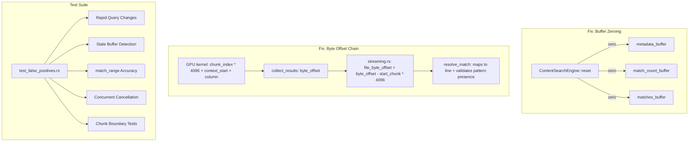

# Design: gpu-search-false-positives

## Overview

Two-part fix: (1) eliminate stale GPU buffer data by zeroing metadata and match buffers in `reset()`, and (2) validate byte_offset calculation chain end-to-end. A new integration test suite drives `ContentSearchEngine` and `StreamingSearchEngine` directly with rapid query changes to verify correctness.

## Architecture



## Components

### Component A: Buffer Zeroing in reset()
**Purpose**: Eliminate stale data in GPU buffers between search dispatches.
**Responsibilities**:
- Zero `metadata_buffer` up to `max_chunks * sizeof(ChunkMetadata)`
- Zero `match_count_buffer` (4 bytes)
- Zero `matches_buffer` up to `MAX_MATCHES * sizeof(GpuMatchResult)`
- Expose `max_chunks` for testing buffer state inspection

**Implementation**:
```rust
pub fn reset(&mut self) {
    self.current_chunk_count = 0;
    self.total_data_bytes = 0;
    self.file_count = 0;

    // Zero metadata buffer to prevent stale ChunkMetadata from leaking
    // into subsequent searches. Only zero the used portion for performance.
    unsafe {
        let meta_ptr = self.metadata_buffer.contents().as_ptr() as *mut u8;
        let meta_bytes = self.max_chunks * std::mem::size_of::<ChunkMetadata>();
        std::ptr::write_bytes(meta_ptr, 0, meta_bytes);

        // Zero match count (defense-in-depth; also zeroed in search())
        let count_ptr = self.match_count_buffer.contents().as_ptr() as *mut u32;
        *count_ptr = 0;
    }
}
```

**Performance note**: Zeroing metadata_buffer for max_chunks=100,000 entries at 24 bytes each = 2.4 MB. At memory bandwidth ~200 GB/s, this takes ~12 microseconds. Negligible vs. search dispatch overhead.

### Component B: Byte Offset Validation
**Purpose**: Ensure byte_offset chain from GPU kernel through streaming.rs to resolve_match is correct.
**Responsibilities**:
- Audit `collect_results()` in content.rs: `byte_offset = chunk_index * 4096 + context_start + column`
- Audit `search_files_with_profile()` in streaming.rs: `file_byte_offset = byte_offset - start_chunk * 4096`
- Verify `resolve_match()` correctly maps file_byte_offset to line number and validates pattern presence

**Analysis of byte_offset chain**:
1. GPU kernel writes `result.chunk_index = chunk_idx` (global chunk index) and `result.context_start = global_pos - (local_pos - line_start)` where `global_pos = offset_in_chunk + local_pos`
2. `collect_results()` computes: `byte_offset = m.chunk_index * 4096 + m.context_start + m.column`
   - This gives: `global_chunk * 4096 + (offset_in_chunk + local_pos - (local_pos - line_start)) + (local_pos - line_start)`
   - Simplified: `global_chunk * 4096 + offset_in_chunk + local_pos`
   - This is the global byte position of the match across all loaded chunks
3. streaming.rs subtracts `start_chunk * 4096` to get file-relative offset
4. `resolve_match()` uses this offset to find the line

**Potential issue**: `context_start` is `global_pos - (local_pos - line_start)` = `offset_in_chunk + line_start`. Then `byte_offset = chunk_index * 4096 + offset_in_chunk + line_start + column`. But `column = local_pos - line_start`. So `byte_offset = chunk_index * 4096 + offset_in_chunk + local_pos`. This is correct for the global offset of the match.

The subtraction `file_byte_offset = byte_offset - start_chunk * 4096` correctly converts to file-relative. This appears correct mathematically. The false positives likely come from stale metadata, not arithmetic.

### Component C: Integration Test Suite
**Purpose**: Catch false positives, stale results, and match_range corruption through automated tests.
**Responsibilities**:
- Rapid query change simulation driving `StreamingSearchEngine` directly
- Stale buffer detection using `ContentSearchEngine` buffer inspection
- match_range accuracy tests comparing GPU results against CPU ground truth
- Search cancellation correctness tests
- Chunk boundary tests for files spanning multiple 4KB chunks

## Data Flow

1. Test creates temp files with known content (unique patterns per file)
2. Test drives `ContentSearchEngine` or `StreamingSearchEngine` with a sequence of queries
3. Between queries, `reset()` is called (now zeros buffers)
4. Each query's results are validated against CPU reference (`cpu_search` or `memchr::memmem`)
5. False positives = GPU matches that CPU does not confirm at the reported byte offset
6. match_range validated: `line_content[match_range]` must equal pattern

## Technical Decisions

| Decision | Options | Choice | Rationale |
|----------|---------|--------|-----------|
| What to zero in reset() | Zero all buffers / Zero metadata+matches only / Zero nothing | Zero metadata + match_count | Metadata is the stale data vector; chunks_buffer already zero-pads per chunk; matches_buffer bounded by match_count |
| Test level | Unit tests in content.rs / Integration tests in tests/ | Both | Unit tests for buffer state; integration tests for end-to-end pipeline |
| Test fixture strategy | Real files / In-memory content | Temp files via tempfile | Matches production pipeline (streaming.rs reads from disk) |
| Buffer inspection | Public field / Getter method / #[cfg(test)] accessor | `#[cfg(test)]` pub method | Only needed for tests, no production API change |

## File Structure

| File | Action | Purpose |
|------|--------|---------|
| `src/search/content.rs` | Modify | Zero buffers in `reset()`, add `#[cfg(test)]` buffer inspection methods |
| `src/search/streaming.rs` | Modify | Add logging/instrumentation for byte_offset chain validation |
| `src/search/orchestrator.rs` | Modify | Add eprintln instrumentation for false positive detection in resolve_match |
| `tests/test_false_positives.rs` | Create | Comprehensive integration test suite |

## Error Handling

| Error | Handling | User Impact |
|-------|----------|-------------|
| Stale metadata produces false match | `resolve_match()` rejects via pattern.find() -> None | Match silently dropped (correct behavior, but zero-buffer fix prevents this scenario) |
| byte_offset out of bounds | `resolve_match()` returns None (line 1323: `if byte_offset >= content.len()`) | Match silently dropped |
| GPU match_count exceeds MAX_MATCHES | Kernel bounds check (line 97: `if global_idx < 10000`) | Extra matches silently dropped |

## Existing Patterns to Follow

- Test structure: `tests/test_stale_results.rs` pattern for SimulatedApp + generation guard tests
- Test helpers: `make_streaming_test_files()` and `make_large_test_data()` in streaming.rs tests
- GPU init in tests: `MTLCreateSystemDefaultDevice()` + `PsoCache::new()` pattern (content.rs tests)
- Verification: `cpu_verify_matches()` in verify.rs for ground-truth comparison
- Profile: `StreamingProfile` for timing instrumentation
