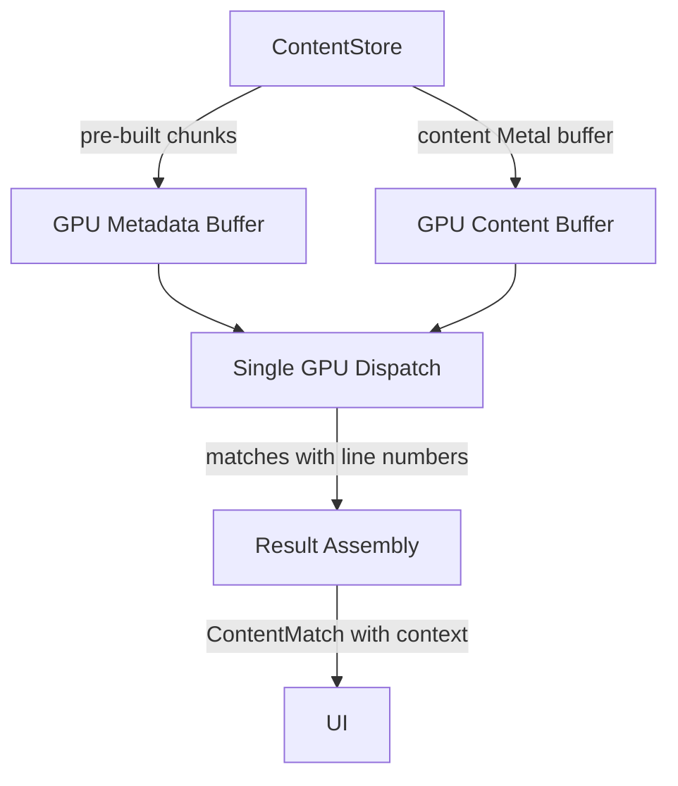

# Design: gpu-search-overhaul-3

## Overview

Three targeted changes to eliminate the dispatch overhead, CPU resolve bottleneck, and per-keystroke metadata rebuild. No architectural changes -- just removing artificial limits and moving computation to where it belongs.

## Architecture



## Components

### Component A: Single-Dispatch Content Search (content.rs)

**Purpose**: Remove 100K chunk cap, dispatch all chunks in one GPU call.

**Changes**:
1. `ContentSearchEngine::new()` (line 177): Accept chunk count parameter instead of computing from max_files. Remove `.min(100_000)`.
2. `search_zerocopy()` (lines 560-682): Remove batch loop entirely. Reallocate metadata buffer to fit actual chunk count. Single dispatch path.
3. Alternatively: dynamically resize metadata buffer based on chunk_metas.len() before dispatch.

**Key decision**: Rather than pre-allocating a huge metadata buffer, resize it on first call to `search_zerocopy()` when actual chunk count is known. This avoids wasting memory for small searches while supporting millions of chunks for large ones.

**Implementation approach**:
- Add `ensure_metadata_capacity(&mut self, chunk_count: usize)` method
- Reallocate metadata_buffer if `chunk_count > self.max_chunks`
- Update `self.max_chunks` after reallocation
- Single dispatch: write all chunk_metas, set params, commit, wait

### Component B: GPU Line Number Resolution (content_search.metal + orchestrator.rs)

**Purpose**: Compute accurate file-relative line numbers in the GPU kernel.

**Current kernel behavior** (content_search_zerocopy_kernel, line 90-97):
```metal
uint line_num = 1;
for (uint scan = 0; scan < local_pos; scan++) {
    if (local_data[scan] == '\n') { line_num++; }
}
```
This only counts within the 64-byte thread window, not from file start.

**New approach**: After finding a match, scan `raw_data` from `meta.buffer_offset` (file start in contiguous buffer) to `meta.buffer_offset + offset_in_chunk + local_pos` counting 0x0A bytes. This gives the true file-relative line number.

**Performance concern**: Scanning from file start for every match could be expensive for matches deep in large files. But:
- Only matches trigger the scan (not every thread)
- Typical match count is <10K (MAX_MATCHES)
- Average file is ~3KB, max scan ~40KB for very large files
- GPU memory bandwidth (200+ GB/s) makes this trivial

**Metal kernel changes**:
```metal
// After match found at local_pos:
uint file_line = 1;
ulong file_start = meta.buffer_offset;  // already available
ulong match_global_pos = file_start + offset_in_chunk + local_pos;
// Scan from file_start to match position counting newlines
for (ulong scan = file_start; scan < match_global_pos; scan++) {
    if (raw_data[scan] == 0x0A) { file_line++; }
}
result.line_number = file_line;
```

**Orchestrator changes** (search_from_content_store):
- Remove lines 1491-1581 (the String::from_utf8_lossy + lines().collect loop)
- Use GPU-provided line_number directly
- Still need to extract line_content + context lines from in-memory content (but using byte offset, not line-by-line scan)
- New resolve approach: binary search for newlines around byte_offset to extract line content + context

### Component C: Pre-built Chunk Metadata in GCIX (content_store.rs + gcix.rs)

**Purpose**: Build chunk metadata once at index time, persist in GCIX, skip rebuild on search.

**ContentStore changes**:
- Add `chunk_metadata: Option<Vec<ChunkMetadata>>` field
- Add `pub fn chunk_metadata(&self) -> Option<&[ChunkMetadata]>` getter
- Add `pub fn set_chunk_metadata(&mut self, meta: Vec<ChunkMetadata>)` setter

**GCIX format changes** (gcix.rs):
- Bump `GCIX_VERSION` from 2 to 3
- Add to GcixHeader: `chunks_offset: u64`, `chunks_bytes: u64`
- Layout: header | meta_table | padding | content_data | path_table | chunk_metadata_table
- `save_gcix()`: after writing path table, write `Vec<ChunkMetadata>` as raw bytes
- `load_gcix()`: if version >= 3, read chunk metadata table, store in ContentStore

**Orchestrator changes**:
- In `search_from_content_store()`: check `content_store.chunk_metadata()` first
- If Some, use directly; if None, fall back to `build_chunk_metadata()`

## Data Flow

1. **Index time**: ContentStore built -> `build_chunk_metadata()` called once -> stored in ContentStore -> saved to GCIX v3
2. **App startup**: GCIX v3 loaded -> chunk metadata parsed -> stored in ContentStore
3. **Search keystroke**: ContentStore.chunk_metadata() returns pre-built Vec -> metadata buffer filled -> single GPU dispatch -> matches with file-relative line numbers -> line content extracted by byte offset -> results displayed

## Technical Decisions

| Decision | Options | Choice | Rationale |
|----------|---------|--------|-----------|
| Metadata buffer sizing | Pre-alloc max vs dynamic resize | Dynamic resize | Avoids 204MB upfront alloc for small searches |
| Line number computation | CPU scan vs GPU scan | GPU scan from file start | Eliminates 3.6s CPU bottleneck, GPU has bandwidth |
| Chunk metadata storage | Separate file vs GCIX extension | GCIX v3 extension | Single file, atomic persistence, existing CRC |
| GCIX backward compat | Reject v2 vs fallback rebuild | Fallback: if v2, rebuild chunks on load | Smooth upgrade path |

## File Structure

| File | Action | Purpose |
|------|--------|---------|
| `gpu-search/src/search/content.rs` | Modify | Remove 100K cap, add ensure_metadata_capacity, simplify search_zerocopy |
| `gpu-search/shaders/content_search.metal` | Modify | Scan from file start for line numbers in zerocopy kernel |
| `gpu-search/shaders/search_types.h` | No change | MatchResult already has line_number field |
| `gpu-search/src/search/orchestrator.rs` | Modify | Remove CPU resolve loop, use GPU line numbers + byte-offset context extraction |
| `gpu-search/src/index/content_store.rs` | Modify | Add chunk_metadata field, getter, setter |
| `gpu-search/src/index/gcix.rs` | Modify | v3 header fields, save/load chunk metadata table |
| `gpu-search/src/gpu/types.rs` | No change | GpuMatchResult already has line_number field |

## Error Handling

| Error | Handling | User Impact |
|-------|----------|-------------|
| Metadata buffer realloc fails | Fallback to batch path | Slower search, no crash |
| GCIX v2 file loaded | Rebuild chunk metadata at load time | One-time ~20ms cost |
| GPU line number mismatch | Debug assertion in tests | None in release |
| Match byte_offset out of bounds | Skip match (existing behavior) | Fewer results |

## Existing Patterns to Follow

- `ContentSearchEngine::search_zerocopy()` (content.rs:560) -- pattern for GPU dispatch with external buffers
- `GcixHeader::to_bytes()/from_bytes()` (gcix.rs) -- pattern for header serialization
- `build_chunk_metadata()` (content_store.rs:916) -- existing chunk metadata builder to reuse
- `from_gcix_mmap()` (content_store.rs:486) -- pattern for GCIX deserialization into ContentStore
