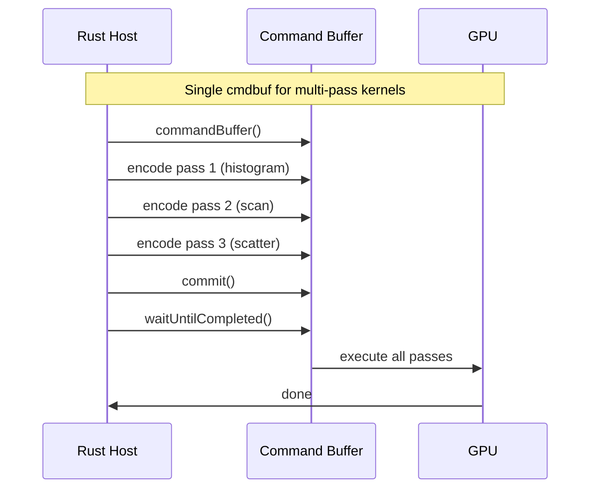
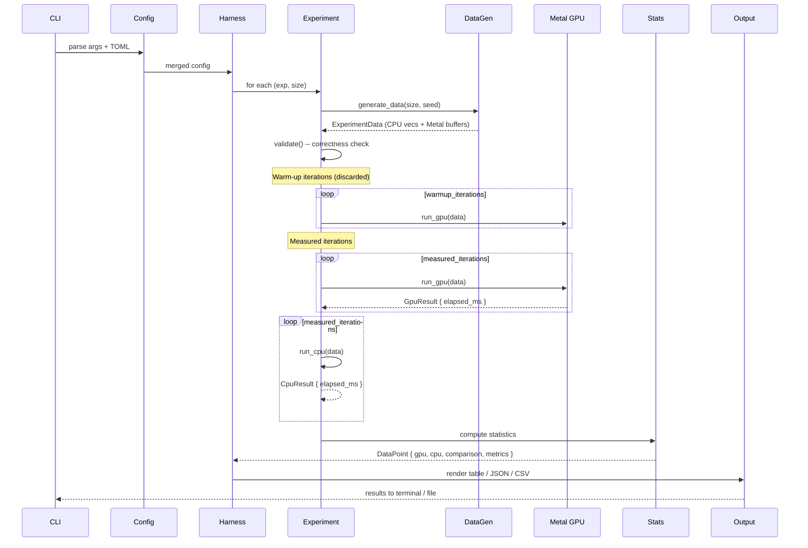

# Technical Architecture: metal-forge-compute Experiment Suite

## Overview

Workspace with two crates: `forge-bench` (binary, CLI harness + experiment orchestration) and `forge-primitives` (library, Metal kernel wrappers + shared GPU infrastructure). All 16 experiments implement a common `Experiment` trait. Metal pipelines use the PSO cache pattern from gpu-query with page-aligned buffers for zero-copy. Single command buffer per experiment dispatch (lesson from inference pipeline: 91->1 cmdbuf was key).

## Architecture

```mermaid
graph TB
    subgraph Workspace["metal-forge-compute workspace"]
        subgraph ForgeBench["forge-bench (binary)"]
            CLI[cli.rs<br/>clap derive]
            Config[config.rs<br/>TOML + CLI merge]
            Harness[harness.rs<br/>warmup + measure loop]
            Output[output/<br/>table, json, csv, roofline]
            DataGen[data_gen.rs<br/>deterministic synthetic data]
            Stats[stats.rs<br/>mean, median, CV, outlier]
            Exps[experiments/<br/>16 Experiment impls]
        end

        subgraph ForgePrimitives["forge-primitives (library)"]
            MetalCtx[metal_ctx.rs<br/>device, queue, library]
            PsoCache[pso_cache.rs<br/>PsoKey + HashMap cache]
            BufferPool[buffer_pool.rs<br/>page-aligned alloc + reuse]
            Dispatch[dispatch.rs<br/>1D/2D encode helpers]
            Types[types.rs<br/>repr(C) param structs]
            Hardware[hardware.rs<br/>chip detect + BW lookup]
            Timing[timing.rs<br/>wall-clock + GPU timestamps]
        end

        Shaders[shaders/<br/>*.metal kernels]
    end

    CLI --> Config
    Config --> Harness
    Harness --> Exps
    Exps --> ForgePrimitives
    Exps --> DataGen
    Harness --> Stats
    Harness --> Output
    ForgePrimitives --> Shaders
```

## Crate Architecture

### Workspace Layout

```toml
# metal-forge-compute/Cargo.toml
[workspace]
members = ["forge-bench", "forge-primitives"]

[workspace.dependencies]
objc2 = "0.6"
objc2-metal = "0.3"
objc2-foundation = "0.3"
block2 = "0.6"
serde = { version = "1", features = ["derive"] }
serde_json = "1"
```

### forge-bench (binary crate)

Owns: CLI, config, harness loop, experiments, output formatting, data generation, statistics.

**Dependencies**: forge-primitives, clap, toml, serde, serde_json, indicatif, comfy-table, colored, rayon, rand, csv, chrono.

### forge-primitives (library crate)

Owns: Metal device/queue lifecycle, PSO cache, buffer pool, dispatch helpers, `#[repr(C)]` types, hardware detection, timing infrastructure.

**Dependencies**: objc2, objc2-metal, objc2-foundation, block2.

**Rationale for split**: forge-primitives is the seed of the eventual GPU primitives library (PM.md Layer 1). Clean separation means kernel wrappers can graduate to a standalone crate without extracting from benchmark code.

### Module Structure (forge-bench)

```
forge-bench/src/
  main.rs                     # CLI entry, experiment dispatch
  cli.rs                      # clap derive args (mirrors UX.md 1.2)
  config.rs                   # TOML loading, profile merge, size parser
  harness.rs                  # Measurement loop: warmup/measure/validate
  stats.rs                    # Statistical analysis (mean, median, CV, IQR outlier)
  data_gen.rs                 # Deterministic generators (uniform, Zipf, skewed)
  output/
    mod.rs
    table.rs                  # comfy-table terminal rendering
    json.rs                   # JSON schema from UX.md 2.1
    csv.rs                    # CSV output
    roofline.rs               # ASCII roofline diagram
    summary.rs                # Suite summary + decision signal
    progress.rs               # indicatif progress bars
  experiments/
    mod.rs                    # Experiment trait + registry + phase grouping
    reduce.rs                 # FR-3: sum/min/max, u32/f32
    scan.rs                   # FR-2: inclusive/exclusive prefix scan
    compact.rs                # FR-5: scan-based stream compaction
    sort.rs                   # FR-1: radix sort u32/f32
    histogram.rs              # FR-4: 256-bin, 65536-bin
    filter.rs                 # FR-8: columnar filter (extend gpu-query)
    groupby.rs                # FR-9: sort-based group-by aggregate
    gemm.rs                   # FR-6: simdgroup_matrix 8x8 tiled
    gemv.rs                   # FR-7: reuse matvec pattern
    pipeline.rs               # FR-14: end-to-end analytical query
    duckdb.rs                 # FR-15: DuckDB CLI comparison
    spreadsheet.rs            # FR-11: batch formula eval
    timeseries.rs             # FR-12: MA, VWAP, Bollinger
    json_parse.rs             # FR-13: GPU JSON/CSV parsing
    hash_join.rs              # FR-10: hash join
  cpu_baselines/
    mod.rs                    # CPU baseline trait
    rayon_sort.rs             # std::sort_unstable + rayon parallel sort
    rayon_reduce.rs           # rayon par_iter().sum/min/max
    rayon_filter.rs           # rayon par_iter().filter().collect()
    accelerate.rs             # vDSP/cblas_sgemm bindings via FFI
    hashmap_ops.rs            # HashMap group-by, hash join
    sequential.rs             # Sequential scan, histogram
    duckdb_runner.rs          # DuckDB CLI subprocess
```

### Module Structure (forge-primitives)

```
forge-primitives/src/
  lib.rs
  metal_ctx.rs                # GpuDevice equivalent: device + queue + library
  pso_cache.rs                # PsoKey + HashMap<PsoKey, PSO> (from gpu-query pattern)
  buffer_pool.rs              # Page-aligned buffer alloc, reuse, zero-copy
  dispatch.rs                 # dispatch_1d, dispatch_2d, encode helpers
  types.rs                    # #[repr(C)] param structs matching types.h
  hardware.rs                 # Chip detection, bandwidth lookup table
  timing.rs                   # Wall-clock timer, GPU timestamp support
```

## Metal Compute Pipeline Design

### Pipeline State Object (PSO) Caching

Reuse the `PsoCache` pattern from `gpu-query/src/gpu/pipeline.rs`:

```rust
pub struct PsoCache {
    cache: HashMap<PsoKey, Retained<ProtocolObject<dyn MTLComputePipelineState>>>,
}

pub struct PsoKey {
    pub function_name: String,
    pub constants: Vec<(usize, u8, Vec<u8>)>,  // (index, type_tag, value_bytes)
}
```

**Strategy**: Pre-warm all PSOs during harness init (before measurement). Each experiment registers its kernel names + function constant combinations. PSO compilation is excluded from timing.

**Expected PSO count**: ~30-40 (16 experiments x 1-3 variants each, plus utility kernels like prefix scan shared across sort/compact/groupby).

### Buffer Allocation & Reuse

```rust
pub struct BufferPool {
    device: Retained<ProtocolObject<dyn MTLDevice>>,
    /// Reusable buffers keyed by page-aligned size.
    free_list: HashMap<usize, Vec<Retained<ProtocolObject<dyn MTLBuffer>>>>,
    /// Track peak allocation for NFR-4 reporting.
    peak_allocated: usize,
}

impl BufferPool {
    /// Allocate page-aligned buffer. Reuse from free_list if available.
    pub fn alloc(&mut self, min_bytes: usize) -> Retained<ProtocolObject<dyn MTLBuffer>> {
        let aligned = Self::page_align(min_bytes);
        if let Some(buffers) = self.free_list.get_mut(&aligned) {
            if let Some(buf) = buffers.pop() {
                return buf;
            }
        }
        self.alloc_new(aligned)
    }

    /// Return buffer to pool for reuse.
    pub fn recycle(&mut self, buffer: Retained<ProtocolObject<dyn MTLBuffer>>) {
        let size = buffer.length();
        self.free_list.entry(size).or_default().push(buffer);
    }

    fn page_align(bytes: usize) -> usize {
        const PAGE_SIZE: usize = 16384; // 16KB Apple Silicon page
        (bytes + PAGE_SIZE - 1) & !(PAGE_SIZE - 1)
    }
}
```

**Key decisions**:
- **Page-aligned (16KB)**: Required for `newBufferWithBytesNoCopy` zero-copy path. Even with `newBufferWithLength`, page alignment avoids internal fragmentation.
- **StorageModeShared**: All buffers use shared storage (unified memory on Apple Silicon). No explicit CPU<->GPU transfers needed.
- **Pool reuse across sizes within experiment**: Same buffer can serve 1M, 10M, 100M -- just allocate largest needed size upfront. Experiments declare max buffer size in `supported_sizes()`.

### Command Buffer Batching Strategy



**Rule**: One command buffer per experiment iteration. Multi-pass algorithms (radix sort = 8 passes x 3 kernels = 24 dispatches) encode all passes into a single command buffer. This is the key lesson from the inference pipeline where collapsing 91 command buffers to 1 eliminated per-dispatch overhead.

**Exception**: The end-to-end pipeline experiment (FR-14) uses one command buffer for the entire filter->groupby->sort->topK chain, mirroring real-world usage.

### Timing Infrastructure

```rust
pub struct BenchTimer {
    /// CPU wall-clock (primary metric, includes dispatch overhead per NFR-2).
    start: Instant,
}

impl BenchTimer {
    pub fn start() -> Self { Self { start: Instant::now() } }

    pub fn stop(&self) -> f64 {
        self.start.elapsed().as_secs_f64() * 1000.0  // ms
    }
}
```

**Timing boundary** (matches UX.md 6.2):

```rust
// Buffer allocation is OUTSIDE timing (pre-allocated)
let timer = BenchTimer::start();
let cb = queue.commandBuffer().unwrap();
{
    let encoder = cb.computeCommandEncoder().unwrap();
    encoder.setComputePipelineState(&pso);
    // ... set buffers, dispatch ...
    encoder.endEncoding();
}
cb.commit();
cb.waitUntilCompleted();
let elapsed_ms = timer.stop();
```

This deliberately includes encode + commit + GPU execution + synchronization. Kernel-only time via `MTLCounterSampleBuffer` is a future enhancement (Metal Counters API), recorded in verbose mode but not the primary metric.

## Kernel Architecture

### Category 1: Primitives (reduce, scan, compact, sort, histogram)

#### Reduce (FR-3)

3-level hierarchical reduction (reuse pattern from `aggregate.metal`):

```
Level 1: simd_sum/simd_min/simd_max across 32-lane simdgroup
Level 2: threadgroup reduction via shared memory + barrier
Level 3: global atomic accumulation
```

**Kernel variants**: `reduce_sum_u32`, `reduce_sum_f32`, `reduce_min_u32`, `reduce_max_u32`

**Threadgroup size**: 256 (matches existing aggregate.metal)

**Dispatch**: 1 thread per element, `dispatchThreadgroups` with ceil(N/256) groups.

**For u32**: Use `simd_sum(uint)` directly (native 32-bit support).
**For f32**: Use `simd_sum(float)` directly.
**For min/max u32**: Use `simd_min(uint)` / `simd_max(uint)`.

Global atomic for sum: `atomic_fetch_add_explicit`. For min/max: per-threadgroup partials array, CPU final reduction (pattern from `aggregate_min_int64`).

**New file**: `shaders/reduce.metal`

#### Prefix Scan (FR-2)

**Algorithm**: Decoupled fallback scan (NOT decoupled lookback).

| Algorithm | Status on Apple Silicon |
|-----------|----------------------|
| Decoupled lookback (Merrill-Grimshaw) | DEADLOCKS -- forward progress not guaranteed across threadgroups on Apple GPU |
| Blelloch work-efficient | Works but requires 2 passes + global barrier |
| Reduce-then-scan (decoupled fallback) | Works, 3 passes, no inter-threadgroup dependency |

**3-pass approach**:
1. **Local scan**: Each threadgroup performs Blelloch scan on its chunk, writes partial sum to `partials[]`
2. **Scan partials**: Single threadgroup scans the `partials[]` array (fits in one group for N <= 100M)
3. **Add offsets**: Each threadgroup adds its prefix from `partials[]` to every element in its chunk

**Threadgroup size**: 256 (512 elements per group using Blelloch 2x work-efficiency)

**New files**: `shaders/scan.metal`, `shaders/scan_helpers.h`

#### Stream Compaction (FR-5)

**Algorithm**: Scan-based scatter (prefix scan + write to compacted output).

1. Each thread evaluates predicate, writes 0/1 to `flags[]`
2. Exclusive prefix scan over `flags[]` (reuse scan kernel)
3. Scatter: if `flags[i] == 1`, write `input[i]` to `output[scan[i]]`

**Existing code**: `compact.metal` uses atomic counter approach (simple but serialized). For benchmark, implement scan-based version for better throughput at 10M+ elements.

**New file**: `shaders/compact_scan.metal` (scan-based), keep `compact.metal` for comparison.

#### Radix Sort (FR-1)

**Algorithm**: Reduce-then-scan radix sort (NOT OneSweep).

| Algorithm | Status on Apple Silicon |
|-----------|----------------------|
| OneSweep (cooperative) | DEADLOCKS -- requires forward-progress guarantees Apple GPU lacks |
| Reduce-then-scan radix | Works, ~2x slower than OneSweep but reliable |
| Bitonic sort | Works but O(n log^2 n), only competitive for N < 100K |

**Per-pass (4-bit radix, 8 passes for u32)**:
1. **Histogram**: Each threadgroup computes local 16-bin histogram using shared memory atomics
2. **Scan**: Exclusive prefix scan over global histogram (reuse scan kernel)
3. **Scatter**: Each thread reads its key, computes digit, looks up scatter offset, writes to output

**Double buffer**: Ping-pong between `keys_in` and `keys_out` across passes. 8 passes for u32 (32 bits / 4 bits).

**f32 support**: Transform float bits for radix-sortable order: flip sign bit, conditionally flip all bits for negative values.

**New files**: `shaders/radix_sort.metal` (histogram, scatter kernels), reuse `shaders/scan.metal`

#### Histogram (FR-4)

**Algorithm**: Shared-memory histogram (NOT global atomics).

```metal
threadgroup atomic_uint local_hist[NUM_BINS];  // 256 or 65536

// Initialize local histogram
for (uint i = tid_in_tg; i < NUM_BINS; i += tg_size)
    atomic_store_explicit(&local_hist[i], 0, memory_order_relaxed);
threadgroup_barrier(mem_flags::mem_threadgroup);

// Accumulate
uint bin = compute_bin(input[tid]);
atomic_fetch_add_explicit(&local_hist[bin], 1, memory_order_relaxed);
threadgroup_barrier(mem_flags::mem_threadgroup);

// Merge to global
for (uint i = tid_in_tg; i < NUM_BINS; i += tg_size)
    atomic_fetch_add_explicit(&global_hist[i], local_hist[i], memory_order_relaxed);
```

**256-bin**: Fits in threadgroup memory easily (1 KB). Full 256-thread threadgroup.
**65536-bin**: 256 KB shared memory. May exceed threadgroup memory limit (32 KB on Apple Silicon). **Fallback**: Tile into multiple passes or use sub-histograms per simdgroup (8 KB each, 8 simdgroups x 256 bins = 8 KB per group, merge after).

**New file**: `shaders/histogram.metal`

### Category 2: Linear Algebra (GEMM, GEMV)

#### GEMM (FR-6)

**Algorithm**: simdgroup_matrix 8x8 tiled multiply (Metal 4 / apple9 family).

```metal
#include <metal_simdgroup_matrix>

// Each simdgroup computes one 8x8 output tile
simdgroup_matrix<float, 8, 8> acc = simdgroup_matrix<float, 8, 8>(0.0f);

for (uint k = 0; k < K; k += 8) {
    simdgroup_matrix<float, 8, 8> a, b;
    simdgroup_load(a, A + row * K + k, K);
    simdgroup_load(b, B + k * N + col, N);
    simdgroup_multiply_accumulate(acc, a, b, acc);
}

simdgroup_store(acc, C + row * N + col, N);
```

**Tiling**: 2D threadgroups. Each threadgroup covers a tile of the output matrix. Tile sizes tuned per matrix dimension:
- 256x256: 32x32 tiles (1 simdgroup per 8x8 sub-tile, 16 sub-tiles per threadgroup)
- 1024x1024: 64x64 tiles with shared memory staging
- 4096x4096: 128x128 tiles with double-buffered shared memory loads

**FP16**: Use `simdgroup_matrix<half, 8, 8>` for FP16 variant. Metal 4 has native FP16 matrix multiply.

**New file**: `shaders/gemm.metal`

#### GEMV (FR-7)

Reuse the matvec pattern from the inference pipeline. Each thread processes one output element by dot-producting a row of the matrix with the input vector.

**Optimization**: Vectorized loads (float4) to maximize memory bandwidth utilization.

**New file**: `shaders/gemv.metal` (adapted from inference `matvec_f32.metal`)

### Category 3: Relational (filter, group-by, join)

#### Filter (FR-8)

**Extend existing** `gpu-query/shaders/filter.metal`. The existing kernel is production-quality with:
- Function constant specialization for op/type/null
- Bitmask output (1 bit per row)
- simd_sum for efficient match counting

**Adaptation for benchmark**: Copy kernel to forge-bench shaders, add u32/f32 column types (existing handles i64/f32), add benchmark-specific selectivity rates.

**New file**: `shaders/filter_bench.metal` (extended from gpu-query filter.metal)

#### Group-By Aggregate (FR-9)

**Algorithm**: Sort-based group-by (NOT hash-based).

```
1. Sort keys using radix sort (reuse sort kernel)
2. Scan sorted keys to find group boundaries (flag[i] = key[i] != key[i-1])
3. Segmented reduce within each group (prefix scan of flags -> group IDs, then reduce per group)
```

**Rationale for sort-based over hash-based**: Sort uses sequential memory access, leverages the GPU sort we already built. Hash-based has random scatter/gather that defeats GPU bandwidth advantage (PM.md R2). Sort-based approach means group-by performance is bounded by sort performance.

**New file**: `shaders/groupby.metal` (boundary detection + segmented reduce)

#### Hash Join (FR-10)

**Algorithm**: Hash-based build + probe (high-risk experiment per PM.md).

1. **Build phase**: Hash the build table keys, insert into hash table (open addressing, linear probing)
2. **Probe phase**: Each thread hashes its probe key, linear-probes the hash table, writes matches

**Hash table**: Device buffer, power-of-2 size, 1.5x load factor. Use `atomic_compare_exchange` for concurrent build.

**Expected outcome**: GPU likely slower than CPU for < 10M rows due to random access pattern. This experiment exists to validate (or invalidate) the hypothesis.

**New file**: `shaders/hash_join.metal`

### Category 4: Consumer (spreadsheet, time-series, parsing)

#### Spreadsheet Formulas (FR-11)

**Pattern**: Map-reduce. Each thread evaluates one cell's formula.

- **SUM/AVERAGE**: Columnar reduce over range (reuse reduce kernel)
- **VLOOKUP-equivalent**: Binary search in sorted lookup column (each thread does its own binary search)

**New file**: `shaders/spreadsheet.metal`

#### Time Series (FR-12)

**Pattern**: Sliding window with shared memory.

```metal
// Moving average with window W
threadgroup float window_cache[THREADGROUP_SIZE + W];

// Load W-1 elements from previous region + THREADGROUP_SIZE elements
// Each thread computes sum of its W neighbors
```

- **VWAP**: `sum(price * volume) / sum(volume)` -- two parallel reductions
- **Bollinger bands**: Moving average + moving standard deviation (two-pass or Welford online)

**New file**: `shaders/timeseries.metal`

#### JSON/CSV Parsing (FR-13)

**Strategy**: Extend existing `gpu-query/shaders/csv_parse.metal` and `json_parse.metal`.

**CSV** (high probability of GPU win): Parallel newline detection + per-field extraction. Each thread handles one record after newline positions are identified via scan.

**JSON** (low probability of GPU win): Structural character detection parallelizes well, but nested parsing has divergent control flow. Benchmark the existing `json_parse.metal` as-is.

**New files**: None -- reuse existing kernels from gpu-query/shaders/.

### Category 5: Pipeline & Competitive

#### End-to-End Pipeline (FR-14)

**Single command buffer** encoding the full chain:

```
filter -> compact -> sort (group keys) -> segmented reduce -> sort (result) -> topK
```

All within one `commandBuffer().commit().waitUntilCompleted()`. No intermediate CPU readback.

**New file**: None (composed from existing experiment kernels in Rust host code).

#### DuckDB Comparison (FR-15)

**Implementation**: Shell out to `duckdb` CLI via `std::process::Command`.

```rust
fn run_duckdb_query(query: &str, data_path: &str) -> f64 {
    let start = Instant::now();
    let output = Command::new("duckdb")
        .args(["-csv", "-cmd", &format!(".timer on"), data_path, query])
        .output()
        .expect("duckdb not found");
    start.elapsed().as_secs_f64() * 1000.0
}
```

**Data format**: Generate Parquet file from synthetic data, load into DuckDB. Ensures fair comparison (DuckDB reads same columnar format, not CSV overhead).

## CPU Baseline Implementation

| Baseline | Crate/Framework | Used By |
|----------|-----------------|---------|
| Parallel sort | `rayon` + `std::sort_unstable` | sort |
| Parallel reduce | `rayon::par_iter().sum/min/max` | reduce |
| Sequential scan | `std::iter::scan()` | scan |
| Parallel filter | `rayon::par_iter().filter().collect()` | compact, filter |
| Sequential histogram | `Vec<u32>` + sequential bin increment | histogram |
| Accelerate GEMM | `cblas_sgemm` via FFI | gemm |
| Accelerate GEMV | `cblas_sgemv` via FFI | gemv |
| HashMap group-by | `HashMap<K, Vec<V>>` + aggregate | groupby |
| HashMap join | `HashMap<K, Vec<V>>` build + probe | hash_join |
| serde_json/csv | `serde_json::from_slice`, `csv::Reader` | json_parse |
| DuckDB CLI | `std::process::Command` | duckdb, pipeline |

### Accelerate Framework FFI

```rust
// Link against Accelerate.framework
#[link(name = "Accelerate", kind = "framework")]
extern "C" {
    fn cblas_sgemm(
        order: i32, transA: i32, transB: i32,
        M: i32, N: i32, K: i32,
        alpha: f32, A: *const f32, lda: i32,
        B: *const f32, ldb: i32,
        beta: f32, C: *mut f32, ldc: i32,
    );
    fn cblas_sgemv(
        order: i32, trans: i32,
        M: i32, N: i32,
        alpha: f32, A: *const f32, lda: i32,
        X: *const f32, incX: i32,
        beta: f32, Y: *mut f32, incY: i32,
    );
}
```

**No external crate needed** -- Accelerate is a system framework. Direct FFI is sufficient for benchmark purposes.

## Data Generation

### Generators

```rust
pub struct DataGenerator {
    rng: StdRng,  // Seeded for reproducibility (NFR-5)
}

impl DataGenerator {
    pub fn new(seed: u64) -> Self {
        Self { rng: StdRng::seed_from_u64(seed) }
    }

    /// Uniform random u32 values.
    pub fn uniform_u32(&mut self, count: usize) -> Vec<u32>;

    /// Uniform random f32 values in [0.0, 1.0).
    pub fn uniform_f32(&mut self, count: usize) -> Vec<f32>;

    /// Zipf distribution for group keys (models real cardinality).
    /// `alpha` controls skew: 1.0 = mild, 2.0 = heavy skew.
    pub fn zipf_u32(&mut self, count: usize, max_val: u32, alpha: f64) -> Vec<u32>;

    /// Columnar data for relational experiments.
    pub fn columnar_table(&mut self, rows: usize, config: &TableConfig) -> ColumnarData;

    /// Time series data (sorted timestamps + prices + volumes).
    pub fn time_series(&mut self, ticks: usize) -> TimeSeriesData;

    /// Spreadsheet cells (row-major, mixed numeric + formula refs).
    pub fn spreadsheet_cells(&mut self, rows: usize, cols: usize) -> SpreadsheetData;

    /// JSON/CSV payload for parsing experiments.
    pub fn json_records(&mut self, count: usize) -> Vec<u8>;
    pub fn csv_records(&mut self, count: usize, cols: usize) -> Vec<u8>;
}
```

### Distribution Support

| Distribution | Use Case | Parameters |
|-------------|----------|------------|
| Uniform | Sort, reduce, scan, compact base case | range: [0, u32::MAX] |
| Zipf | Group-by cardinality, hash join key skew | alpha: 1.0-2.0, max_key |
| Skewed selectivity | Filter experiments | Generate data where X% of values pass predicate |
| Sorted + noise | Time series, pre-sorted merge scenarios | Monotonic + Gaussian noise |

### Storage Format

All generated data stored as raw binary buffers in memory. For DuckDB comparison, write to Parquet via `parquet` crate (already in gpu-query's Cargo.toml).

**Memory-mapped path**: For 100M element experiments (400MB+ for u32), use `mmap` to avoid doubling memory. Generate to file, then `mmap` as Metal buffer source via `newBufferWithBytesNoCopy`.

```rust
/// Zero-copy Metal buffer from mmap'd file.
pub fn mmap_as_metal_buffer(
    device: &ProtocolObject<dyn MTLDevice>,
    data: &[u8],
) -> Retained<ProtocolObject<dyn MTLBuffer>> {
    let aligned_len = page_align(data.len());
    unsafe {
        let ptr = NonNull::new(data.as_ptr() as *mut c_void).unwrap();
        device.newBufferWithBytesNoCopy_length_options_deallocator(
            ptr, aligned_len,
            MTLResourceOptions::StorageModeShared,
            None,  // no deallocator -- mmap owns the memory
        ).unwrap()
    }
}
```

## Technical Decisions

| Decision | Options Considered | Choice | Rationale |
|----------|-------------------|--------|-----------|
| Scan algorithm | Decoupled lookback, Blelloch, Reduce-then-scan | Reduce-then-scan (3-pass) | Decoupled lookback DEADLOCKS on Apple Silicon -- no forward-progress guarantee across threadgroups. Reduce-then-scan is safe, only ~20% slower. |
| Sort algorithm | OneSweep, Reduce-then-scan radix, Bitonic | Reduce-then-scan radix (8-pass) | OneSweep DEADLOCKS on Apple Silicon (same forward-progress issue). Bitonic is O(n log^2 n). Reduce-then-scan is O(n) with constant factor ~2x OneSweep. |
| Command buffer strategy | 1 cmdbuf per kernel, 1 per experiment pass, 1 per experiment | 1 per experiment iteration | Learned from inference pipeline: 91->1 cmdbuf eliminated dispatch overhead domination. Multi-pass kernels (sort: 24 dispatches) all encode into single cmdbuf. |
| Buffer alignment | Arbitrary, 4KB page, 16KB page | 16KB page-aligned | Apple Silicon page size is 16KB. Page alignment enables `newBufferWithBytesNoCopy` zero-copy path. Avoids internal fragmentation in Metal allocator. |
| Group-by approach | Hash-based, Sort-based | Sort-based | Hash-based has random scatter/gather that defeats GPU bandwidth advantage (PM.md R2). Sort-based reuses our radix sort, uses sequential access patterns the GPU excels at. |
| Histogram approach | Global atomics, Shared memory | Shared memory histogram | Global atomics create extreme contention with 20 GPU cores x 256 threads. Shared memory histogram reduces contention to within-threadgroup, then single atomic merge per group. |
| GEMM approach | Naive tiling, simdgroup_matrix 8x8 | simdgroup_matrix 8x8 | Metal 4 (apple9 family) hardware feature. Analogous to CUDA tensor cores. Up to 4x throughput vs manual SIMD. |
| CPU GEMM baseline | Naive loops, NEON SIMD, Accelerate | Accelerate cblas_sgemm | PM.md NFR-3 requires fair baselines. Accelerate uses AMX (matrix coprocessor), representing Apple's best CPU-side performance. Naive loops would inflate GPU speedup unfairly. |
| DuckDB integration | C API bindings, CLI subprocess | CLI subprocess | C API would be more precise but adds build complexity (cmake, C linkage). CLI timing includes process startup (~50ms) but is simpler and matches how users actually run DuckDB. Document the overhead. |
| Crate split | Monolith, workspace | 2-crate workspace | forge-primitives seeds the eventual GPU primitives library. Clean separation means kernel wrappers can graduate without extraction surgery. |
| Timing method | CPU wall-clock only, MTLCounterSampleBuffer, Both | CPU wall-clock (primary) + GPU timestamps (verbose) | Wall-clock includes dispatch overhead per NFR-2. GPU timestamps useful for kernel optimization but don't reflect real-world latency. |

## Data Flow



## File Structure

| File | Action | Purpose |
|------|--------|---------|
| `metal-forge-compute/Cargo.toml` | Create | Workspace manifest |
| `forge-bench/Cargo.toml` | Create | Binary crate dependencies |
| `forge-bench/src/main.rs` | Create | CLI entry point |
| `forge-bench/src/cli.rs` | Create | clap derive arg definitions |
| `forge-bench/src/config.rs` | Create | TOML loading + CLI merge |
| `forge-bench/src/harness.rs` | Create | Measurement loop (warmup/measure/validate) |
| `forge-bench/src/stats.rs` | Create | Statistical analysis (mean, median, CV, IQR) |
| `forge-bench/src/data_gen.rs` | Create | Deterministic synthetic data generators |
| `forge-bench/src/output/mod.rs` | Create | Output module root |
| `forge-bench/src/output/table.rs` | Create | Terminal table rendering (comfy-table) |
| `forge-bench/src/output/json.rs` | Create | JSON serialization (UX.md 2.1 schema) |
| `forge-bench/src/output/csv.rs` | Create | CSV output |
| `forge-bench/src/output/roofline.rs` | Create | ASCII roofline diagram |
| `forge-bench/src/output/summary.rs` | Create | Suite summary + decision signal |
| `forge-bench/src/output/progress.rs` | Create | indicatif progress bars |
| `forge-bench/src/experiments/mod.rs` | Create | Experiment trait + registry |
| `forge-bench/src/experiments/reduce.rs` | Create | Reduce experiment (FR-3) |
| `forge-bench/src/experiments/scan.rs` | Create | Prefix scan experiment (FR-2) |
| `forge-bench/src/experiments/compact.rs` | Create | Stream compaction (FR-5) |
| `forge-bench/src/experiments/sort.rs` | Create | Radix sort (FR-1) |
| `forge-bench/src/experiments/histogram.rs` | Create | Histogram (FR-4) |
| `forge-bench/src/experiments/filter.rs` | Create | Columnar filter (FR-8) |
| `forge-bench/src/experiments/groupby.rs` | Create | Sort-based group-by (FR-9) |
| `forge-bench/src/experiments/gemm.rs` | Create | GEMM (FR-6) |
| `forge-bench/src/experiments/gemv.rs` | Create | GEMV (FR-7) |
| `forge-bench/src/experiments/pipeline.rs` | Create | End-to-end pipeline (FR-14) |
| `forge-bench/src/experiments/duckdb.rs` | Create | DuckDB comparison (FR-15) |
| `forge-bench/src/experiments/spreadsheet.rs` | Create | Spreadsheet formulas (FR-11) |
| `forge-bench/src/experiments/timeseries.rs` | Create | Time series analytics (FR-12) |
| `forge-bench/src/experiments/json_parse.rs` | Create | JSON/CSV parsing (FR-13) |
| `forge-bench/src/experiments/hash_join.rs` | Create | Hash join (FR-10) |
| `forge-bench/src/cpu_baselines/mod.rs` | Create | CPU baseline trait + module root |
| `forge-bench/src/cpu_baselines/rayon_sort.rs` | Create | std::sort + rayon parallel |
| `forge-bench/src/cpu_baselines/rayon_reduce.rs` | Create | rayon parallel sum/min/max |
| `forge-bench/src/cpu_baselines/rayon_filter.rs` | Create | rayon parallel filter |
| `forge-bench/src/cpu_baselines/accelerate.rs` | Create | Accelerate BLAS FFI |
| `forge-bench/src/cpu_baselines/hashmap_ops.rs` | Create | HashMap group-by, join |
| `forge-bench/src/cpu_baselines/sequential.rs` | Create | Sequential scan, histogram |
| `forge-bench/src/cpu_baselines/duckdb_runner.rs` | Create | DuckDB CLI subprocess |
| `forge-bench/forge-bench.toml` | Create | Default experiment config (from UX.md 3.1) |
| `forge-primitives/Cargo.toml` | Create | Library crate dependencies |
| `forge-primitives/src/lib.rs` | Create | Library root, re-exports |
| `forge-primitives/src/metal_ctx.rs` | Create | Metal device + queue + library init |
| `forge-primitives/src/pso_cache.rs` | Create | PSO cache (from gpu-query pattern) |
| `forge-primitives/src/buffer_pool.rs` | Create | Page-aligned buffer pool |
| `forge-primitives/src/dispatch.rs` | Create | Compute dispatch helpers |
| `forge-primitives/src/types.rs` | Create | #[repr(C)] param structs |
| `forge-primitives/src/hardware.rs` | Create | Hardware detection + BW lookup |
| `forge-primitives/src/timing.rs` | Create | Timing infrastructure |
| `forge-primitives/build.rs` | Create | Metal shader compilation (from gpu-query build.rs) |
| `forge-primitives/shaders/types.h` | Create | Shared MSL type definitions |
| `forge-primitives/shaders/reduce.metal` | Create | Hierarchical reduce kernel |
| `forge-primitives/shaders/scan.metal` | Create | 3-pass prefix scan |
| `forge-primitives/shaders/scan_helpers.h` | Create | Shared scan utilities |
| `forge-primitives/shaders/compact_scan.metal` | Create | Scan-based stream compaction |
| `forge-primitives/shaders/radix_sort.metal` | Create | Histogram + scatter for radix sort |
| `forge-primitives/shaders/histogram.metal` | Create | Shared-memory histogram |
| `forge-primitives/shaders/filter_bench.metal` | Create | Extended filter (from gpu-query) |
| `forge-primitives/shaders/groupby.metal` | Create | Group boundary detect + segmented reduce |
| `forge-primitives/shaders/gemm.metal` | Create | simdgroup_matrix 8x8 GEMM |
| `forge-primitives/shaders/gemv.metal` | Create | Vectorized GEMV |
| `forge-primitives/shaders/hash_join.metal` | Create | Hash build + probe |
| `forge-primitives/shaders/spreadsheet.metal` | Create | Formula eval + VLOOKUP |
| `forge-primitives/shaders/timeseries.metal` | Create | Sliding window MA/VWAP/Bollinger |
| `scripts/plot_speedup.py` | Create | Speedup vs element count chart |
| `scripts/plot_roofline.py` | Create | Roofline model chart |
| `scripts/plot_dashboard.py` | Create | Multi-experiment dashboard |
| `scripts/compare_runs.py` | Create | Regression detection |

**Total**: ~65 new files.

## Error Handling & Edge Cases

| Error Scenario | Handling Strategy | User Impact |
|----------------|-------------------|-------------|
| Metal device not found | Check `MTLCreateSystemDefaultDevice()` at startup. Print diagnostic with system info. Offer `--no-gpu` for CPU-only baseline. | Clear error message, graceful exit |
| PSO compilation failure | Panic with kernel name + Metal compiler error. PSOs are compiled at startup, so failure is immediate and diagnosable. | Immediate crash with actionable error |
| Buffer allocation failure (OOM) | Catch nil return from `newBufferWithLength`. Skip the current size, warn, continue with smaller sizes. | Warning + data point skipped |
| 100M elements memory pressure | Pre-calculate total buffer requirement per experiment. Warn if > 80% of unified memory. Auto-cap at 50M if memory insufficient. | Auto-downscale with warning |
| Thermal throttling | Detect via iteration time drift: if last measured iteration > 1.2x first measured iteration, flag warning. | Warning in output, CV will also flag |
| CV > 5% (NFR-1 violation) | Flag per-data-point, print individual iteration timings for diagnosis. Do not discard data -- report as-is with warning. | Warning + raw timing data in verbose |
| DuckDB not found on PATH | Disable duckdb experiment, warn, continue suite. | Experiment skipped, warning printed |
| Shader not found in metallib | Panic at PSO creation (startup). Means build.rs failed to compile shader. | Immediate crash with shader name |
| Buffer alignment mismatch | All allocations go through `BufferPool::page_align()`. Types use `#[repr(C)]` with explicit padding tested at compile time (pattern from gpu-query types.rs). | Prevented by construction |
| f32 NaN/Inf in reduce | Identity elements handle correctly: sum(NaN) propagates, min/max use IEEE comparison. Document in results if data contains specials. | Correct IEEE behavior |
| Zero-length input | Early return from kernel dispatch. Report 0.0ms GPU time. | Valid data point at N=0 |
| Watchdog timeout (>5s single dispatch) | Keep all dispatches under 512MB working set (from gpu-query BATCH_SIZE_BYTES pattern). 100M u32 = 400MB, under limit. | Prevented by working set cap |

## Test Strategy

### Correctness Tests (per kernel)

Each experiment's `validate()` method runs once before measurement:

```rust
fn validate(&self, data: &ExperimentData) -> Result<(), String> {
    let gpu_result = self.run_gpu(data);
    let cpu_result = self.run_cpu(data);
    assert_results_match(&gpu_result, &cpu_result, self.epsilon())?;
    Ok(())
}
```

| Kernel | CPU Reference | Epsilon |
|--------|--------------|---------|
| reduce_sum_u32 | Iterator sum | 0 (exact for integers) |
| reduce_sum_f32 | Kahan summation | 1e-3 (relative) |
| prefix_scan | Sequential scan | 0 (exact for u32) |
| compact | filter().collect() | Exact set equality |
| radix_sort | std::sort_unstable | Exact element equality |
| histogram | Sequential histogram | 0 (exact) |
| filter | Iterator filter | Exact bitmask equality |
| groupby | HashMap group-by | Per-group aggregate within 1e-3 |
| gemm | Accelerate cblas_sgemm | 1e-4 (relative, FP32), 1e-2 (FP16) |
| gemv | Accelerate cblas_sgemv | 1e-4 (relative) |

### Unit Tests

```rust
#[cfg(test)]
mod tests {
    // Test data generation determinism
    #[test]
    fn test_data_gen_reproducible() {
        let d1 = DataGenerator::new(42).uniform_u32(1000);
        let d2 = DataGenerator::new(42).uniform_u32(1000);
        assert_eq!(d1, d2);
    }

    // Test size parser
    #[test]
    fn test_parse_size() {
        assert_eq!(parse_size("1M"), 1_000_000);
        assert_eq!(parse_size("100K"), 100_000);
        assert_eq!(parse_size("1_000_000"), 1_000_000);
    }

    // Test statistics
    #[test]
    fn test_stats_cv() {
        let data = vec![10.0, 10.1, 9.9, 10.0, 10.2];
        let s = compute_stats(&data);
        assert!(s.cv_percent < 2.0);
    }

    // Test buffer pool page alignment
    #[test]
    fn test_page_align() {
        assert_eq!(BufferPool::page_align(1), 16384);
        assert_eq!(BufferPool::page_align(16384), 16384);
        assert_eq!(BufferPool::page_align(16385), 32768);
    }

    // Test repr(C) layout matches types.h
    #[test]
    fn test_reduce_params_layout() {
        assert_eq!(std::mem::size_of::<ReduceParams>(), 16);
        assert_eq!(std::mem::offset_of!(ReduceParams, element_count), 0);
    }
}
```

### Integration Tests

```rust
#[test]
fn test_reduce_gpu_correctness_1m() {
    let ctx = MetalContext::new();
    let gen = DataGenerator::new(42);
    let data = gen.uniform_u32(1_000_000);
    let gpu_sum = reduce_sum_u32_gpu(&ctx, &data);
    let cpu_sum: u64 = data.iter().map(|&x| x as u64).sum();
    assert_eq!(gpu_sum, cpu_sum);
}

#[test]
fn test_sort_gpu_correctness_1m() {
    let ctx = MetalContext::new();
    let gen = DataGenerator::new(42);
    let data = gen.uniform_u32(1_000_000);
    let mut expected = data.clone();
    expected.sort_unstable();
    let gpu_sorted = radix_sort_u32_gpu(&ctx, &data);
    assert_eq!(gpu_sorted, expected);
}

#[test]
fn test_scan_gpu_correctness_1m() {
    let ctx = MetalContext::new();
    let gen = DataGenerator::new(42);
    let data = gen.uniform_u32(1_000_000);
    let gpu_scan = prefix_scan_u32_gpu(&ctx, &data);
    let mut cpu_scan = vec![0u32; data.len()];
    let mut acc = 0u32;
    for i in 0..data.len() {
        cpu_scan[i] = acc;
        acc = acc.wrapping_add(data[i]);
    }
    assert_eq!(gpu_scan, cpu_scan);
}
```

### Benchmark Reproducibility Tests

```rust
#[test]
fn test_benchmark_reproducibility() {
    // Run same experiment twice, verify CV < 5% (NFR-1)
    let results_1 = run_experiment("reduce", "1M", seed=42, runs=10);
    let results_2 = run_experiment("reduce", "1M", seed=42, runs=10);
    // Data should be identical (same seed)
    assert_eq!(results_1.data_checksum, results_2.data_checksum);
    // GPU timings should be within 10% (thermal/system variation)
    let ratio = results_1.mean_ms / results_2.mean_ms;
    assert!(ratio > 0.9 && ratio < 1.1);
}
```

## Performance Considerations

- **Dispatch overhead amortization**: At 1M elements, 10-50us dispatch overhead is 1-5% of kernel time. At 100K, it's 10-50%. At 10K, it dominates. This is the crossover dynamic.
- **SLC cache warming**: After 3 warmup iterations, the M4 Pro's 48MB SLC will contain recently-accessed data. Warm measurement reflects steady-state performance.
- **Memory bandwidth ceiling**: 273 GB/s theoretical. Practical ceiling for compute kernels is ~70-80% due to address translation, cache misses, bank conflicts. Reduce should approach 70%+, sort will be lower due to scatter writes.
- **Buffer reuse between sizes**: Allocate for largest size (100M), reuse for smaller sizes. Avoids allocation overhead in measurement loop.
- **Thread occupancy**: 256 threads per threadgroup x 20 GPU cores = 5120 concurrent threads minimum. For 1M elements, each thread handles 1 element = good occupancy. For 100M, excellent.

## Security Considerations

- **No user input in Metal shaders**: All kernel parameters are internally generated. No code injection risk.
- **Fixed random seeds**: Reproducible data generation. Seeds are documented, not secret.
- **No network access**: Entirely local benchmark. DuckDB runs as local subprocess.
- **No persistent state**: Results written to user-specified paths only. No implicit file creation outside `results/`.

## Existing Patterns to Follow

Based on codebase analysis:

1. **`GpuDevice` pattern** (gpu-query/src/gpu/device.rs): `MTLCreateSystemDefaultDevice()` + `newCommandQueue()` + `newLibraryWithFile()` from build.rs output.
2. **`PsoCache` pattern** (gpu-query/src/gpu/pipeline.rs): `HashMap<PsoKey, PSO>` with function constant specialization.
3. **`dispatch_1d` helper** (gpu-query/src/gpu/encode.rs): Set pipeline, set buffers, compute threadgroup count, dispatch. Cap at 256 threads per threadgroup.
4. **`#[repr(C)]` types with layout tests** (gpu-query/src/gpu/types.rs): Every shared struct has `size_of`, `align_of`, and `offset_of` tests matching types.h.
5. **`build.rs` metal compilation** (gpu-query/build.rs): xcrun metal -> .air, xcrun metallib -> .metallib, cargo:rerun-if-changed.
6. **3-level reduction** (gpu-query/shaders/aggregate.metal): simd -> threadgroup -> global. 64-bit via lo/hi split.
7. **Function constant specialization** (gpu-query/shaders/filter.metal): Compile-time branching elimination.
8. **`alloc_buffer_with_data`** (gpu-query/src/gpu/encode.rs): `newBufferWithBytes_length_options` with `StorageModeShared`.
9. **`read_buffer` / `read_buffer_slice`** (gpu-query/src/gpu/encode.rs): CPU readback via `buffer.contents()`.
10. **Metrics formatting** (gpu-query/src/gpu/metrics.rs): `format_bytes`, `format_throughput`, `format_time` helpers.

## Unresolved Questions

1. **65536-bin histogram threadgroup memory**: May exceed 32KB limit. Need runtime check of `maxTotalThreadsPerThreadgroup` to determine if sub-histogram tiling is needed. Resolution: implement 256-bin first, add 65536-bin with tiling fallback.
2. **FP16 GEMM availability**: `simdgroup_matrix<half, 8, 8>` requires Metal 3+ (apple8 family). Need runtime feature check. All M4 chips support this, but M1/M2 may not.
3. **DuckDB timing precision**: CLI startup adds ~50ms overhead. For fair comparison at 100M rows (expected ~100-500ms query time), this overhead is 10-50%. Consider C API for Phase 2 if DuckDB comparison is the deciding factor.
4. **100M f32 mmap buffer alignment**: `newBufferWithBytesNoCopy` requires pointer to be page-aligned AND data generation must produce page-aligned allocation. Use `mmap` directly or `aligned_alloc(16384, size)`.

## Implementation Steps

1. Create workspace `Cargo.toml` with `forge-bench` and `forge-primitives` members
2. Implement `forge-primitives`: `metal_ctx.rs`, `pso_cache.rs`, `buffer_pool.rs`, `dispatch.rs`, `types.rs`, `hardware.rs`, `timing.rs`
3. Implement `build.rs` for metal shader compilation (copy from gpu-query)
4. Write `shaders/types.h` with shared param structs
5. Write `shaders/reduce.metal` -- simplest kernel, validates infrastructure
6. Implement `forge-bench` scaffolding: `main.rs`, `cli.rs`, `config.rs`, `harness.rs`, `stats.rs`
7. Implement `experiments/mod.rs` with `Experiment` trait
8. Implement `experiments/reduce.rs` + `cpu_baselines/rayon_reduce.rs` -- first complete experiment
9. Implement output: `table.rs`, `json.rs`, `progress.rs`
10. Validate end-to-end: `forge-bench reduce --profile quick` produces correct results + table output
11. Write `shaders/scan.metal` (3-pass) + `experiments/scan.rs`
12. Write `shaders/compact_scan.metal` + `experiments/compact.rs`
13. Write `shaders/radix_sort.metal` + `experiments/sort.rs`
14. Write `shaders/histogram.metal` + `experiments/histogram.rs`
15. Complete Phase 1 output: summary table, JSON, decision signal
16. Phase 2 kernels: `filter_bench.metal`, `groupby.metal`, `gemm.metal`
17. Phase 2 experiments: filter, groupby, gemm, pipeline, duckdb
18. Phase 3 kernels: hash_join, spreadsheet, timeseries
19. Phase 3 experiments: remaining 5 experiments
20. Python plotting scripts: `plot_speedup.py`, `plot_roofline.py`, `plot_dashboard.py`, `compare_runs.py`
21. Integration tests for all kernels (correctness vs CPU reference)
22. Full suite run: `forge-bench all --profile thorough --json-file results/full_run.json`
