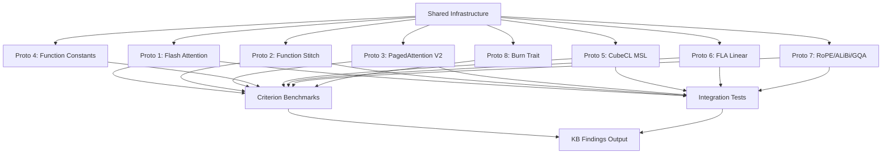

# Design: attention-proto

## Overview

Single Cargo library crate with 8 prototype modules, shared Metal infrastructure, criterion benchmarks, and integration tests. Each prototype: one MSL kernel, one host code module, one benchmark, one correctness test. Total: ~10 MSL files, ~3K lines Rust, ~1K lines MSL. Duration: 14 days (3 weeks). Location: `gpu_kernel/attention-proto/`.

## Architecture



## Components

### Shared Infrastructure (`src/device.rs`, `src/pipeline.rs`, `src/encode.rs`, `src/timing.rs`, `src/kb.rs`)

**Purpose**: Reusable Metal host code eliminating per-prototype boilerplate.

**Responsibilities**:
- **device.rs**: MTLDevice + MTLCommandQueue + MTLLibrary singleton, find_metallib() for compiled shaders
- **pipeline.rs**: PsoCache (HashMap<PsoKey, MTLComputePipelineState>) for function constant specialization, binary archive support
- **encode.rs**: alloc_buffer, alloc_buffer_with_data, dispatch_1d, dispatch_2d, read_buffer, read_buffer_slice
- **timing.rs**: benchmark_kernel_gpu_time (GPUStartTime/GPUEndTime), gpu_warmup (4 dispatches), optional MTLCounterSampleBuffer (feature-gated)
- **kb.rs**: emit_finding (JSON-lines output), KbFinding struct (domain, title, content, tags, confidence, source)

**Existing patterns**: Adapted from gpu-query/src/gpu/{device,pipeline,encode,metrics}.rs

### Proto 1: Metal Flash Attention (`src/proto1_flash.rs`, `shaders/flash_attention.metal`)

**Purpose**: Hand-written tiled attention using simdgroup_matrix. Baseline for all comparisons.

**MSL Design**:
```c
kernel void flash_attention_forward(
    device const float* Q [[buffer(0)]],      // [N, D]
    device const float* K [[buffer(1)]],      // [N, D]
    device const float* V [[buffer(2)]],      // [N, D]
    device float* O [[buffer(3)]],            // [N, D]
    constant AttentionParams& params [[buffer(4)]],
    uint2 tid [[thread_position_in_grid]]     // (query_block, head)
) {
    // Function constants: HEAD_DIM, BLOCK_R, BLOCK_C
    threadgroup float Q_tile[BLOCK_R][HEAD_DIM];
    threadgroup float K_chunk[BLOCK_C][HEAD_DIM];

    // Online softmax: running max and sum
    float m_i = -INFINITY;
    float l_i = 0.0;

    // Outer loop: key blocks (Bc)
    for (uint j = 0; j < N; j += BLOCK_C) {
        // Load K chunk (stream to fit 32KB)
        // Load V chunk

        // simdgroup_matrix S = Q_tile * K_chunk^T
        simdgroup_float8x8 acc;
        simdgroup_load(acc, Q_tile, ...);
        simdgroup_matrix_multiply_accumulate(acc, q_sg, k_sg, acc);

        // Online softmax update
        // Accumulate O += P * V
    }
    // Write O
}
```

**Tile sizes**: Br in {16, 32, 64}, Bc in {64, 80, 128}, D in {64, 128, 256} via function constants.

**Threadgroup memory budget**: At D=128, Br=32: Q_tile = 32x128x4 = 16KB. Stream K in Bc_inner=32 chunks: K_chunk = 32x128x4 = 16KB. S_partial = 32x32x4 = 4KB. Total = 36KB exceeds 32KB → reduce Bc_inner to 24 → 28KB fits.

**Host code**: Generate random Q/K/V, upload, dispatch 2D (ceil(N/Br), num_heads), read back, compare vs CPU reference.

**Benchmark**: Criterion group for D × N × tile_config. Report TFLOPS = (4*N²*D*heads / time) / 1e12.

### Proto 2: Function Stitching (`src/proto2_stitch.rs`, `shaders/flash_attention_stitched.metal`)

**Purpose**: Measure [[stitchable]] function dispatch overhead in inner loop.

**MSL Design**:
```c
// Function constant STITCH_MODE: 0=monolithic, 1=inline, 2=function_table
#if STITCH_MODE == 1
inline __attribute__((always_inline)) float compute_score(...) { ... }
#elif STITCH_MODE == 2
[[visible_function_table]] float compute_score(...) { ... }
#else
// Monolithic: inline in main kernel
#endif
```

**Host code**: Compile 3 PSO variants (STITCH_MODE 0/1/2), run identical workload (N=2048, D=128), compare wall-clock time.

**Benchmark**: 3-way comparison, 100 iterations each. Report ns/call overhead, break-even point.

### Proto 3: PagedAttention V2 (`src/proto3_paged.rs`, `shaders/paged_attention.metal`, `shaders/paged_reduce.metal`)

**Purpose**: Two-phase partitioned attention with block table indirection under 32KB constraint.

**MSL Design (Phase 1)**:
```c
kernel void paged_attention_partition(
    device const float* Q [[buffer(0)]],
    device const float* K_pool [[buffer(1)]],       // Physical page pool
    device const float* V_pool [[buffer(2)]],
    device const uint* page_table [[buffer(3)]],    // Logical → physical mapping
    device float* O_partial [[buffer(4)]],          // [num_partitions, heads, Br, D]
    device float* m_partial [[buffer(5)]],          // Running max per partition
    device float* l_partial [[buffer(6)]],          // Running sum per partition
    constant AttentionParams& params [[buffer(7)]],
    uint3 tid [[thread_position_in_grid]]           // (partition, head, query_block)
) {
    // Each threadgroup processes one partition of KV pages
    // Page size: 16 tokens/page × D=128 × 4B = 8KB
    // Two pages in threadgroup: 16KB + Q_tile 8KB = 24KB fits

    for (uint page_idx = partition_start; page_idx < partition_end; ++page_idx) {
        uint physical_page = page_table[page_idx];
        // Load K, V from physical_page offset in pool
        // Compute attention for this page
        // Update O_partial, m_partial, l_partial
    }
}
```

**MSL Design (Phase 2)**:
```c
kernel void paged_reduce(
    device const float* O_partial [[buffer(0)]],
    device const float* m_partial [[buffer(1)]],
    device const float* l_partial [[buffer(2)]],
    device float* O_final [[buffer(3)]],
    constant uint& num_partitions [[buffer(4)]],
    uint2 tid [[thread_position_in_grid]]  // (head, query_token)
) {
    // Log-sum-exp reduction across partitions
    float m_global = max(m_partial[0..num_partitions]);
    float l_global = sum(exp(m_partial[i] - m_global) * l_partial[i]);
    // Combine O_partial weighted by corrected softmax denominators
}
```

**Host code**: Allocate page pool, construct fragmented page table, two-pass dispatch, validate bit-exact vs contiguous Proto 1.

**Benchmark**: Context lengths 1K/4K/8K/16K, page sizes 8/16/32 tokens. Measure overhead vs Proto 1.

### Proto 4: Function Constant Compilation (`src/proto4_constants.rs`, reuses `flash_attention.metal`)

**Purpose**: Measure PSO compilation latency for variant scaling. 72 variants = 3 D × 3 Br × 2 Bc × 4 VARIANT.

**Host code**:
```rust
fn bench_compile_cold(variant_count: usize) -> Vec<f64> {
    let mut times = vec![];
    for i in 0..variant_count {
        let constants = MTLFunctionConstantValues::new();
        constants.setConstantValue_type_atIndex(&d, MTLDataType::UInt, 0);
        // ... set other constants

        let start = Instant::now();
        let function = library.newFunctionWithName_constantValues_error(...);
        let pso = device.newComputePipelineStateWithFunction_error(&function);
        times.push(start.elapsed().as_secs_f64());
    }
    times
}

fn bench_binary_archive(variant_count: usize) -> (f64, Vec<f64>) {
    // Build archive with all variants
    let archive_start = Instant::now();
    let archive = MTLBinaryArchive::new(device);
    for variant in 0..variant_count {
        archive.addComputePipelineFunctionsWithDescriptor_error(...);
    }
    let archive_time = archive_start.elapsed().as_secs_f64();

    // Measure load time per variant from archive
    let mut load_times = vec![];
    for variant in 0..variant_count {
        let start = Instant::now();
        let pso = device.newComputePipelineStateWithDescriptor_options_reflection_error(...);
        load_times.push(start.elapsed().as_secs_f64());
    }
    (archive_time, load_times)
}
```

**Benchmark**: Report ms/variant for cold compile (N=1/10/50/100/500), archive build time, archive load speedup.

### Proto 5: CubeCL MSL Quality (`src/proto5_cubecl.rs` with feature flag `cubecl`)

**Purpose**: Compare CubeCL-generated MSL vs hand-written Proto 1 kernel.

**Approach**:
```rust
#[cfg(feature = "cubecl")]
use cubecl::prelude::*;

#[cube(launch)]
fn attention_matmul(q: &Tensor<f32>, k: &Tensor<f32>, v: &Tensor<f32>) -> Tensor<f32> {
    // Simplified attention in CubeCL #[cube] syntax
    let scores = matmul(q, k.transpose());
    let attn_weights = softmax(scores);
    matmul(attn_weights, v)
}

fn extract_msl(cubecl_kernel: &CubeCLKernel) -> String {
    // CubeCL can dump IR and generated MSL source
    cubecl_kernel.backend().compile_kernel(...).msl_source()
}
```

**Analysis**:
1. Diff generated MSL vs Proto 1 MSL: instruction count (xcrun metal -S), simdgroup_matrix usage (grep "simdgroup_matrix")
2. Compile both via runtime newLibraryWithSource
3. Benchmark: CubeCL TFLOPS vs Proto 1 TFLOPS
4. Document: register usage from Metal GPU profiler, threadgroup memory, code complexity

**Expected outcome**: CubeCL 30-60% slower (generic codegen), no simdgroup_matrix instructions. Finding: CubeCL not viable for critical-path attention, may work for non-hot kernels.

### Proto 6: FLA Linear Attention (`src/proto6_fla.rs`, `shaders/linear_attention.metal`)

**Purpose**: Port FLA chunk_h (hidden state update) and chunk_o (output computation) to MSL.

**MSL Design (chunk_h)**:
```c
kernel void fla_chunk_h(
    device const float* K [[buffer(0)]],      // [N, D]
    device const float* V [[buffer(1)]],      // [N, D]
    device float* H [[buffer(2)]],            // [num_chunks, D, D]
    constant uint& chunk_size [[buffer(3)]],
    constant uint& head_dim [[buffer(4)]],
    uint tid [[thread_position_in_grid]]      // chunk index
) {
    uint chunk_start = tid * chunk_size;
    uint chunk_end = min(chunk_start + chunk_size, N);

    // H_chunk = K_chunk^T * V_chunk (outer product accumulation)
    threadgroup float K_chunk[CHUNK_SIZE][HEAD_DIM];
    threadgroup float V_chunk[CHUNK_SIZE][HEAD_DIM];

    // Load K, V for this chunk
    // simdgroup_matrix for D×D accumulation
    simdgroup_float8x8 h_acc;
    for (uint t = chunk_start; t < chunk_end; ++t) {
        // H += outer(K[t], V[t])
        simdgroup_matrix_multiply_accumulate(...);
    }
    // Store H[chunk_idx]
}
```

**MSL Design (chunk_o)**:
```c
kernel void fla_chunk_o(
    device const float* Q [[buffer(0)]],
    device const float* H [[buffer(1)]],      // [num_chunks, D, D]
    device float* O [[buffer(2)]],
    constant uint& chunk_size [[buffer(3)]],
    uint tid [[thread_position_in_grid]]
) {
    // O_chunk = Q_chunk * H_chunk
    // Plus intra-chunk causal attention (small softmax within chunk)
}
```

**Host code**: CPU reference linear attention (O(N*D²) recurrence), two-pass GPU dispatch, validate vs CPU.

**Benchmark**: Seq lengths 1K/4K/16K/64K (long context is where linear shines), chunk sizes 32/64/128. Compare TFLOPS vs Proto 1, report crossover point.

### Proto 7: RoPE/ALiBi/GQA Variants (`src/proto7_variants.rs`, `shaders/rope.metal`, `shaders/alibi.metal`, `shaders/gqa_remap.metal`)

**Purpose**: Empirical per-variant overhead for position encodings and grouped queries.

**MSL Design (RoPE)**:
```c
kernel void apply_rope(
    device float* q [[buffer(0)]],
    device float* k [[buffer(1)]],
    constant AttentionParams& params [[buffer(2)]],
    uint2 tid [[thread_position_in_grid]]     // (token, dim_pair)
) {
    uint token = tid.x;
    uint pair = tid.y;
    float angle = float(token) / pow(10000.0, 2.0 * float(pair) / float(params.head_dim));
    float cos_a = cos(angle);
    float sin_a = sin(angle);

    // Rotate q[token, 2*pair:2*pair+2] and k[token, 2*pair:2*pair+2]
    uint idx = token * params.head_dim + 2 * pair;
    float q0 = q[idx], q1 = q[idx+1];
    q[idx] = q0 * cos_a - q1 * sin_a;
    q[idx+1] = q0 * sin_a + q1 * cos_a;
    // Same for k
}
```

**MSL Design (ALiBi)**: Fused into Proto 1 kernel score computation. Add `bias = -slope * abs(pos_q - pos_k)` to S[i][j].

**MSL Design (GQA)**: Index remapping: `kv_head = q_head / group_size`. Measure buffer rebinding overhead.

**Host code**: Standalone kernels (isolated overhead), fused into Proto 1 (integrated overhead). Compare standalone vs fused.

**Benchmark**: N=2048, D=128, heads=32. GQA group sizes: 1 (MHA), 2, 4, 8 (MQA). Report microseconds per modifier, % overhead vs base attention.

### Proto 8: Burn Extension Trait (`src/proto8_burn.rs` with feature flag `burn-ext`)

**Purpose**: Test `trait AttentionBackend: Backend` feasibility without forking Burn.

**Design**:
```rust
#[cfg(feature = "burn-ext")]
pub trait AttentionBackend: burn::backend::Backend {
    fn flash_attention(
        q: &Tensor<Self, 3>,  // [batch, seq, dim]
        k: &Tensor<Self, 3>,
        v: &Tensor<Self, 3>,
        mask: Option<&Tensor<Self, 2>>,
    ) -> Tensor<Self, 3>;
}

// Newtype wrapper to avoid orphan rule
pub struct MetalAttentionBackend(burn_cubecl::CubeCL<burn_cubecl::MetalRuntime>);

impl burn::backend::Backend for MetalAttentionBackend {
    // Delegate all methods to inner CubeCL backend
    type Device = <burn_cubecl::CubeCL<burn_cubecl::MetalRuntime> as Backend>::Device;
    // ... delegate other associated types and methods
}

impl AttentionBackend for MetalAttentionBackend {
    fn flash_attention(...) -> Tensor<Self, 3> {
        // Call Proto 1 kernel via unsafe FFI through objc2-metal
        // Convert Burn tensors to Metal buffers
        // Dispatch Proto 1
        // Wrap output buffer back into Burn tensor
    }
}
```

**Benchmark**: Measure dispatch overhead (Burn API → Metal kernel) vs direct Proto 1 dispatch. Expected: 1-5 µs (Burn tensor metadata checks).

**Test**: Does newtype compile? Does it require unsafe? Orphan rule violations? Document code complexity, lines of boilerplate, maintenance burden.

## Data Flow

### Correctness Verification Flow
1. Generate random QKV tensors (Rust, FP32)
2. Upload to Metal buffers (StorageModeShared)
3. Dispatch GPU kernel
4. Read back output O_gpu
5. Compute CPU reference O_cpu (FP64 accumulation, then cast to FP32/FP16)
6. Compare: assert_allclose(O_gpu, O_cpu, atol, rtol)

### Benchmark Flow
1. Setup: allocate buffers, compile PSO (outside measurement)
2. GPU warmup: 4 throwaway dispatches
3. Criterion iter_custom loop:
   - Create command buffer
   - Encode kernel with buffers
   - Commit, wait
   - Extract GPUEndTime - GPUStartTime
   - Read back one element (prevent dead-code elimination)
4. Criterion statistical analysis (50 samples, 10s measurement)
5. Report: TFLOPS, bandwidth, p5/p50/p95

### Finding Generation Flow
1. Benchmark produces ProtoResult struct (variant, wall_time_us, throughput_gflops, bandwidth_gbps, notes)
2. emit_finding converts to KbFinding (domain, title, content, tags, confidence, source)
3. Write JSON-lines to findings.jsonl
4. Post-benchmark script: `python3 scripts/findings_to_kb.py findings.jsonl` ingests to KB via `gpu-forge:knowledge add`

## File Structure

```
attention-proto/
├── Cargo.toml
├── build.rs                      # Metal shader compilation
├── shaders/
│   ├── types.h                   # Shared #repr(C) structs
│   ├── flash_attention.metal     # Proto 1
│   ├── flash_attention_stitched.metal  # Proto 2
│   ├── paged_attention.metal     # Proto 3 phase 1
│   ├── paged_reduce.metal        # Proto 3 phase 2
│   ├── linear_attention.metal    # Proto 6 chunk_h, chunk_o
│   ├── rope.metal                # Proto 7
│   ├── alibi.metal               # Proto 7
│   └── gqa_remap.metal           # Proto 7
├── src/
│   ├── lib.rs
│   ├── device.rs                 # GpuDevice singleton
│   ├── pipeline.rs               # PsoCache, binary archive
│   ├── encode.rs                 # Buffer alloc, dispatch helpers
│   ├── timing.rs                 # GPU timing infrastructure
│   ├── types.rs                  # #[repr(C)] AttentionParams with layout assertions
│   ├── kb.rs                     # KB finding output (JSON-lines)
│   ├── proto1_flash.rs
│   ├── proto2_stitch.rs
│   ├── proto3_paged.rs
│   ├── proto4_constants.rs
│   ├── proto5_cubecl.rs          # Feature-gated
│   ├── proto6_fla.rs
│   ├── proto7_variants.rs
│   └── proto8_burn.rs            # Feature-gated
├── benches/
│   ├── flash_attention.rs
│   ├── function_stitch.rs
│   ├── paged_attention.rs
│   ├── constant_overhead.rs
│   ├── cubecl_comparison.rs
│   ├── linear_attention.rs
│   ├── variant_overhead.rs
│   └── burn_extension.rs
├── tests/
│   ├── integration.rs            # Correctness tests (require M4)
│   └── layout_assertions.rs      # Compile-time struct layout checks
└── scripts/
    └── findings_to_kb.py         # Parse Criterion JSON → KB entries
```

## Technical Decisions

| Decision | Options | Choice | Rationale |
|----------|---------|--------|-----------|
| **Tile size selection** | Fixed 32x32, sweep 16-64 | Sweep 16/32/64 rows, 64/80/128 cols | MFA shows warped aspect ratios optimal, must measure on M4 |
| **Threadgroup memory strategy** | Large tiles, stream K in chunks | Stream K in chunks | 32KB constraint forces streaming for D=128 |
| **Dispatch strategy** | Stitchable functions, function constants, pre-compile all | Measure both, recommend based on data | Proto 2+4 empirically determine best approach |
| **PagedAttention phases** | Single-pass, two-pass partitioned | Two-pass (partition + reduce) | Fits 32KB better, aligns with vLLM V2 |
| **Linear attention port** | CubeCL codegen, hand-written MSL | Hand-written MSL | Learn internals, CubeCL likely can't emit optimal code |
| **Reference precision** | FP32, FP64 | FP64 for CPU reference | Minimizes reference error, standard in Flash Attention tests |
| **Timing method** | Wall-clock, GPU timestamps, Metal Counters | GPU timestamps (GPUStartTime/GPUEndTime) | Per-command-buffer accuracy, excludes CPU dispatch overhead |
| **Benchmark framework** | Criterion, custom harness | Criterion with iter_custom for GPU timing | Statistical rigor, HTML reports, regression detection |
| **Build system** | Runtime compilation, build.rs | build.rs (xcrun metal) | Compile-time shader compilation standard in codebase |
| **CubeCL/Burn** | Required deps, optional | Optional (feature flags) | Proto 5/8 can fail without blocking Protos 1-4, 6-7 |

## Error Handling

| Error | Handling | User Impact |
|-------|----------|-------------|
| Metal device not found | Panic with "M4 required" | Test/benchmark fails immediately |
| Shader compilation error | Panic in build.rs with compiler output | Build fails with actionable error |
| Shader validation error | Panic in test with MTL error description | Test fails, indicates kernel bug |
| Correctness assertion failure | Panic with max_abs_err, max_rel_err, first 5 failing indices | Test fails with diagnostic data |
| Watchdog timeout | MTLCommandBuffer error, panic | Test fails, indicates kernel too slow |
| Metal allocation failure | Panic with currentAllocatedSize | Test fails, indicates memory exhaustion |
| PSO compilation failure | Panic with MTLError description | Benchmark fails, indicates invalid function constants |
| Binary archive save/load failure | Panic with file error | Proto 4 benchmark fails |
| CubeCL backend crash | Feature-gated panic, document as finding | Proto 5 fails, generates "CubeCL not viable" finding |
| Burn orphan rule violation | Compile error, document as finding | Proto 8 fails, generates "Burn fork required" finding |

## Existing Patterns to Follow

- **GpuDevice singleton**: `gpu-query/src/gpu/device.rs` — lazy_static or OnceLock for benchmarks
- **PsoCache**: `gpu-query/src/gpu/pipeline.rs` — HashMap with function constant key serialization
- **Dispatch helpers**: `gpu-query/src/gpu/encode.rs` — alloc_buffer, dispatch_1d patterns
- **CPU reference + tolerance**: `gpu-query/tests/autonomous_integration.rs` — FP64 reference, assert_allclose
- **Layout assertions**: `particle-system/src/types.rs` — offset_of! for #[repr(C)] validation
- **build.rs**: `particle-system/build.rs` — xcrun metal -std=metal3.1 -O2 for release builds
- **Criterion patterns**: `gpu-query/benches/aggregate_throughput.rs` — benchmark_group, BenchmarkId, throughput reporting
