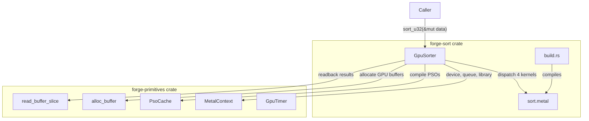
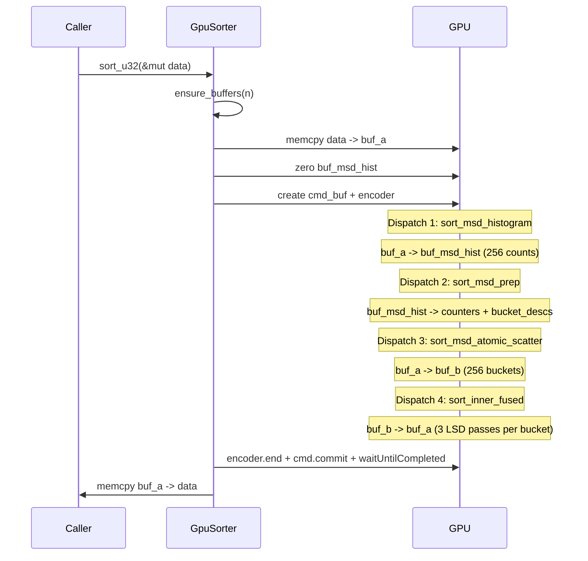

# Design: forge-sort

## Overview

Extract exp17 Investigation W radix sort into a standalone `forge-sort` crate within the `metal-forge-compute` workspace. 4 Metal kernels renamed from `exp17_*` to `sort_*`, wrapped in a `GpuSorter` struct with a single `sort_u32(&mut [u32])` method. No algorithm changes -- pure extraction with clean naming.

## Architecture



## Components

### GpuSorter

**Purpose**: Single entry point for GPU radix sort.

**Responsibilities**:
- Initialize Metal device, queue, shader library, 4 PSOs
- Manage 5 GPU buffers (grow-only)
- Copy data host->GPU, dispatch 4 kernels, copy GPU->host
- Return sorted data in-place

**Interface**:
```rust
pub struct GpuSorter {
    ctx: MetalContext,              // from forge-primitives
    pso_cache: PsoCache,           // from forge-primitives
    // Grow-only buffer pool (None until first sort)
    buf_a: Option<Retained<ProtocolObject<dyn MTLBuffer>>>,
    buf_b: Option<Retained<ProtocolObject<dyn MTLBuffer>>>,
    buf_msd_hist: Option<Retained<ProtocolObject<dyn MTLBuffer>>>,
    buf_counters: Option<Retained<ProtocolObject<dyn MTLBuffer>>>,
    buf_bucket_descs: Option<Retained<ProtocolObject<dyn MTLBuffer>>>,
    // Track current capacity for grow-only logic
    data_buf_capacity: usize,  // bytes allocated for buf_a/buf_b
}

impl GpuSorter {
    /// Initialize Metal device, queue, compile 4 sort kernel PSOs.
    pub fn new() -> Result<Self, SortError>;

    /// Sort u32 slice in-place on GPU. Empty/single-element = immediate Ok(()).
    pub fn sort_u32(&mut self, data: &mut [u32]) -> Result<(), SortError>;
}

#[derive(Debug, thiserror::Error)]
pub enum SortError {
    #[error("no Metal GPU device found")]
    DeviceNotFound,
    #[error("shader compilation failed: {0}")]
    ShaderCompilation(String),
    #[error("GPU execution failed: {0}")]
    GpuExecution(String),
}
```

**Note on SortParams naming**: forge-primitives already exports a `SortParams` type with different fields. forge-sort defines its own `MsdSortParams` (private, not exported) to avoid collision. Alternatively, since the params struct is only used internally via `setBytes`, it can be a private `#[repr(C)]` struct within `lib.rs` with no public export conflict.

### sort.metal (4 kernels)

**Purpose**: GPU compute kernels for MSD+fused-inner radix sort.

| Kernel | Source | Buffers | Grid |
|--------|--------|---------|------|
| `sort_msd_histogram` | exp17_msd_histogram | src[0], global_hist[1], params[2] | N/4096 TGs x 256 |
| `sort_msd_prep` | exp17_msd_prep | global_hist[0], counters[1], bucket_descs[2], tile_size[3] | 1 TG x 256 |
| `sort_msd_atomic_scatter` | exp17_msd_atomic_scatter | src[0], dst[1], counters[2], params[3] | N/4096 TGs x 256 |
| `sort_inner_fused` | exp17_inner_fused_v4 | buf_a[0], buf_b[1], bucket_descs[2], batch_start[3] | 256 TGs x 256 |

**Rename map** (search-replace in shader):

| Old | New |
|-----|-----|
| `EXP17_NUM_BINS` | `SORT_NUM_BINS` |
| `EXP17_TILE_SIZE` | `SORT_TILE_SIZE` |
| `EXP17_ELEMS` | `SORT_ELEMS` |
| `EXP17_THREADS` | `SORT_THREADS` |
| `EXP17_NUM_SGS` | `SORT_NUM_SGS` |
| `EXP17_MAX_TPB` | `SORT_MAX_TPB` |
| `Exp17Params` | `SortParams` |
| `exp17_msd_histogram` | `sort_msd_histogram` |
| `exp17_msd_prep` | `sort_msd_prep` |
| `exp17_msd_atomic_scatter` | `sort_msd_atomic_scatter` |
| `exp17_inner_fused_v4` | `sort_inner_fused` |

**Not extracted**: All other exp17 kernels (placeholder, compute_bucket_descs, inner_zero, inner_histogram, inner_scan_scatter, inner_fused v1/v2/v3, global_prefix, 6bit variants, bitonic, partition, precompute, large variants, fused_scatter). Only the 4 Investigation W kernels.

### build.rs

**Purpose**: Compile `shaders/sort.metal` into `sort.metallib`.

Pattern: Copy forge-primitives `build.rs` with one change: add `-std=metal3.2` flag (required for `atomic_thread_fence` in `sort_inner_fused`).

```rust
// Key difference from forge-primitives build.rs:
cmd.args(["-sdk", "macosx", "metal", "-std=metal3.2", "-c", ...]);
```

### MetalContext Integration

forge-sort creates its own `MetalContext` internally. The `MetalContext::try_load_metallib()` searches `build/` directory relative to the executable -- this works for workspace members because all crates share the same `target/` directory.

**Issue**: `MetalContext::find_metallib()` searches for `shaders.metallib` -- forge-sort's build.rs must output the same filename. Since build.rs already uses `out_dir.join("shaders.metallib")`, and `MetalContext` walks `build/` subdirectories looking for `out/shaders.metallib`, this should work without changes.

**Verification needed**: The metallib search path logic in `MetalContext::find_metallib()` iterates `target/{debug,release}/build/*/out/shaders.metallib`. With two crates producing `shaders.metallib`, the first match wins. Solution: forge-sort should NOT use `MetalContext` for library loading. Instead, load the metallib directly using the `OUT_DIR` path embedded at compile time.

**Decision**: Embed metallib path at build time:
```rust
// build.rs: output the path
println!("cargo:rustc-env=SORT_METALLIB_PATH={}", metallib_path.display());

// lib.rs: load it
const METALLIB_PATH: &str = env!("SORT_METALLIB_PATH");
```

This avoids the ambiguity of two `shaders.metallib` files in the build directory.

## Data Flow



**Buffer lifecycle per sort call**:
1. `ensure_buffers(n)`: if `buf_a` is None or `data_buf_capacity < n*4`, reallocate buf_a and buf_b. Metadata buffers (hist/counters/descs) allocated once on first call (fixed 1KB/1KB/4KB).
2. `ptr::copy_nonoverlapping`: host `data` -> `buf_a.contents()`
3. `ptr::write_bytes`: zero `buf_msd_hist` (256 x u32 = 1KB)
4. 4 dispatches in single encoder (implicit device memory barriers between dispatches)
5. `commit()` + `waitUntilCompleted()`
6. `ptr::copy_nonoverlapping`: `buf_a.contents()` -> host `data`

**Result location**: `buf_a`. Inner fused does 3 passes: pass 0 b->a, pass 1 a->b, pass 2 b->a. Final data in `buf_a`.

## Technical Decisions

| Decision | Options | Choice | Rationale |
|----------|---------|--------|-----------|
| Metallib loading | MetalContext search vs embedded path | Embedded `env!()` path | Two crates with `shaders.metallib` creates ambiguity; compile-time path is deterministic |
| Buffer management | BufferPool vs inline Option fields | Inline Option fields | Only 5 buffers; pool overhead not justified |
| Params struct name | SortParams vs MsdSortParams | Private `SortParams` (no pub export) | Metal shader uses `SortParams`; Rust struct is `#[repr(C)]` private, no name collision with forge-primitives |
| Error handling | anyhow vs custom enum | `SortError` enum | Library crate should have typed errors |
| MetalContext ownership | Shared ref vs owned | Owned | Simpler API; no lifetime coupling |
| thiserror dependency | Manual Display impl vs thiserror | thiserror | Standard practice, minimal overhead |
| Small input handling | GPU dispatch vs CPU sort | Early return `Ok(())` for n <= 1 | Dispatch overhead > benefit for tiny inputs |
| Device+queue init | Reuse forge-primitives MetalContext::new() | Yes, then load sort-specific metallib | Avoids duplicating device discovery code |

## File Structure

| File | Action | Purpose |
|------|--------|---------|
| `metal-forge-compute/Cargo.toml` | Modify | Add `"forge-sort"` to workspace members |
| `metal-forge-compute/forge-sort/Cargo.toml` | Create | Crate manifest with forge-primitives, objc2, objc2-metal, thiserror deps |
| `metal-forge-compute/forge-sort/build.rs` | Create | Compile sort.metal with -std=metal3.2, emit SORT_METALLIB_PATH |
| `metal-forge-compute/forge-sort/shaders/sort.metal` | Create | 4 kernels extracted from exp17_hybrid.metal, renamed |
| `metal-forge-compute/forge-sort/src/lib.rs` | Create | GpuSorter, SortError, private SortParams/BucketDesc structs |
| `metal-forge-compute/forge-sort/tests/correctness.rs` | Create | Multi-size correctness tests + edge cases |

### Cargo.toml (forge-sort)

```toml
[package]
name = "forge-sort"
version = "0.1.0"
edition = "2021"
description = "GPU radix sort for Apple Silicon (Metal 3.2)"

[dependencies]
forge-primitives = { path = "../forge-primitives" }
objc2 = "0.6"
objc2-metal = "0.3"
objc2-foundation = "0.3"
thiserror = "2"

[dev-dependencies]
rand = "0.8"
```

### Workspace Cargo.toml change

```toml
[workspace]
members = ["forge-bench", "forge-primitives", "forge-sort"]
resolver = "2"
```

## Error Handling

| Error Scenario | Handling Strategy | User Impact |
|----------------|-------------------|-------------|
| No Metal device | `SortError::DeviceNotFound` in `new()` | Caller knows GPU unavailable |
| Shader compile fail | `SortError::ShaderCompilation(msg)` in `new()` | Includes xcrun error text |
| Metallib not found | `SortError::ShaderCompilation("metallib not found")` in `new()` | Build system issue |
| PSO creation fails | `SortError::ShaderCompilation(kernel_name)` in `new()` | Specific kernel identified |
| Command buffer nil | `SortError::GpuExecution("command buffer")` in `sort_u32()` | Runtime Metal error |
| GPU timeout/error | `SortError::GpuExecution(status)` in `sort_u32()` | Check MTLCommandBufferStatus |

## Edge Cases

- **Empty slice (n=0)**: Return `Ok(())` immediately, no GPU dispatch
- **Single element (n=1)**: Return `Ok(())` immediately
- **n < 4096 (sub-tile)**: Works correctly -- histogram handles partial tiles via `valid[e] = idx < n` bounds checks; inner fused handles `tile_count = 1` with `local_idx < desc.count` guard
- **n not divisible by 4096**: Handled by `num_tiles = n.div_ceil(TILE_SIZE)` and per-element validity checks in kernels
- **All-same values**: One bucket gets all N elements, other 255 empty. Inner fused handles `desc.count == 0` with early return
- **Pre-sorted/reverse-sorted**: Bucket distribution may be skewed but algorithm is still correct
- **n > 32M**: Works (tested up to 32M); buf_a/buf_b grow to accommodate
- **Repeated calls with decreasing n**: Buffers never shrink, reused at previous capacity

## Test Strategy

### Unit Tests (in lib.rs)
- `SortParams` and `BucketDesc` layout: assert `size_of == 16`, field offsets correct
- `SortError` Display impl outputs expected strings

### Integration Tests (tests/correctness.rs)

```rust
#[test] fn test_sort_1k()   { sort_and_verify(1_000); }
#[test] fn test_sort_4k()   { sort_and_verify(4_000); }
#[test] fn test_sort_16k()  { sort_and_verify(16_000); }
#[test] fn test_sort_64k()  { sort_and_verify(64_000); }
#[test] fn test_sort_256k() { sort_and_verify(256_000); }
#[test] fn test_sort_1m()   { sort_and_verify(1_000_000); }
#[test] fn test_sort_4m()   { sort_and_verify(4_000_000); }
#[test] fn test_sort_16m()  { sort_and_verify(16_000_000); }
#[test] fn test_sort_32m()  { sort_and_verify(32_000_000); }

#[test] fn test_empty()         { /* sort_u32(&mut []) == Ok(()) */ }
#[test] fn test_single()        { /* sort_u32(&mut [42]) == Ok(()) */ }
#[test] fn test_all_zeros()     { sort_and_verify_data(vec![0u32; 16_000_000]); }
#[test] fn test_all_same()      { sort_and_verify_data(vec![0xDEADBEEF; 16_000_000]); }
#[test] fn test_pre_sorted()    { sort_and_verify_data((0..16_000_000u32).collect()); }
#[test] fn test_reverse_sorted(){ sort_and_verify_data((0..16_000_000u32).rev().collect()); }
#[test] fn test_non_tile_aligned() { sort_and_verify(4097); } // 4096+1

fn sort_and_verify(n: usize) {
    let mut data: Vec<u32> = /* random */;
    let mut expected = data.clone();
    expected.sort();
    let mut sorter = GpuSorter::new().unwrap();
    sorter.sort_u32(&mut data).unwrap();
    assert_eq!(data, expected);
}
```

### Performance Tests (optional, not in CI)
- Assert 16M sort completes in < 10ms (sanity, not perf target)
- Benchmark harness integration with forge-bench is out of scope

## Performance Considerations

- **Zero-copy impossible**: `sort_u32(&mut [u32])` requires host memcpy to/from GPU buffer because Metal buffers need `StorageModeShared` allocation. Caller's slice is heap-allocated, not Metal-allocated. Memcpy is ~1GB/s for 16M (64ms round-trip) but actual sort is ~3ms. Future API could expose `sort_buffer()` taking pre-allocated Metal buffer.
- **Single encoder, 4 dispatches**: Implicit device memory barriers between dispatches (~1us overhead each). No encoder boundaries needed.
- **Buffer reuse**: Grow-only strategy means repeated same-size sorts have zero allocation overhead after first call.
- **Metadata buffers**: 1KB + 1KB + 4KB = 6KB total, allocated once, never grow.

## Security Considerations

- No user-controlled shader input (kernel constants are compile-time)
- Buffer bounds: all kernel reads guarded by `idx < n` / `local_idx < desc.count`
- No network I/O, no file I/O beyond metallib loading

## Existing Patterns to Follow

Based on forge-primitives codebase:
- **Cargo.toml**: Same dependency versions (objc2 0.6, objc2-metal 0.3, objc2-foundation 0.3)
- **build.rs**: Same xcrun metal/metallib compilation pattern, add `-std=metal3.2`
- **#[repr(C)] structs**: 16-byte aligned params structs matching Metal layout
- **PsoCache**: Use `get_or_create()` for lazy PSO compilation with maxTotalThreadsPerThreadgroup=256
- **alloc_buffer**: StorageModeShared, same helper function
- **Buffer readback**: `read_buffer_slice` pattern with unsafe pointer cast
- **Tests**: Integration tests use real Metal device (no mocks)

## Implementation Steps

1. Add `"forge-sort"` to `metal-forge-compute/Cargo.toml` workspace members
2. Create `forge-sort/Cargo.toml` with dependencies
3. Create `forge-sort/build.rs` (copy forge-primitives build.rs, add `-std=metal3.2`, emit `SORT_METALLIB_PATH`)
4. Extract 4 kernels + `SortParams` + `BucketDesc` from `exp17_hybrid.metal` into `forge-sort/shaders/sort.metal`, rename all `EXP17_*` to `SORT_*` and kernel names
5. Create `forge-sort/src/lib.rs` with `GpuSorter`, `SortError`, private structs, `sort_u32()` dispatch logic (adapted from `bench_investigation_w_at_size`)
6. Create `forge-sort/tests/correctness.rs` with 16 tests (9 sizes + 7 edge cases)
7. Run `cargo build -p forge-sort` -- verify shader compilation
8. Run `cargo test -p forge-sort` -- verify all correctness tests pass
