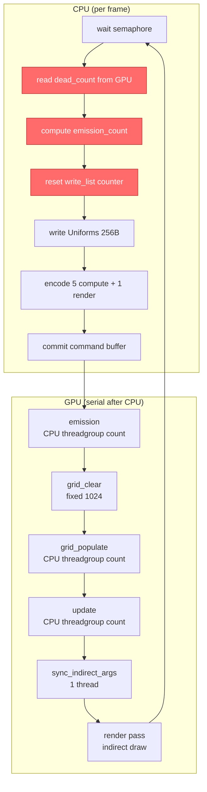
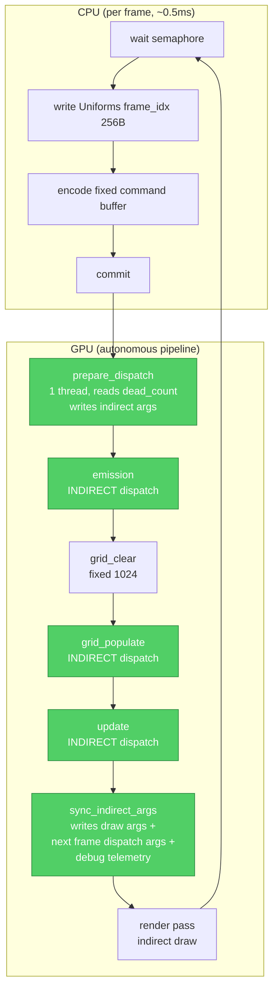
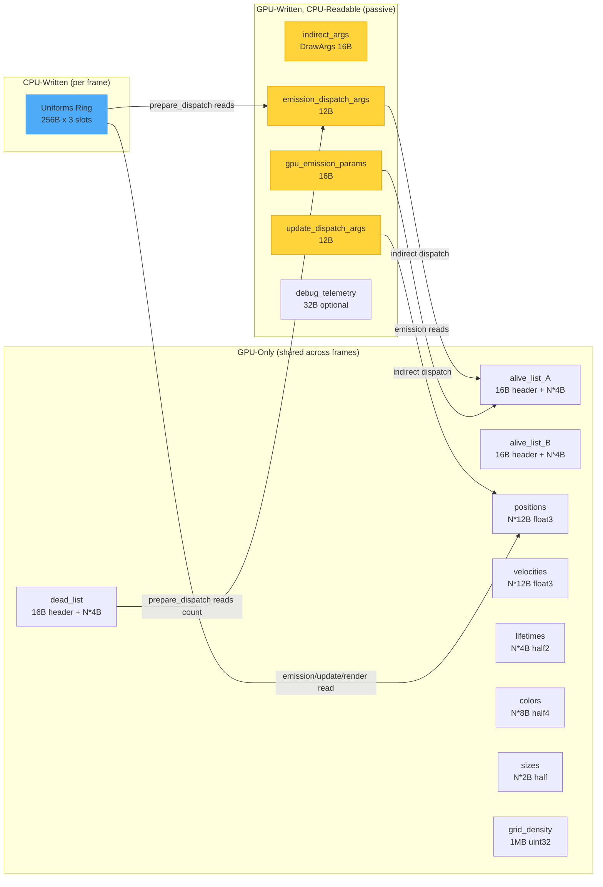

# Technical Architecture: CPU-Orchestrated to GPU-Centric Particle System

**Date**: 2026-02-10
**Architect**: Technical Architect Agent (Deep-Mode Foreman Spec)
**System**: gpu-particle-system (particle-system/)
**Codebase State**: Working, CPU-orchestrated, 10M particles @ 60fps on M4
**Target**: Full GPU-centric architecture via Metal 3 indirect dispatch + triple buffering

---

## 1. KB Findings Referenced

All architecture decisions cite GPU-Forge knowledge base findings. The table below lists every finding referenced in this document.

| KB ID | Skill | Topic | Relevance to Architecture |
|-------|-------|-------|--------------------------|
| 22 | gpu-silicon | Threadgroup memory / tile memory | 32KB threadgroup limit; Apple Silicon tile memory reuse; informs prepare_dispatch design (no threadgroup memory needed) |
| 23 | gpu-silicon | Uniform register prefetch | `constant` address space enables hardware prefetch for Uniforms reads in prepare_dispatch |
| 52 | metal4-api | Metal 4 command buffer lifecycle | Long-lived command buffers inform Metal 4 spike design; current Metal 3 approach uses transient command buffers |
| 133 | metal-compute | Command submission path | Full Metal command path (CPU encode -> ASC doorbell -> GPU exec); informs understanding of encoder overhead |
| 134 | metal-compute | Empty kernel round-trip overhead | ~120us on M2 Max for empty kernel; prepare_dispatch overhead budget |
| 137 | metal-compute | Command buffer best practice | 1-2 command buffers per frame; batch encoders; informs encoder strategy |
| 143 | metal-compute | Completion handler patterns | addCompletedHandler + semaphore for triple buffering; current code already uses this |
| 148 | metal-compute | dispatchThreadgroups indirect API | Core API: reads 3x uint32 from GPU buffer for threadgroup counts; threadgroup size CPU-specified; available since macOS 10.14 |
| 149 | metal-compute | ICB compute dispatch encoding | Metal 3+ ICBs for GPU-encoded dispatches; 16,384 command limit; follow-on phase |
| 151 | metal-compute | No persistent kernels on Metal | GPU watchdog + no forward progress guarantee; validates our multi-dispatch architecture over megakernel |
| 153 | metal-compute | SharedStorage ring buffer | Unified memory: CPU+GPU same physical address; 32-bit atomics natively supported; ring buffer pattern for triple buffering |
| 154 | metal-compute | Shared buffer coherency concern | gfx-rs found intermittent coherency issues with StorageModeShared; mitigated by semaphore-guarded access pattern |
| 165 | metal-compute | Encoder allocation is cheap | Encoders are "very inexpensive to allocate"; driver coalesces sequential compute encoders; validates separate-encoder-per-kernel approach |
| 184 | msl-kernels | MSL atomic types | atomic_uint for dead/alive list counters; no float atomics; informs counter management |
| 232 | gpu-io | Triple buffering canonical pattern | dispatch_semaphore(3), buffer[n%3], completion handler signal; THE pattern for our Phase 2 |
| 250 | gpu-io | Memory bandwidth gap | M4: 100 GB/s memory bandwidth; triple buffering essential for pre-staging data |
| 262 | gpu-perf | Device/constant match threadgroup perf | On Family 9 (M3/M4), device/constant buffer reads can match threadgroup memory; no need for prepare_dispatch to use threadgroup memory |
| 276 | gpu-perf | Command buffers per frame | 1-2 command buffers with triple buffering; batch compute encoders per CB |
| 277 | gpu-perf | Indirect dispatch eliminates sync | Core finding: MTLDispatchThreadgroupsIndirectArguments eliminates CPU-GPU synchronization for GPU-generated dispatch args |
| 278 | gpu-perf | Metal 4 unified compute encoder | Unified encoder handles compute + blits; pass barriers for serialization; future optimization |
| 279 | gpu-perf | waitUntilCompleted anti-pattern | Validates our semaphore-based approach; blocking calls create GPU bubbles |
| 283 | gpu-perf | Atomic contention scales with cores | Global atomics bottleneck on Pro/Max; prepare_dispatch uses single-thread pattern (no contention) |
| 301 | gpu-centric-arch | ICB speedup: 39-44% on Apple Silicon | Validates ICB as follow-on; M1 39% faster with ICB vs CPU loop |
| 368 | gpu-centric-arch | UMA eliminates GPU-centric barrier | Zero-copy data sharing on Apple Silicon; pointer passing not data copying; validates StorageModeShared |
| 440 | gpu-centric-arch | No persistent kernels; ICB alternative | Metal 3+ ICBs closest to persistent patterns; validates multi-dispatch + indirect architecture |
| 441 | gpu-centric-arch | Metal GPU watchdog timeout | Command buffer timeout kills long-running shaders; validates separate dispatches over megakernel |
| 442 | gpu-centric-arch | Metal 4 unified compute encoder | Consolidates dispatches, blits, accel structure builds; pass barriers for serial dependencies; future target |
| 451 | gpu-centric-arch | GPU dispatch overhead | CUDA: 2.1us/launch via streams; straggler effects reduce bandwidth utilization to ~50%; validates combining work in fewer dispatches |
| 453 | gpu-centric-arch | ICBs as Metal's Work Graphs equivalent | GPU compute fills ICBs executed in subsequent passes; more limited than DX12 Work Graphs |
| 555 | metal4-api | GPU Work Graphs | GPU-driven work amplification; mesh shader nodes; Metal 4 direction for future exploration |

---

## 2. Architecture Overview

### 2.1 Current Pipeline (CPU-Orchestrated)

The current system has a CPU-in-the-loop bottleneck where the host reads GPU state, computes dispatch parameters, and writes them back. Single-buffered (`MAX_FRAMES_IN_FLIGHT = 1`) means CPU and GPU execute strictly serially.



**Data flow bottleneck (red nodes)**: CPU reads `dead_list.contents().count` (4 bytes GPU->CPU), computes `emission_count = min(base + burst, dead_count)`, writes it back to `uniforms.emission_count`, and computes threadgroup counts for all variable-size dispatches. This creates a hard GPU->CPU->GPU round-trip every frame.

### 2.2 Target Pipeline (GPU-Centric)



**Key changes (green nodes)**: All GPU state reads and dispatch sizing move to GPU kernels. CPU writes only Uniforms (declarative intent: `base_emission_rate`, not computed `emission_count`). Triple buffering enables 2-3 frames of CPU-GPU overlap.

### 2.3 Triple-Buffered Timeline

```mermaid
gantt
    title Triple-Buffered Frame Timeline
    dateFormat X
    axisFormat %L

    section CPU
    Frame N encode     :a1, 0, 5
    Frame N+1 encode   :a2, 5, 10
    Frame N+2 encode   :a3, 10, 15
    Frame N+3 encode   :a4, 15, 20

    section GPU
    Frame N execute    :b1, 2, 17
    Frame N+1 execute  :b2, 7, 22
    Frame N+2 execute  :b3, 12, 27
```



With triple buffering [KB 232], the CPU can encode frame N+1 while the GPU executes frame N. The dispatch_semaphore(3) ensures at most 3 frames are in flight. The CPU blocks only when all 3 slots are occupied.

### 2.4 Buffer Ownership Diagram



---

## 3. New Kernel: `prepare_dispatch`

### 3.1 Purpose

The `prepare_dispatch` kernel is a single-thread compute kernel that runs at the start of each frame's GPU pipeline. It replaces all CPU-side readback and dispatch computation:

1. Reads `dead_list.count` (atomic counter at buffer offset 0)
2. Reads `uniforms.base_emission_rate` and `uniforms.burst_count`
3. Computes `emission_count = min(base_emission_rate + burst_count, dead_count)`
4. Computes `actual_burst_count = min(burst_count, emission_count)`
5. Writes emission_count and actual_burst_count to `GpuEmissionParams` buffer
6. Writes `ceil(emission_count / 256)` to `emission_dispatch_args` buffer
7. Resets `write_list` counter to 0

### 3.2 MSL Design

```metal
// prepare_dispatch.metal -- GPU-side emission count computation and dispatch arg generation.
//
// Single-thread kernel: reads dead count, computes emission count, writes indirect
// dispatch arguments and GPU emission parameters. Also resets write list counter.

#include "types.h"

/// GPU-computed emission parameters communicated to the emission kernel.
/// Written by prepare_dispatch, read by emission_kernel.
struct GpuEmissionParams {
    uint emission_count;       // actual count after min(requested, available)
    uint actual_burst_count;   // burst_count clamped to emission_count
    uint _pad0;
    uint _pad1;
};

/// Indirect dispatch arguments matching MTLDispatchThreadgroupsIndirectArguments.
/// 3 x uint32: threadgroupsPerGridX, threadgroupsPerGridY, threadgroupsPerGridZ.
struct DispatchArgs {
    uint threadgroupsPerGridX;
    uint threadgroupsPerGridY;
    uint threadgroupsPerGridZ;
};

/// Threadgroup size for emission kernel (must match emission_kernel dispatch).
constant uint EMISSION_THREADGROUP_SIZE = 256;

kernel void prepare_dispatch(
    device const uint*         dead_list         [[buffer(0)]],  // read: dead_count at offset 0
    constant Uniforms&         uniforms          [[buffer(1)]],  // read: base_emission_rate, burst_count, pool_size
    device uint*               write_list        [[buffer(2)]],  // write: reset counter to 0
    device DispatchArgs*       emission_args     [[buffer(3)]],  // write: indirect dispatch args for emission
    device GpuEmissionParams*  emission_params   [[buffer(4)]],  // write: computed emission count for emission kernel
    uint                       tid               [[thread_position_in_grid]]
) {
    if (tid != 0) return;

    // --- Reset write list counter to 0 ---
    // The write list counter is at offset 0 (first uint of CounterHeader).
    // This replaces the CPU-side: (*write_ptr).count = 0
    write_list[0] = 0;

    // --- Read dead count ---
    // dead_list[0] is the atomic counter value. At this point in the pipeline,
    // no other kernel is running, so a non-atomic read is safe.
    uint dead_count = dead_list[0];

    // --- Compute emission count (GPU-side, no CPU readback needed) ---
    uint base_emission = uniforms.base_emission_rate;
    uint burst = uniforms.burst_count;
    uint total_requested = base_emission + burst;
    uint emission_count = min(total_requested, dead_count);

    // Actual burst count must not exceed total emission
    uint actual_burst = min(burst, emission_count);

    // --- Write GPU emission parameters (for emission kernel to read) ---
    emission_params->emission_count = emission_count;
    emission_params->actual_burst_count = actual_burst;

    // --- Write indirect dispatch args for emission kernel ---
    // Clamp threadgroups to pool_size / THREADGROUP_SIZE as defense-in-depth
    uint threadgroups = (emission_count + EMISSION_THREADGROUP_SIZE - 1) / EMISSION_THREADGROUP_SIZE;
    uint max_threadgroups = (uniforms.pool_size + EMISSION_THREADGROUP_SIZE - 1) / EMISSION_THREADGROUP_SIZE;
    threadgroups = min(threadgroups, max_threadgroups);

    emission_args->threadgroupsPerGridX = threadgroups;
    emission_args->threadgroupsPerGridY = 1;
    emission_args->threadgroupsPerGridZ = 1;
}
```

### 3.3 Buffer Bindings

| Index | Buffer | Access | Size | Purpose |
|-------|--------|--------|------|---------|
| 0 | `dead_list` | read | 16B header + N*4B | Read `count` at offset 0 |
| 1 | `uniforms` | read (constant) | 256B | Read `base_emission_rate`, `burst_count`, `pool_size` |
| 2 | `write_list` | write | 16B header + N*4B | Reset counter at offset 0 to zero |
| 3 | `emission_dispatch_args` | write | 12B | Write MTLDispatchThreadgroupsIndirectArguments |
| 4 | `gpu_emission_params` | write | 16B | Write emission_count + actual_burst_count |

### 3.4 Thread Safety Analysis

The `prepare_dispatch` kernel runs as a **single thread** dispatched as `MTLSize{1,1,1}` threadgroups of `MTLSize{1,1,1}` threads. At this point in the command buffer:

- No other compute encoder is active (Metal serializes encoders within a command buffer)
- The dead_list counter reflects the true count from the *previous frame's* update kernel
- The write_list counter can be safely zeroed because no other kernel writes to it yet
- The emission_dispatch_args buffer has no concurrent readers

The `if (tid != 0) return` guard is technically unnecessary for a 1x1 dispatch but provides defense-in-depth and makes the single-thread intent explicit [KB 134: ~120us empty kernel overhead on M2 Max, dominated by encoder setup, not compute].

### 3.5 Emission Kernel Modification

The emission kernel must be modified to read from `GpuEmissionParams` instead of `uniforms.emission_count`:

```metal
// BEFORE (reads CPU-computed emission_count from uniforms):
//   if (tid >= uniforms.emission_count) return;

// AFTER (reads GPU-computed emission_count from side-channel buffer):
kernel void emission_kernel(
    constant Uniforms&            uniforms       [[buffer(0)]],
    device uint*                  dead_list      [[buffer(1)]],
    device uint*                  alive_list     [[buffer(2)]],
    device packed_float3*         positions      [[buffer(3)]],
    device packed_float3*         velocities     [[buffer(4)]],
    device half2*                 lifetimes      [[buffer(5)]],
    device half4*                 colors         [[buffer(6)]],
    device half*                  sizes          [[buffer(7)]],
    device const GpuEmissionParams* emission_params [[buffer(8)]],  // NEW
    uint                          tid            [[thread_position_in_grid]]
) {
    // Guard: use GPU-computed emission_count
    if (tid >= emission_params->emission_count) return;

    // Burst detection: use GPU-computed actual_burst_count
    bool is_burst = (tid < emission_params->actual_burst_count);

    // ... rest of emission kernel unchanged ...
}
```

The `GpuEmissionParams` struct must be defined in `types.h` so both `prepare_dispatch.metal` and `emission.metal` can include it.

---

## 4. Indirect Dispatch Integration

### 4.1 MTLDispatchThreadgroupsIndirectArguments Struct Layout

Per Apple documentation and [KB 148], the struct is:

```c
typedef struct {
    uint32_t threadgroupsPerGrid[3];  // [X, Y, Z] at byte offsets 0, 4, 8
} MTLDispatchThreadgroupsIndirectArguments;
// Total: 12 bytes, 4-byte aligned
```

The indirect buffer offset passed to `dispatchThreadgroupsWithIndirectBuffer` must be a multiple of 4.

### 4.2 Rust-Side DispatchArgs Struct

Add to `types.rs`:

```rust
/// Indirect compute dispatch arguments matching MTLDispatchThreadgroupsIndirectArguments.
/// 3 x u32 = 12 bytes. The GPU writes threadgroup counts here; the CPU passes this
/// buffer to dispatchThreadgroupsWithIndirectBuffer.
#[repr(C)]
#[derive(Clone, Copy, Debug, Default)]
pub struct DispatchArgs {
    pub threadgroups_per_grid: [u32; 3],  // [X, Y, Z]
}
```

Layout test:
```rust
#[test]
fn test_dispatch_args_layout() {
    assert_eq!(std::mem::size_of::<DispatchArgs>(), 12);
    assert_eq!(std::mem::align_of::<DispatchArgs>(), 4);
    // Verify offset of each element
    let args = DispatchArgs { threadgroups_per_grid: [10, 1, 1] };
    let base = &args as *const DispatchArgs as *const u8;
    unsafe {
        assert_eq!(*(base as *const u32), 10);       // X at offset 0
        assert_eq!(*(base.add(4) as *const u32), 1); // Y at offset 4
        assert_eq!(*(base.add(8) as *const u32), 1); // Z at offset 8
    }
}
```

### 4.3 objc2-metal API for Indirect Dispatch

Verified via docs.rs, the objc2-metal binding is:

```rust
unsafe fn dispatchThreadgroupsWithIndirectBuffer_indirectBufferOffset_threadsPerThreadgroup(
    &self,
    indirect_buffer: &ProtocolObject<dyn MTLBuffer>,
    indirect_buffer_offset: NSUInteger,  // must be multiple of 4
    threads_per_threadgroup: MTLSize,
)
```

This method is available on `MTLComputeCommandEncoder`. The `indirect_buffer` contains a `MTLDispatchThreadgroupsIndirectArguments` struct at the given offset. The `threads_per_threadgroup` is still CPU-specified (fixed at `MTLSize { width: 256, height: 1, depth: 1 }` for all our compute kernels).

Per [KB 277]: "Indirect dispatch eliminates CPU-GPU synchronization when dispatch arguments are GPU-generated. CPU issues dispatch immediately; GPU fills arguments and executes without CPU intervention." This is the core enabler: the CPU encodes the dispatch call *before* knowing the threadgroup count, and the GPU fills in the count at runtime.

### 4.4 Rust Dispatch Code Transformation

**Before (CPU-computed threadgroup count)**:
```rust
// main.rs: emission dispatch
let threadgroup_count = (emission_count as usize).div_ceil(256);
compute_encoder.dispatchThreadgroups_threadsPerThreadgroup(
    MTLSize { width: threadgroup_count, height: 1, depth: 1 },
    MTLSize { width: 256, height: 1, depth: 1 },
);
```

**After (GPU-computed indirect dispatch)**:
```rust
// main.rs: emission dispatch via indirect buffer
unsafe {
    compute_encoder
        .dispatchThreadgroupsWithIndirectBuffer_indirectBufferOffset_threadsPerThreadgroup(
            &pool.emission_dispatch_args,
            0, // offset: MTLDispatchThreadgroupsIndirectArguments starts at byte 0
            MTLSize { width: 256, height: 1, depth: 1 },
        );
}
```

The CPU no longer needs `emission_count` to compute the dispatch size. The GPU `prepare_dispatch` kernel has already written the correct threadgroup count to `emission_dispatch_args`.

### 4.5 Phase 3: Indirect Dispatch for Update and Grid Populate

In Phase 3, the `sync_indirect_args` kernel (which already runs after the update kernel) is extended to also write dispatch args for the *next frame's* grid_populate and update kernels:

```metal
// Extended sync_indirect_args: write draw args + next-frame dispatch args
kernel void sync_indirect_args(
    device const uint*  alive_list       [[buffer(0)]],  // write_list (survivors)
    device DrawArgs*    indirect_args    [[buffer(1)]],  // draw args for render
    device DispatchArgs* update_args     [[buffer(2)]],  // dispatch args for next frame's update + grid_populate
    uint                tid              [[thread_position_in_grid]]
) {
    if (tid != 0) return;

    uint alive_count = alive_list[0];

    // Write indirect draw args (existing behavior)
    indirect_args->instanceCount = alive_count;
    indirect_args->vertexCount = 4;
    indirect_args->vertexStart = 0;
    indirect_args->baseInstance = 0;

    // Write dispatch args for next frame's update and grid_populate kernels
    uint threadgroups = (alive_count + 255) / 256;
    update_args->threadgroupsPerGridX = threadgroups;
    update_args->threadgroupsPerGridY = 1;
    update_args->threadgroupsPerGridZ = 1;
}
```

The `update_dispatch_args` buffer is used by both `grid_populate` and `update_physics_kernel` dispatches in the next frame. Since both use `pool_size / 256` threadgroups with an `alive_count` guard, they can share the same dispatch args buffer. However, there is a subtlety: the alive_count written here is from the *current frame's* write_list, but the next frame's read_list (after ping-pong) will have the same count. The guard in the kernel (`if tid >= alive_count return`) reads the counter from the alive list header, so the dispatch args just need to be >= the actual alive count. Using pool_size / 256 (the maximum) is safe but wasteful for small alive counts; using alive_count / 256 is optimal.

**Initial dispatch bootstrap**: On the first frame, `update_dispatch_args` has not been written by any GPU kernel yet. It must be initialized to `{ pool_size / 256, 1, 1 }` by the CPU during pool creation, or grid_populate and update must use CPU-computed dispatch for the first frame. The simplest approach: initialize the buffer to `{ pool_size / 256, 1, 1 }` during `ParticlePool::new()`.

---

## 5. Triple Buffering Design

### 5.1 Per-Frame Uniform Ring

Following Apple's canonical triple buffering pattern [KB 232]:

```
Frame 0: uniforms[0] (256 bytes at offset 0)
Frame 1: uniforms[1] (256 bytes at offset 256)
Frame 2: uniforms[2] (256 bytes at offset 512)
Total: 768 bytes (3 x 256)
```

Implementation approach: allocate a single 768-byte MTLBuffer with StorageModeShared. Each frame, the CPU writes to `offset = frame_index * 256`. All compute encoders in that frame bind the buffer at the correct offset via `setBuffer_offset_atIndex`.

```rust
// FrameRing or ParticlePool:
pub uniform_ring: Retained<ProtocolObject<dyn MTLBuffer>>,  // 768 bytes

// Per-frame:
let uniform_offset = self.frame_ring.frame_index() * std::mem::size_of::<Uniforms>();

// When binding to compute encoder:
compute_encoder.setBuffer_offset_atIndex(
    Some(&pool.uniform_ring),
    uniform_offset,  // byte offset for this frame's slot
    0,  // buffer index in shader
);
```

### 5.2 FrameRing Changes

```rust
const MAX_FRAMES_IN_FLIGHT: usize = 3;  // Changed from 1

pub struct FrameRing {
    semaphore: DispatchRetained<DispatchSemaphore>,  // semaphore count = 3
    frame_index: usize,  // cycles 0, 1, 2
    // ... rest unchanged ...
}

impl FrameRing {
    pub fn new() -> Self {
        Self {
            semaphore: DispatchSemaphore::new(MAX_FRAMES_IN_FLIGHT as isize),
            frame_index: 0,
            // ...
        }
    }

    pub fn advance(&mut self) {
        self.frame_index = (self.frame_index + 1) % MAX_FRAMES_IN_FLIGHT;
    }
}
```

### 5.3 Data Race Analysis for Shared SoA Buffers

**Question**: With 3 frames in flight, can frame N's update kernel write to SoA data while frame N+1's emission kernel reads from the same SoA slots?

**Answer: No race exists**, due to the ping-pong alive list mechanism.

The invariant: **no SoA slot index appears in both the read_list and write_list simultaneously**. Here is why:

1. The read_list contains indices of particles that survived the *previous* frame (output of the previous update kernel).
2. The write_list (initially counter=0) will receive indices of particles that survive *this* frame.
3. The emission kernel appends *new* particle indices to the read_list (from the dead list). These indices were previously dead -- their SoA slots are not in any alive list.
4. The update kernel reads from the read_list and writes survivors to the write_list. A particle either survives (goes to write_list) or dies (goes to dead_list). It never appears in both.
5. New particles emitted in step 3 get written to the read_list. The update kernel processes them (reads from read_list indices). The SoA data for these particles was written by the emission kernel *before* the update kernel runs (sequential within the command buffer).

**With triple buffering**: Frame N's command buffer and frame N+1's command buffer are in-flight simultaneously. However:

- Frame N's kernels operate on `read_list = alive_list_A, write_list = alive_list_B` (if ping_pong = false)
- Frame N+1's kernels operate on `read_list = alive_list_B, write_list = alive_list_A` (if ping_pong = true)

Frame N's update writes to `alive_list_B` indices. Frame N+1's emission writes to `alive_list_B` indices (its read list). **These are different index sets**: frame N's update wrote survivors there, and frame N+1's emission appends new particles to the counter that N's update already finished incrementing.

**But wait**: The SoA buffers (positions, velocities, etc.) are shared. Frame N's update kernel writes to SoA[idx] for each surviving particle. Frame N+1's emission kernel writes to SoA[dead_idx] for each newly emitted particle. Since dead_idx comes from the dead list and alive_idx comes from the alive list, and these are disjoint sets, **there is no SoA data race**.

The only remaining concern is the dead list counter itself. Frame N's update kernel increments the dead counter (returning dead particles). Frame N+1's prepare_dispatch reads the dead counter. Since these execute in different command buffers submitted sequentially, Metal guarantees that frame N's command buffer completes all work before frame N+1's prepare_dispatch reads the counter (due to serial command queue execution).

**Conclusion**: Triple buffering of SoA data is safe given ping-pong semantics. Only the Uniforms buffer requires tripling (per-frame slots), because the CPU writes different values each frame and the GPU may still be reading the previous frame's uniforms [KB 232, KB 153].

### 5.4 Pool Growth Under Triple Buffering

Pool growth (`pool.grow(new_size)`) replaces all SoA buffer references. With triple buffering, up to 3 command buffers may reference the old buffers.

**Strategy: Drain all in-flight frames before growing.**

```rust
// In render(), before grow:
if let Some(new_size) = self.input.pending_grow.take() {
    // Drain all in-flight frames (wait for all 3 semaphore slots)
    for _ in 0..MAX_FRAMES_IN_FLIGHT {
        self.frame_ring.acquire();
    }
    // GPU is fully idle now
    pool.grow(new_size);
    // Re-initialize dispatch args buffers for new pool_size
    pool.init_update_dispatch_args();
    // Re-signal semaphores to restore count
    for _ in 0..MAX_FRAMES_IN_FLIGHT {
        self.frame_ring.signal();
    }
    // Acquire normally for this frame
    self.frame_ring.acquire();
}
```

Metal command buffers retain their bound resources (MTLBuffer is reference-counted), so in-flight command buffers referencing old buffers will keep them alive until GPU completion [KB 52: Metal 3 command buffers implicitly retain resources].

### 5.5 Coherency Guarantee

[KB 154] warns about intermittent coherency issues with `StorageModeShared`. However, our pattern is safe because:

1. The dispatch_semaphore guarantees that the CPU does not overwrite uniforms[frame_idx] until the GPU signals completion for that frame slot.
2. Metal command buffers within a serial command queue execute in order.
3. The CPU does not read from GPU-written buffers in the hot path (the HUD alive count read from `indirect_args.instanceCount` is inherently stale by 1-2 frames, which is acceptable for display).

The gfx-rs coherency issue was about concurrent CPU-GPU access without semaphore protection. Our semaphore-guarded triple buffering avoids this pattern entirely.

---

## 6. Sync_indirect_args Evolution

### 6.1 Current Implementation

The current `sync_indirect_args` kernel is minimal:

```metal
kernel void sync_indirect_args(
    device const uint*  alive_list    [[buffer(0)]],
    device DrawArgs*    indirect_args [[buffer(1)]],
    uint                tid           [[thread_position_in_grid]]
) {
    if (tid != 0) return;
    indirect_args->instanceCount = alive_list[0];
    indirect_args->vertexCount = 4;
    indirect_args->vertexStart = 0;
    indirect_args->baseInstance = 0;
}
```

### 6.2 Phase 3 Evolution

In Phase 3, this kernel becomes the "end-of-frame bookkeeper" that also writes dispatch args for the next frame's variable-count kernels and optionally writes debug telemetry:

```metal
/// Extended sync_indirect_args: writes render draw args, next-frame compute dispatch
/// args, and optional debug telemetry. Single-thread kernel, runs after update/compaction.
kernel void sync_indirect_args(
    device const uint*    alive_list       [[buffer(0)]],  // write_list (this frame's survivors)
    device DrawArgs*      draw_args        [[buffer(1)]],  // indirect draw args for render
    device DispatchArgs*  update_args      [[buffer(2)]],  // dispatch args for NEXT frame's update + grid_populate
#if DEBUG_TELEMETRY
    device DebugTelemetry* telemetry       [[buffer(3)]],  // optional debug output
    constant Uniforms&    uniforms         [[buffer(4)]],  // for frame_number
#endif
    uint                  tid              [[thread_position_in_grid]]
) {
    if (tid != 0) return;

    uint alive_count = alive_list[0];

    // --- Write indirect draw args (existing) ---
    draw_args->instanceCount = alive_count;
    draw_args->vertexCount = 4;
    draw_args->vertexStart = 0;
    draw_args->baseInstance = 0;

    // --- Write dispatch args for next frame's update + grid_populate ---
    uint update_threadgroups = (alive_count + 255) / 256;
    // Clamp to at least 1 threadgroup to avoid zero-dispatch edge case
    // (zero dispatch is valid but some debug tools report it as warning)
    update_args->threadgroupsPerGridX = max(update_threadgroups, 1u);
    update_args->threadgroupsPerGridY = 1;
    update_args->threadgroupsPerGridZ = 1;

#if DEBUG_TELEMETRY
    // --- Write debug telemetry ---
    telemetry->frame_number = uniforms.frame_number;
    telemetry->alive_count_post_update = alive_count;
    telemetry->update_threadgroups = update_threadgroups;
#endif
}
```

### 6.3 Timing Considerations

The sync_indirect_args kernel writes `update_dispatch_args` for the **next** frame. This is safe because:

1. The next frame's grid_populate and update dispatches have not been encoded yet (they are in a future command buffer).
2. The `update_dispatch_args` buffer is written by exactly one thread in exactly one kernel per frame (sync_indirect_args).
3. Command queue serialization ensures sync_indirect_args completes before the next frame's command buffer begins execution.

This "write for next frame" pattern avoids needing a separate prepare-dispatch kernel for the update path. The prepare_dispatch kernel handles only the emission path (which depends on dead_count, not alive_count).

---

## 7. Debug Infrastructure

### 7.1 F1 Programmatic GPU Capture

Metal's programmatic capture API enables on-demand GPU state inspection without running under Xcode.

**API components (verified via Apple Developer documentation)**:

1. `MTLCaptureManager.shared()` - singleton capture manager
2. `MTLCaptureDescriptor` - configures capture target (device, command queue, or scope) and destination (GPU trace document or developer tools)
3. `MTLCaptureScope` - defines capture boundaries
4. `MTLCaptureDestination.gpuTraceDocument` - saves .gputrace file to disk for later analysis in Xcode

**Implementation in Rust via objc2-metal**:

```rust
// InputState addition:
pub capture_next_frame: bool,  // toggled by F1

// In render(), after creating command buffer:
if self.input.capture_next_frame {
    self.input.capture_next_frame = false;

    // Create capture descriptor
    let capture_manager = unsafe { MTLCaptureManager::sharedCaptureManager() };
    let descriptor = MTLCaptureDescriptor::new();
    descriptor.setCaptureObject(&*gpu.command_queue);  // capture entire queue
    descriptor.setDestination(MTLCaptureDestination::GPUTraceDocument);

    // Set output path
    let trace_url = NSURL::fileURLWithPath(&NSString::from_str("/tmp/particle_capture.gputrace"));
    descriptor.setOutputURL(Some(&trace_url));

    // Start capture
    unsafe {
        let _ = capture_manager.startCaptureWithDescriptor_error(&descriptor);
    }

    // After command_buffer.commit():
    // command_buffer.waitUntilCompleted();  // ensure capture completes
    // capture_manager.stopCapture();
}
```

**Note**: Programmatic capture requires the `MTL_CAPTURE_ENABLED=1` environment variable or the Info.plist `MetalCaptureEnabled` key. For a CLI Rust binary, the environment variable is simplest.

**Keyboard binding**:
```rust
KeyCode::F1 => {
    self.input.capture_next_frame = true;
    eprintln!("[DEBUG] GPU capture requested - next frame will be captured to /tmp/particle_capture.gputrace");
}
```

### 7.2 Debug Telemetry Buffer

A 32-byte buffer written by GPU kernels and read asynchronously by the CPU for always-on telemetry.

**MSL struct** (add to `types.h`):
```metal
struct DebugTelemetry {
    uint frame_number;               // offset 0
    uint dead_count_at_prepare;      // offset 4: dead count when prepare_dispatch ran
    uint requested_emission;         // offset 8: base_emission_rate + burst_count
    uint actual_emission;            // offset 12: after min(requested, dead_count)
    uint alive_count_post_update;    // offset 16: alive count after update kernel
    uint emission_threadgroups;      // offset 20: threadgroups dispatched for emission
    uint update_threadgroups;        // offset 24: threadgroups dispatched for update
    uint _pad;                       // offset 28: pad to 32 bytes
};
```

**Rust struct** (add to `types.rs`):
```rust
#[repr(C)]
#[derive(Clone, Copy, Debug, Default)]
pub struct DebugTelemetry {
    pub frame_number: u32,
    pub dead_count_at_prepare: u32,
    pub requested_emission: u32,
    pub actual_emission: u32,
    pub alive_count_post_update: u32,
    pub emission_threadgroups: u32,
    pub update_threadgroups: u32,
    pub _pad: u32,
}
```

**Written by**:
- `prepare_dispatch`: fields 0-5 (frame_number, dead_count, requested, actual, -, emission_threadgroups)
- `sync_indirect_args`: fields 4-6 (-, -, -, -, alive_count_post_update, -, update_threadgroups)

**Read by CPU**: Asynchronously, 1-2 frames late, approximately once per second (same cadence as FPS update). The read is non-blocking because the semaphore guarantees the GPU has finished the frame slot before the CPU can re-use it.

**Feature flag**: Compile-time Cargo feature `debug-telemetry`:
```toml
[features]
debug-telemetry = []
```

In Rust code:
```rust
#[cfg(feature = "debug-telemetry")]
{
    let telemetry = pool.read_debug_telemetry();
    // Display in window title or log to stderr
}
```

In MSL, use a preprocessor define passed via the metal compiler:
```
xcrun metal -c -DDEBUG_TELEMETRY=1 ...
```

The `build.rs` would conditionally add `-DDEBUG_TELEMETRY=1` when the Cargo feature is enabled:
```rust
// In build.rs, when compiling .metal files:
if std::env::var("CARGO_FEATURE_DEBUG_TELEMETRY").is_ok() {
    cmd.arg("-DDEBUG_TELEMETRY=1");
}
```

### 7.3 HUD: Read Alive Count from indirect_args.instanceCount

Per user decision (PM Q3), the HUD reads alive count from the GPU-written indirect draw args buffer:

```rust
// Replace:
//   let alive_count = pool.read_alive_count(write_list);
// With:
let alive_count = unsafe {
    let args = pool.indirect_args.contents().as_ptr() as *const DrawArgs;
    (*args).instance_count
};
```

This is a passive read of shared memory [KB 368: zero-copy on Apple Silicon UMA]. The value was written by `sync_indirect_args` before the render pass. By the time the CPU reads it (after command buffer commit and 0.5-second FPS update interval), the GPU has long finished writing. No synchronization needed.

---

## 8. File Changes Matrix

### Phase 1: Eliminate CPU Readback (~2-3 days)

| File | Action | Description |
|------|--------|-------------|
| `shaders/types.h` | **Modify** | Add `GpuEmissionParams` struct, `DispatchArgs` struct, rename `emission_count` to `base_emission_rate` in Uniforms |
| `shaders/prepare_dispatch.metal` | **Create** | New single-thread kernel: compute emission count, write indirect args, reset write list counter |
| `shaders/emission.metal` | **Modify** | Add `buffer(8)` for `GpuEmissionParams`; read `emission_params->emission_count` instead of `uniforms.emission_count`; use `emission_params->actual_burst_count` for burst detection |
| `src/types.rs` | **Modify** | Add `DispatchArgs` struct + layout test, add `GpuEmissionParams` struct + layout test, rename `emission_count` to `base_emission_rate` in Uniforms |
| `src/buffers.rs` | **Modify** | Add `emission_dispatch_args` and `gpu_emission_params` buffer allocation to ParticlePool; add `read_alive_count_from_indirect()` method; initialize new buffers in `new()` and `grow()` |
| `src/gpu.rs` | **Modify** | Add `prepare_dispatch_pipeline` to GpuState; load `prepare_dispatch` kernel from metallib |
| `src/main.rs` | **Modify** | Remove CPU readback of dead_count (lines 132-136); remove CPU emission_count computation; remove CPU write_list counter reset; add prepare_dispatch encode before emission; change emission dispatch to indirect; write `base_emission_rate` to uniforms instead of `emission_count`; use `read_alive_count_from_indirect()` for HUD |
| `build.rs` | **No change** | Already globs all `.metal` files; `prepare_dispatch.metal` is auto-detected |

### Phase 2: Triple Buffering (~1-2 days)

| File | Action | Description |
|------|--------|-------------|
| `src/frame.rs` | **Modify** | Change `MAX_FRAMES_IN_FLIGHT` from 1 to 3; update FrameRing docs |
| `src/buffers.rs` | **Modify** | Add `uniform_ring` buffer (768 bytes); update `init_uniforms()` for ring; add `uniforms_offset(frame_index)` helper method |
| `src/main.rs` | **Modify** | Write uniforms to `uniform_ring` at `frame_index * 256` offset; bind uniforms with offset in all compute encoders and render encoder; add pipeline drain for pool growth under triple buffering |

### Phase 3: Full GPU Autonomy (~1-2 days)

| File | Action | Description |
|------|--------|-------------|
| `shaders/render.metal` | **Modify** | Extend `sync_indirect_args` to also write `update_dispatch_args` (next-frame dispatch args for update + grid_populate) |
| `shaders/types.h` | **Modify** | Add `DebugTelemetry` struct (if feature-gated) |
| `src/types.rs` | **Modify** | Add `DebugTelemetry` struct + layout test |
| `src/buffers.rs` | **Modify** | Add `update_dispatch_args` buffer allocation; add optional `debug_telemetry` buffer; initialize `update_dispatch_args` to `{pool_size/256, 1, 1}` |
| `src/gpu.rs` | **No change** | sync_indirect_args pipeline already exists |
| `src/main.rs` | **Modify** | Change grid_populate and update dispatches to indirect; bind `update_dispatch_args` to sync_indirect_args encoder; add F1 capture key handling; add debug telemetry display (feature-gated) |
| `src/input.rs` | **Modify** | Add `capture_next_frame: bool` to InputState; add F1 key handling |
| `build.rs` | **Modify** | Conditionally pass `-DDEBUG_TELEMETRY=1` to metal compiler when Cargo feature is enabled |
| `Cargo.toml` | **Modify** | Add `debug-telemetry` feature |

### Summary

| Phase | Files Created | Files Modified | Lines Added (est.) | Lines Removed (est.) |
|-------|--------------|----------------|-------------------|---------------------|
| Phase 1 | 1 (prepare_dispatch.metal) | 6 (types.h, emission.metal, types.rs, buffers.rs, gpu.rs, main.rs) | ~250 | ~30 |
| Phase 2 | 0 | 3 (frame.rs, buffers.rs, main.rs) | ~60 | ~10 |
| Phase 3 | 0 | 7 (render.metal, types.h, types.rs, buffers.rs, main.rs, input.rs, build.rs) + Cargo.toml | ~150 | ~20 |
| **Total** | **1** | **~10 unique** | **~460** | **~60** |

---

## 9. Technical Decisions Table

| # | Decision | Options | Choice | Rationale |
|---|----------|---------|--------|-----------|
| D1 | How to communicate emission_count from prepare_dispatch to emission kernel | A) Write to Uniforms buffer (GPU writes to CPU-managed buffer) B) Small side-channel GpuEmissionParams buffer C) Compute from threadgroups * threadgroup_size in emission kernel | **B) GpuEmissionParams** | Clean separation of CPU intent (Uniforms) vs GPU computation (GpuEmissionParams). Option A creates bidirectional CPU-GPU writes on Uniforms. Option C is imprecise due to rounding. |
| D2 | Encoder strategy: one encoder for all compute, or separate encoders per kernel | A) Single compute encoder with dispatchThreadgroups for all kernels B) Separate compute encoder per kernel (current approach) | **B) Separate encoders** | [KB 165]: "Command encoders are very inexpensive to allocate and deallocate" and "Metal driver internally coalesces sequential compute encoders." Separate encoders provide clear labels in GPU Capture and System Trace. Metal 4 unified encoder [KB 442] will eliminate this decision entirely. |
| D3 | Indirect dispatch for grid_clear | A) Use indirect dispatch B) Keep fixed CPU-computed dispatch (1024 threadgroups) | **B) Fixed dispatch** | Grid clear is always 1024 threadgroups (64^3 / 256). It does not depend on any GPU-computed value. Indirect dispatch adds complexity with zero benefit. |
| D4 | Uniforms buffer: single buffer vs ring | A) Single 256B buffer (overwrite each frame) B) Ring buffer: 768B with 3 x 256B slots | **B) Ring buffer** | [KB 232]: Triple buffering requires per-frame buffers. With MAX_FRAMES_IN_FLIGHT=3, the GPU may read frame N's uniforms while CPU writes frame N+3's. A ring buffer prevents races. 768B overhead is negligible. |
| D5 | How to write next-frame update dispatch args | A) Dedicated prepare_dispatch_update kernel at frame start B) Extend sync_indirect_args to write dispatch args at frame end | **B) Extend sync_indirect_args** | sync_indirect_args already reads the alive count (write_list counter) and is a single-thread kernel. Adding one more write (12 bytes) is trivial. Avoids a second prepare-dispatch kernel and its ~120us overhead [KB 134]. |
| D6 | SoA buffers: triple-copy or shared | A) Triple-copy all SoA buffers (3x memory: 1.14 GB at 10M) B) Shared SoA with ping-pong safety | **B) Shared SoA** | Ping-pong mechanism guarantees no concurrent read/write to the same SoA slot (see Section 5.3 data race analysis). Triple-copying would waste >1 GB of memory with no correctness benefit. |
| D7 | Alive count HUD source | A) CPU reads write_list counter (current) B) CPU reads indirect_args.instanceCount C) Deferred readback via debug telemetry buffer | **B) indirect_args.instanceCount** | Per user decision (PM Q3). Zero-cost on Apple Silicon UMA [KB 368]. Same value used by the indirect draw call, guaranteed correct. Architecturally clean: no CPU access to alive list buffers. |
| D8 | Debug capture mechanism | A) Xcode manual capture only B) Programmatic capture via MTLCaptureManager C) Both | **C) Both** | Per user decision (UX Q1). F1 key triggers programmatic capture to .gputrace file. Can also capture manually via Xcode when running under Xcode. Programmatic capture is essential for CLI-built Rust binaries that are not launched from Xcode. |
| D9 | Metal API target | A) Metal 3 only B) Metal 3 + Metal 4 spike C) Metal 4 from start | **B) Metal 3 + Metal 4 spike** | Per user decision (PM Q1). Metal 3 indirect dispatch is stable, well-supported in objc2-metal, and sufficient for all Phase 1-3 goals. Metal 4 objc2-metal bindings need verification. Time-boxed 2-3 day spike after Phase 3. |
| D10 | Indirect Command Buffers (ICBs) | A) Skip ICBs entirely B) Use ICBs instead of indirect dispatch C) Indirect dispatch first, ICBs as follow-on | **C) Indirect dispatch first, ICBs as follow-on** | Per user decision (PM Q4). User wants ALL possible GPU offloading. Indirect dispatch achieves the primary goal (eliminate CPU readback). ICBs [KB 301: 39-44% speedup, KB 149: GPU-encoded compute dispatches] are the next level beyond indirect dispatch args. Explored after Phase 3. |
| D11 | prepare_dispatch dispatch configuration | A) 1 threadgroup of 1 thread B) 1 threadgroup of 32 threads (SIMD-width aligned) C) Fused into emission kernel | **A) 1 threadgroup of 1 thread** | The kernel does 5 reads and 5 writes -- trivially single-threaded work. A 32-thread dispatch wastes 31 threads. Fusing into emission creates circular dependency (emission dispatch args written by the same kernel that needs them). [KB 134]: overhead is encoder-dominated (~120us), not compute-dominated. |
| D12 | Emission count field rename | A) Keep `emission_count` with changed semantics B) Rename to `base_emission_rate` | **B) Rename** | Per user decision (UX Q2). The field changes from "CPU-computed final count" to "CPU-declared intent." Keeping the old name with new semantics would cause confusion. 4-file rename (types.rs, types.h, main.rs, emission.metal). |

---

## 10. Risk Analysis

### R1: objc2-metal Indirect Dispatch API Coverage

**Risk**: `dispatchThreadgroupsWithIndirectBuffer_indirectBufferOffset_threadsPerThreadgroup` may not be exposed in objc2-metal.

**Assessment**: **LOW RISK**. Verified via docs.rs that the method exists on the `MTLComputeCommandEncoder` trait in objc2-metal. The exact signature is:
```rust
unsafe fn dispatchThreadgroupsWithIndirectBuffer_indirectBufferOffset_threadsPerThreadgroup(
    &self,
    indirect_buffer: &ProtocolObject<dyn MTLBuffer>,
    indirect_buffer_offset: NSUInteger,
    threads_per_threadgroup: MTLSize,
)
```

**Fallback**: If the binding is missing or broken, use raw `objc2::msg_send!` to call the Objective-C method directly. The system already uses other objc2-metal APIs successfully.

### R2: Triple Buffering Data Races on Shared SoA

**Risk**: Frame N's update kernel writing SoA data while frame N+1's emission kernel reads from overlapping SoA slots.

**Assessment**: **LOW RISK** (after analysis). The ping-pong mechanism ensures index-disjoint access. See Section 5.3 for the complete data race analysis. The key invariant: dead list indices and alive list indices are disjoint sets; the emission kernel writes to dead-list-sourced indices while the update kernel reads from alive-list-sourced indices.

**Validation plan**: Run at 10M particles for 10+ minutes with Metal Shader Validation enabled. Check for any out-of-bounds access or data corruption. Compare alive/dead count sums to pool_size (conservation invariant).

### R3: prepare_dispatch Kernel Overhead

**Risk**: Adding a new compute kernel dispatch adds ~120-300us latency per frame [KB 134].

**Assessment**: **MEDIUM RISK, LOW IMPACT**. The overhead is real but:
1. 120us is <0.75% of the 16.6ms frame budget
2. The overhead is hidden by triple buffering (CPU encodes during GPU execution)
3. [KB 165]: Metal driver coalesces sequential compute encoders, reducing GPU-side overhead
4. The kernel itself does trivial work (5 reads, 5 writes) -- execution time is negligible

**Mitigation**: If profiling shows the overhead is significant, combine prepare_dispatch writes into the sync_indirect_args kernel of the *previous* frame. This eliminates one encoder creation.

### R4: Indirect Dispatch Argument Buffer Alignment

**Risk**: `MTLDispatchThreadgroupsIndirectArguments` requires specific struct layout. Misalignment or incorrect field order causes GPU crash or silent incorrect dispatch.

**Assessment**: **LOW RISK with mitigations**:
1. The struct is 3 x uint32 at offset 0. Our MSL `DispatchArgs` and Rust `DispatchArgs` both use `#[repr(C)]` / plain struct layout.
2. Unit tests verify `size_of::<DispatchArgs>() == 12` and field offsets.
3. Metal Shader Validation validates indirect buffer contents at dispatch time.
4. The prepare_dispatch kernel clamps threadgroup counts to `pool_size / 256` as defense-in-depth.

### R5: StorageModeShared Coherency Under Triple Buffering

**Risk**: [KB 154] reports intermittent coherency failures with StorageModeShared on Metal.

**Assessment**: **LOW RISK**. The gfx-rs issue was about CPU-GPU concurrent access *without* semaphore protection. Our triple buffering pattern uses a dispatch_semaphore(3) that guarantees:
- CPU does not write to uniforms[frame_idx] until GPU signals completion for that slot
- GPU does not read from uniforms[frame_idx] until CPU finishes writing and commits

This is the exact pattern Apple recommends [KB 232]. The semaphore provides the necessary memory ordering.

### R6: First-Frame Bootstrap for update_dispatch_args

**Risk**: On the first frame, `update_dispatch_args` has never been written by `sync_indirect_args`. If grid_populate or update dispatch uses indirect args, the first frame may dispatch with uninitialized values.

**Assessment**: **LOW RISK with mitigation**:
- Phase 1: grid_populate and update still use CPU-computed dispatch (not indirect). No issue.
- Phase 3: Initialize `update_dispatch_args` to `{ pool_size / 256, 1, 1 }` in `ParticlePool::new()`. This is conservative (dispatches max threadgroups) but correct (the kernel guard `if tid >= alive_count return` prevents incorrect behavior). After the first frame's sync_indirect_args runs, the buffer contains the correct value.

### R7: Metal GPU Capture from CLI Binary

**Risk**: Programmatic GPU capture via `MTLCaptureManager` may not work for a non-Xcode-launched binary.

**Assessment**: **MEDIUM RISK**. Programmatic capture to `.gpuTrace` file works independently of Xcode, but requires:
1. `MTL_CAPTURE_ENABLED=1` environment variable
2. The capture descriptor configured with `GPUTraceDocument` destination
3. The output URL must be writable

**Fallback**: If programmatic capture fails, the developer can run the binary from Xcode (Product > Scheme > Edit Scheme > Run > Arguments > Environment Variables) and use Xcode's built-in capture button. This is more cumbersome but always works.

### R8: Emission Kernel Buffer Index Shift

**Risk**: Adding `buffer(8)` for `GpuEmissionParams` to the emission kernel changes the buffer binding layout. If the Rust-side encoding does not match, buffers bind to wrong indices.

**Assessment**: **LOW RISK with careful implementation**. The current emission kernel uses buffers 0-7. Adding buffer 8 is additive (does not shift existing bindings). The Rust code must add one `setBuffer_offset_atIndex` call for index 8. This is a simple, verifiable change.

---

## 11. Test Strategy

### 11.1 Unit Tests (Rust, CPU-only)

| Test | File | Assertion |
|------|------|-----------|
| `test_dispatch_args_layout` | `types.rs` | `size_of::<DispatchArgs>() == 12`, `align_of == 4`, field offsets at 0/4/8 |
| `test_gpu_emission_params_layout` | `types.rs` | `size_of::<GpuEmissionParams>() == 16`, field offsets match MSL struct |
| `test_debug_telemetry_layout` | `types.rs` | `size_of::<DebugTelemetry>() == 32`, all fields at expected offsets |
| `test_uniforms_base_emission_rate_offset` | `types.rs` | `offset_of!(Uniforms, base_emission_rate) == 200` (same as old emission_count) |
| `test_uniforms_still_256_bytes` | `types.rs` | `size_of::<Uniforms>() == 256` (rename must not change layout) |
| `test_frame_ring_cycles_0_1_2` | `frame.rs` | FrameRing with MAX=3 cycles frame_index through 0, 1, 2 |
| `test_uniform_ring_offset` | `buffers.rs` | `uniforms_offset(0) == 0`, `uniforms_offset(1) == 256`, `uniforms_offset(2) == 512` |

### 11.2 GPU Integration Tests (Metal device required)

| Test | File | Description |
|------|------|-------------|
| `test_prepare_dispatch_correctness` | `tests/gpu_integration.rs` | Allocate dead_list with count=500, set base_emission_rate=1000, burst_count=0. Run prepare_dispatch. Assert: emission_params.emission_count == 500, emission_dispatch_args.X == 2 (500/256 ceil). |
| `test_prepare_dispatch_zero_dead` | `tests/gpu_integration.rs` | dead_count=0, emission_rate=10000. Assert: emission_count == 0, dispatch_args.X == 0. |
| `test_prepare_dispatch_burst_clamping` | `tests/gpu_integration.rs` | dead_count=100, base=50, burst=200. Assert: emission_count == 100, actual_burst == 50 (100 - 50). |
| `test_indirect_dispatch_round_trip` | `tests/gpu_integration.rs` | Run full pipeline: prepare_dispatch -> emission (indirect) -> update -> sync_indirect_args. Read indirect_args.instanceCount. Verify alive count matches expected emission count. |
| `test_write_list_reset_by_gpu` | `tests/gpu_integration.rs` | Set write_list counter to 999. Run prepare_dispatch. Read counter. Assert == 0. |
| `test_sync_indirect_writes_update_args` | `tests/gpu_integration.rs` | Run update with known alive count. Run sync_indirect_args. Read update_dispatch_args.X. Assert == ceil(alive_count / 256). |
| `test_triple_buffer_stress` | `tests/gpu_integration.rs` | Run 1000 frames with MAX_FRAMES_IN_FLIGHT=3 at 1M particles. Assert: no crash, alive+dead == pool_size invariant holds on every sampled frame. |
| `test_pool_grow_under_triple_buffer` | `tests/gpu_integration.rs` | Run 100 frames at 1M, grow to 2M, run 100 more frames. Assert: no crash, pool_size == 2M, alive+dead == pool_size. |

### 11.3 Visual Parity Tests

| Test | Method | Pass Criteria |
|------|--------|---------------|
| Visual comparison at 1M | Run old (CPU-orchestrated) and new (GPU-centric) at 1M particles with identical initial conditions. Screenshot at frame 100. | Particle count, distribution, and motion visually identical. |
| Visual comparison at 10M | Same as above at 10M. | No visual artifacts (flickering, missing particles, incorrect positions). |
| Burst emission parity | Trigger burst at known position. Compare particle spread. | Burst particles appear at correct position with correct count. |
| Pool exhaustion behavior | Set emission_rate > dead_count. Verify emission is clamped, no crash. | Same behavior as CPU-orchestrated: emission stops when pool is full. |

### 11.4 Performance Regression Tests

| Test | Baseline | Target | Tool |
|------|----------|--------|------|
| GPU frame time at 10M | ~15ms | <= 15ms (no regression) | Metal System Trace |
| CPU frame time at 10M (single-buffered) | ~16ms (1ms useful + 15ms blocked) | < 2ms (encoding only) | Metal System Trace |
| CPU-GPU overlap (triple-buffered) | 0% | >50% overlap visible in timeline | Metal System Trace |
| prepare_dispatch overhead | N/A (new) | < 200us | Metal System Trace |
| Total dispatches per frame | 5 compute + 1 render = 6 | 6 compute + 1 render = 7 (Phase 1), same Phase 3 | Metal System Trace |

### 11.5 Conservation Invariant Test

A critical correctness invariant: **alive_count + dead_count == pool_size** at all times.

In the GPU-centric pipeline, both counters are GPU-managed. This invariant should be checked:
1. In debug telemetry (GPU writes both values, CPU reads and verifies)
2. In GPU integration tests (read back both counters after a full pipeline frame)
3. In Metal GPU Capture (inspect both buffer counters at each pipeline stage)

If this invariant is violated, it indicates a bug in the prepare_dispatch/emission/update kernel logic (double-counting or losing particles).

---

## 12. Uniforms Struct Evolution

### 12.1 Field Rename: emission_count -> base_emission_rate

The `emission_count` field at offset 200 in `Uniforms` is renamed to `base_emission_rate`. The struct layout does NOT change -- same offset, same size (uint/u32), same padding. Only the name and semantic change.

**Rust (`types.rs`)**:
```rust
// BEFORE:
pub emission_count: u32,

// AFTER:
pub base_emission_rate: u32,
```

**MSL (`types.h`)**:
```metal
// BEFORE:
uint emission_count;        // offset 200 (4 bytes)

// AFTER:
uint base_emission_rate;    // offset 200 (4 bytes)
```

**CPU write (`main.rs`)**:
```rust
// BEFORE:
(*uniforms_ptr).emission_count = emission_count;

// AFTER:
(*uniforms_ptr).base_emission_rate = self.input.physics.emission_rate;
```

The CPU now writes the **unclamped desired rate**, not the clamped count. The GPU `prepare_dispatch` kernel reads this and computes the actual count from `min(base_emission_rate + burst_count, dead_count)`.

### 12.2 New Shared Structs in types.h

```metal
// Add to types.h:

/// GPU-computed emission parameters. Written by prepare_dispatch, read by emission_kernel.
struct GpuEmissionParams {
    uint emission_count;       // actual count: min(base + burst, dead_count)
    uint actual_burst_count;   // burst after clamping
    uint _pad0;
    uint _pad1;
};

/// Indirect compute dispatch arguments matching MTLDispatchThreadgroupsIndirectArguments.
/// Used for indirect dispatch of emission, update, and grid_populate kernels.
struct DispatchArgs {
    uint threadgroupsPerGridX;
    uint threadgroupsPerGridY;
    uint threadgroupsPerGridZ;
};
```

Both structs must also exist in Rust (`types.rs`) with `#[repr(C)]` and matching layouts.

---

## 13. Phase Execution Summary

### Phase 1: Eliminate CPU Readback

**Goal**: CPU writes 0 bytes to GPU buffers at frame time (beyond Uniforms). CPU reads 0 bytes from GPU buffers during encoding.

**Steps**:
1. Add `GpuEmissionParams` and `DispatchArgs` structs to types.h / types.rs
2. Rename `emission_count` to `base_emission_rate` in Uniforms (types.h, types.rs, main.rs, emission.metal)
3. Create `prepare_dispatch.metal` kernel
4. Add `prepare_dispatch_pipeline` to GpuState
5. Add `emission_dispatch_args` and `gpu_emission_params` buffers to ParticlePool
6. Modify emission.metal to read from GpuEmissionParams (buffer 8)
7. In main.rs: remove CPU readback, remove CPU emission computation, remove CPU write_list reset
8. In main.rs: encode prepare_dispatch before emission
9. In main.rs: change emission to indirect dispatch
10. In main.rs: change HUD alive count to read from indirect_args.instanceCount
11. Verify visual parity and no performance regression

**Acceptance**: CPU readback lines removed. `dead_list.contents()` never called in frame path. Emission dispatched indirectly.

### Phase 2: Triple Buffering

**Goal**: MAX_FRAMES_IN_FLIGHT = 3. CPU-GPU overlap visible in Metal System Trace.

**Steps**:
1. Change MAX_FRAMES_IN_FLIGHT to 3 in frame.rs
2. Allocate uniform_ring (768 bytes) in ParticlePool
3. Write uniforms to `uniform_ring[frame_index * 256]` in main.rs
4. Bind uniforms with byte offset in all encoders
5. Add pipeline drain for pool growth
6. Verify no data races at 10M under stress

**Acceptance**: Metal System Trace shows CPU-GPU overlap. No visual artifacts after 10+ minutes at 10M.

### Phase 3: Full GPU Autonomy

**Goal**: All variable-count dispatches use indirect args. Debug infrastructure in place.

**Steps**:
1. Extend sync_indirect_args to write update_dispatch_args
2. Add update_dispatch_args buffer to ParticlePool, initialize to {pool_size/256, 1, 1}
3. Change grid_populate and update dispatches to indirect
4. Add F1 capture key to InputState and main.rs
5. Add debug telemetry buffer and feature flag (optional)
6. Verify all dispatches are either fixed (grid_clear) or indirect

**Acceptance**: CPU encodes only: uniform write + fixed command buffer structure (no GPU state queries). F1 produces valid .gputrace file.

---

## 14. Metal 4 Readiness Notes

The architecture is designed for Metal 3 but structured for Metal 4 adoption:

1. **Unified encoder** [KB 278, KB 442]: Our separate-encoder-per-kernel approach maps directly to Metal 4's unified encoder with pass barriers. Each `endEncoding()` + `computeCommandEncoder()` boundary becomes a pass barrier. Migration: replace N encoder create/end pairs with N dispatches + N-1 barriers.

2. **Long-lived command buffers** [KB 52]: Metal 4 command buffers are reusable. Our command buffer structure (fixed sequence of 7 dispatches) is a prime candidate for recording once and replaying. The only per-frame change is the uniform buffer contents and ping-pong list bindings.

3. **GPU Work Graphs** [KB 555]: The prepare_dispatch -> emission -> grid_clear -> grid_populate -> update -> sync_indirect_args chain is a natural DAG. Metal 4 or Metal 5 may support work graphs that execute this chain without CPU-encoded command buffers entirely.

4. **ICBs** [KB 149, KB 301, KB 453]: After Phase 3, the next optimization is GPU-encoded command buffers via ICBs. The sync_indirect_args kernel could encode the next frame's entire compute dispatch sequence into an ICB, which is then executed without CPU intervention. This would reduce the CPU's role to: write uniforms, execute ICB, present.

---

## Questions & Answers

### Q1: Should prepare_dispatch be 1 thread or SIMD-aligned?
**Answer**: User wants "most on the GPU" — use 1x32 SIMD-aligned dispatch
**Impact**: Dispatch `prepare_dispatch` with `MTLSize { width: 32, height: 1, depth: 1 }` (one full SIMD group). Thread 0 does all work, threads 1-31 exit immediately. This aligns with Apple Silicon's natural 32-wide SIMD execution and is the most GPU-native dispatch pattern. [KB 134] confirms overhead is encoder-dominated, so 1 vs 32 threads is identical in cost.

### Q2: Uniform ring buffer layout for triple buffering?
**Answer**: User wants "less CPU" — single 768B buffer with GPU-side offsets
**Impact**: Allocate one 768-byte MTLBuffer. CPU writes at `frame_index * 256`. GPU reads at the same offset via `setBuffer_offset_atIndex`. Follows Apple's canonical triple buffering pattern [KB 232]. Single allocation, minimal CPU work.

### Q3: Emission count propagation to emission kernel?
**Answer**: Explicit GpuEmissionParams buffer
**Impact**: 16-byte side-channel buffer with exact `emission_count`. Emission kernel reads this for its `if (tid >= emission_count) return` guard, preventing up to 255 unnecessary atomic decrements per frame on the dead list.

### Q4: Debug telemetry buffer writer?
**Answer**: sync_indirect_args writes all telemetry
**Impact**: sync_indirect_args (last compute kernel) reads dead_list counter, emission_params, and alive count to populate the entire 32-byte telemetry struct. Single writer, no extra kernel, no layout coupling in prepare_dispatch.

---

## Sources

### Apple Developer Documentation
- [MTLDispatchThreadgroupsIndirectArguments](https://developer.apple.com/documentation/metal/mtldispatchthreadgroupsindirectarguments)
- [dispatchThreadgroups(indirectBuffer:indirectBufferOffset:threadsPerThreadgroup:)](https://developer.apple.com/documentation/metal/mtlcomputecommandencoder/dispatchthreadgroups(indirectbuffer:indirectbufferoffset:threadsperthreadgroup:))
- [Specifying Drawing and Dispatch Arguments Indirectly](https://developer.apple.com/documentation/metal/specifying-drawing-and-dispatch-arguments-indirectly)
- [Metal Best Practices Guide: Indirect Buffers](https://developer.apple.com/library/archive/documentation/3DDrawing/Conceptual/MTLBestPracticesGuide/IndirectBuffers.html)
- [Metal Best Practices Guide: Triple Buffering](https://developer.apple.com/library/archive/documentation/3DDrawing/Conceptual/MTLBestPracticesGuide/TripleBuffering.html)
- [Metal Best Practices Guide: Command Buffers](https://developer.apple.com/library/archive/documentation/3DDrawing/Conceptual/MTLBestPracticesGuide/CommandBuffers.html)
- [Capturing a Metal Workload Programmatically](https://developer.apple.com/documentation/metal/tools_profiling_and_debugging/metal_gpu_capture/performing_a_gpu_capture_programmatically)
- [MTLCaptureDescriptor](https://developer.apple.com/documentation/metal/mtlcapturedescriptor)
- [MTLCaptureManager](https://developer.apple.com/documentation/metal/mtlcapturemanager)

### objc2-metal Rust Bindings
- [objc2-metal Crate Documentation](https://docs.rs/objc2-metal/latest/objc2_metal/)
- [objc2 GitHub Repository](https://github.com/madsmtm/objc2)

### Metal System Trace / Profiling
- [Metal Compute on MacBook Pro - Apple Tech Talk](https://developer.apple.com/videos/play/tech-talks/10580/)
- [Learn Performance Best Practices for Metal Shaders](https://developer.apple.com/videos/play/tech-talks/111373/)
- [WWDC20: Optimize Metal Performance for Apple Silicon](https://developer.apple.com/videos/play/wwdc2020/10632/)

### Metal 4
- [Discover Metal 4 - WWDC25](https://developer.apple.com/videos/play/wwdc2025/205/)
- [Metal by Example - Getting Started with Metal 4](https://metalbyexample.com/metal-4/)
