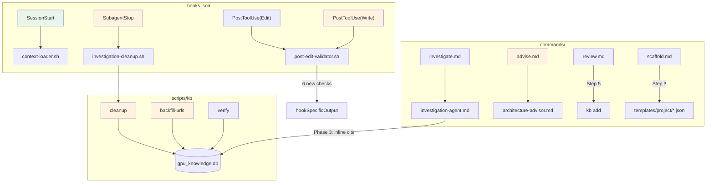

# Design: gpu-forge Harness Wiring

## Design Inputs

| Question | Decision |
|----------|----------|
| Architecture style | Extend existing architecture -- add to hooks.json, scripts/kb, commands/ |
| Technology constraints | Allow Python for complex checks (bash preferred when simple) |
| Integration approach | Use existing APIs and interfaces |

## Overview

Close 8 workflow disconnects in the gpu-forge plugin by extending existing files (hooks.json, scripts/kb, commands/, agents/) with additive changes. No schema changes. No new dependencies. All hooks remain informational (exit 0). Implementation order follows dependency chain: Gap 8 -> 1 -> 6 -> 4 -> 3 -> 5 -> 2 -> 7, with integration tests last.

## Architecture Diagram



Orange = new, Green = existing unchanged.

## Pre-Existing Test Failures

**IMPORTANT**: 7 tests currently fail (not 0 as requirements state):
- 4 hooks.bats tests: hooks.json uses nested object format but tests expect array format
- 2 golden query tests: FTS5 ranking changes from DB growth
- 1 DB size test: DB exceeds 5MB cap

The hooks.bats failures are directly relevant -- our hooks.json changes must use the **nested object format** (current hooks.json), and we must also fix hooks.bats to match. This is a prerequisite, not scope creep -- we cannot extend hooks.json without the tests correctly validating it.

## Component Design

### Gap 8: kb cleanup Subcommand

**Files modified**: `scripts/kb`

Add `cleanup)` case between `fix-confidence)` and `*)` in the existing case statement.

**CLI interface**:
```
kb cleanup [--dry-run] [--hours N]
```

**Implementation**:
```bash
cleanup)
    # kb cleanup [--dry-run] [--hours N]
    dry_run=0
    hours=1
    shift
    while [ $# -gt 0 ]; do
      case "$1" in
        --dry-run) dry_run=1 ;;
        --hours) shift; hours="$1" ;;
      esac
      shift
    done

    if [ "$dry_run" -eq 1 ]; then
      echo "=== Dry Run: Stale Investigations ==="
      run_sql -header -column "$DB" \
        "SELECT id, topic, status, started_at,
                ROUND((julianday('now') - julianday(started_at)) * 24, 1) as hours_running
         FROM investigations
         WHERE status='running'
           AND started_at < datetime('now', '-${hours} hours')
         ORDER BY started_at;"
      count=$(run_sql "$DB" \
        "SELECT COUNT(*) FROM investigations
         WHERE status='running'
           AND started_at < datetime('now', '-${hours} hours');")
      echo ""
      echo "Would close: ${count} investigation(s)"
    else
      count=$(run_sql "$DB" \
        "SELECT COUNT(*) FROM investigations
         WHERE status='running'
           AND started_at < datetime('now', '-${hours} hours');")
      run_sql "$DB" \
        "UPDATE investigations
         SET status='failed',
             completed_at=datetime('now'),
             summary='Auto-closed: agent did not complete'
         WHERE status='running'
           AND started_at < datetime('now', '-${hours} hours');"
      if [ $? -eq 0 ]; then
        echo "Closed ${count} stale investigation(s)"
      fi
    fi
    ;;
```

**Also modify `verify)` case** -- add Check 6 after the existing Check 5 (before the summary `echo`):

```bash
    # Check 6: Stale investigations (running for >1 hour)
    count=$(run_sql "$DB" "SELECT COUNT(*) FROM investigations WHERE status='running' AND started_at < datetime('now', '-1 hours');")
    if [ "$count" -gt 0 ] 2>/dev/null; then
      echo "WARNING: $count investigations running for >1 hour (may be orphaned). Run: kb cleanup --dry-run"
      issues=$((issues + count))
    else
      echo "OK: No stale investigations"
    fi
```

**Also update help text** in `*)` case -- add under "Quality commands:":
```
echo "  cleanup [--dry-run] [--hours N]  Close stale investigations (default: >1h)"
```

**Satisfies**: FR-1, FR-2, FR-3, FR-19 (AC-1.1 through AC-1.6)

---

### Gap 1: SubagentStop Hook

**Files created**: `hooks/scripts/investigation-cleanup.sh`
**Files modified**: `hooks/hooks.json`

#### hooks.json

Add `SubagentStop` key to the `.hooks` object. The current structure is:
```json
{
  "hooks": {
    "SessionStart": [...],
    "PostToolUse": [...]
  }
}
```

Add:
```json
"SubagentStop": [
  {
    "matcher": "investigation-agent",
    "hooks": [
      {
        "type": "command",
        "command": "bash ${CLAUDE_PLUGIN_ROOT}/hooks/scripts/investigation-cleanup.sh",
        "timeout": 5
      }
    ]
  }
]
```

#### investigation-cleanup.sh

```bash
#!/usr/bin/env bash
# SubagentStop hook: Clean up orphaned investigations when investigation-agent exits.
# Always exits 0 — informational only, never blocks.

set -uo pipefail

# Read stdin JSON (contains agent name, exit reason, etc.)
INPUT=$(cat)

# Resolve KB script
if [ -n "${CLAUDE_PLUGIN_ROOT:-}" ]; then
  KB="${CLAUDE_PLUGIN_ROOT}/scripts/kb"
else
  KB="$(dirname "$0")/../../scripts/kb"
fi

# Close any investigations that are still 'running' — agent just stopped
"$KB" cleanup --hours 0 2>/dev/null || true

exit 0
```

Mark executable: `chmod +x hooks/scripts/investigation-cleanup.sh`

**Satisfies**: FR-4, FR-5 (AC-2.1 through AC-2.5)

---

### Gap 6: advise Command

**Files created**: `commands/advise.md`
**Files modified**: `tests/unit/commands.bats`

#### commands/advise.md

```markdown
---
name: advise
description: "Get architectural recommendations for GPU compute designs, backed by knowledge database findings."
argument-hint: "<description-of-requirements>"
context: fork
agent: architecture-advisor
disable-model-invocation: true
---

# Advise Command

This command delegates entirely to the **architecture-advisor**, which runs in a forked
(isolated subagent) context. The agent queries the knowledge database across multiple
skill domains, cross-references findings, and provides architectural recommendations
with citations.

## Valid Skill Areas

- `gpu-silicon` -- Apple GPU microarchitecture, SIMD, TBDR, ALU pipelines
- `unified-memory` -- Unified memory, SLC cache, storage modes, zero-copy
- `metal-compute` -- Metal compute pipeline, command buffers, encoders, sync
- `gpu-perf` -- GPU performance, profiling, occupancy, optimization
- `gpu-centric-arch` -- GPU-centric architecture, persistent kernels, reverse offloading

## Example Usage

```
/gpu-forge:advise "Design a high-performance reduction kernel for 10M floats on M4 Max"
/gpu-forge:advise "Memory strategy for streaming 2GB dataset through GPU pipeline"
/gpu-forge:advise "Architecture for persistent kernel radix sort with decoupled lookback"
```

## How It Works

1. The command parses `$ARGUMENTS` to extract the requirement description
2. Forks an isolated subagent running the architecture-advisor
3. The advisor queries KB across 5+ skill domains
4. Cross-references findings to provide evidence-based recommendations
5. Returns structured output: Architecture Overview, Key Decisions, Rationale, Trade-offs

**Note**: This runs in forked context -- the advisor operates in an isolated subagent
that does not share conversation history with the main session.
```

#### commands.bats updates

Every loop that enumerates commands must add `advise`. There are **5 loops** that enumerate by name:

1. **Line 13**: `for cmd in ask investigate knowledge scaffold template review; do` -- title: "all 6 command files exist"
2. **Line 19**: Same loop -- "all commands have YAML frontmatter"
3. **Line 25**: Same loop -- "all commands have name field"
4. **Line 31**: Same loop -- "all commands have description field"
5. **Line 65**: Same loop -- "all commands reference ARGUMENTS or CLAUDE_PLUGIN_ROOT"

Changes:
- All 5 loops: `for cmd in ask advise investigate knowledge scaffold template review; do`
- Test title line 12: `@test "all 7 command files exist" {`

Add new test after the `investigate` tests:

```bash
@test "advise command uses context: fork" {
  frontmatter=$(get_frontmatter "${COMMANDS_DIR}/advise.md")
  echo "$frontmatter" | grep -q "^context: fork"
}

@test "advise command uses agent: architecture-advisor" {
  frontmatter=$(get_frontmatter "${COMMANDS_DIR}/advise.md")
  echo "$frontmatter" | grep -q "^agent: architecture-advisor"
}
```

**Satisfies**: FR-14, FR-15 (AC-7.1 through AC-7.5)

---

### Gap 4: Post-Edit Hook Expansion

**Files modified**: `hooks/scripts/post-edit-validator.sh`, `hooks/hooks.json`

#### hooks.json

Add second PostToolUse entry for `Write` matcher:

```json
"PostToolUse": [
  {
    "matcher": "Edit",
    "hooks": [
      {
        "type": "command",
        "command": "bash ${CLAUDE_PLUGIN_ROOT}/hooks/scripts/post-edit-validator.sh",
        "timeout": 10
      }
    ]
  },
  {
    "matcher": "Write",
    "hooks": [
      {
        "type": "command",
        "command": "bash ${CLAUDE_PLUGIN_ROOT}/hooks/scripts/post-edit-validator.sh",
        "timeout": 10
      }
    ]
  }
]
```

#### post-edit-validator.sh

Keep the existing structure. Add 6 check functions after the existing kernel-qualifier check (before the JSON output block). Each check is a standalone function for maintainability (NFR-6).

**Refactored structure**:

```bash
#!/usr/bin/env bash
# PostToolUse hook: Validate .metal file edits
# Reads tool input JSON from stdin, checks for common MSL issues.
# Always exits 0 — never blocks edits, only warns.

set -uo pipefail

INPUT=$(cat)

# Extract file_path from tool_input JSON
if command -v jq &>/dev/null; then
  FILE_PATH=$(echo "$INPUT" | jq -r '.tool_input.file_path // empty' 2>/dev/null)
else
  FILE_PATH=$(echo "$INPUT" | grep -o '"file_path"[[:space:]]*:[[:space:]]*"[^"]*"' | sed 's/.*"file_path"[[:space:]]*:[[:space:]]*"//;s/"$//')
fi

# Only act on .metal files
if [[ -z "$FILE_PATH" ]] || [[ "$FILE_PATH" != *.metal ]]; then
  exit 0
fi

if [[ ! -f "$FILE_PATH" ]]; then
  exit 0
fi

WARNINGS=()

# --- Check functions (each appends to WARNINGS) ---

check_missing_kernel_qualifier() {
  while IFS= read -r line; do
    if [[ "$line" == *"[[kernel]]"* ]]; then continue; fi
    if echo "$line" | grep -qE '^\s*void\s+\w+\s*\(' 2>/dev/null; then
      if ! echo "$line" | grep -qE '^\s*kernel\s+void' 2>/dev/null; then
        func_name=$(echo "$line" | grep -oE 'void\s+(\w+)' | awk '{print $2}')
        if [[ -n "$func_name" ]]; then
          WARNINGS+=("Function '${func_name}' may be missing 'kernel' qualifier or [[kernel]] attribute")
        fi
      fi
    fi
  done < "$FILE_PATH"
}

check_address_space_misuse() {
  # 'device const' should be 'constant' (misses constant cache)
  if grep -nE '\bdevice\s+const\b' "$FILE_PATH" >/dev/null 2>&1; then
    local lines
    lines=$(grep -nE '\bdevice\s+const\b' "$FILE_PATH" | head -3)
    WARNINGS+=("Address space misuse: 'device const' should likely be 'constant' for read-only data (constant cache). Lines: $(echo "$lines" | cut -d: -f1 | tr '\n' ',' | sed 's/,$//')")
  fi
}

check_threadgroup_size() {
  # Threadgroup sizes hardcoded to non-multiples of 32
  local tg_sizes
  tg_sizes=$(grep -oE '\[\[max_total_threads_per_threadgroup\(([0-9]+)\)\]\]' "$FILE_PATH" 2>/dev/null | grep -oE '[0-9]+')
  for size in $tg_sizes; do
    if [ $((size % 32)) -ne 0 ]; then
      WARNINGS+=("Threadgroup size ${size} is not a multiple of 32 (SIMD width). Wastes lanes.")
    fi
  done
}

check_atomic_in_loop() {
  # atomic_fetch_* inside for/while loops (contention risk)
  # Simple heuristic: look for atomic within indented blocks after for/while
  if grep -nE '^\s+(for|while)\b' "$FILE_PATH" >/dev/null 2>&1; then
    # Check if any atomic ops appear in the file at all
    if grep -nE 'atomic_fetch_(add|sub|min|max|or|and|xor)\b' "$FILE_PATH" >/dev/null 2>&1; then
      # Rough check: are atomics inside loop bodies?
      local in_loop=0
      local loop_depth=0
      local line_num=0
      while IFS= read -r line; do
        line_num=$((line_num + 1))
        if echo "$line" | grep -qE '^\s+(for|while)\b' 2>/dev/null; then
          in_loop=1
        fi
        if [[ "$in_loop" -eq 1 ]] && echo "$line" | grep -qE 'atomic_fetch_' 2>/dev/null; then
          WARNINGS+=("Potential high-contention atomic at line ${line_num} inside loop. Consider simdgroup reduction first.")
          break  # One warning is enough
        fi
        # Reset after seeing a closing brace at base indent (heuristic)
      done < "$FILE_PATH"
    fi
  fi
}

check_missing_namespace() {
  # Missing 'using namespace metal;' -- required in .metal files
  if ! grep -qE '^\s*using\s+namespace\s+metal\s*;' "$FILE_PATH" 2>/dev/null; then
    # Only warn if file has kernel functions (not a header)
    if grep -qE '\b(kernel|vertex|fragment)\b' "$FILE_PATH" 2>/dev/null; then
      WARNINGS+=("Missing 'using namespace metal;' -- required for MSL types and functions")
    fi
  fi
}

check_buffer_index_gaps() {
  # Extract buffer indices and check for gaps
  local indices
  indices=$(grep -oE '\[\[buffer\(([0-9]+)\)\]\]' "$FILE_PATH" 2>/dev/null | grep -oE '[0-9]+' | sort -n | uniq)
  if [[ -n "$indices" ]]; then
    local prev=-1
    for idx in $indices; do
      if [[ $prev -ge 0 ]] && [[ $((idx - prev)) -gt 1 ]]; then
        WARNINGS+=("Buffer index gap: [[buffer(${prev})]] to [[buffer(${idx})]] -- missing [[buffer($((prev + 1)))]]")
      fi
      prev=$idx
    done
  fi
}

check_barrier_near_tg_write() {
  # Threadgroup memory writes in loops without threadgroup_barrier
  # Heuristic: if file has threadgroup writes AND for/while loops, check for barriers
  if grep -qE '\bthreadgroup\b.*\[' "$FILE_PATH" 2>/dev/null; then
    if grep -qE '^\s+(for|while)\b' "$FILE_PATH" 2>/dev/null; then
      if ! grep -qE 'threadgroup_barrier' "$FILE_PATH" 2>/dev/null; then
        WARNINGS+=("Threadgroup memory used in file with loops but no threadgroup_barrier found. Ensure proper synchronization.")
      fi
    fi
  fi
}

# --- Run all checks ---
check_missing_kernel_qualifier
check_address_space_misuse
check_threadgroup_size
check_atomic_in_loop
check_missing_namespace
check_buffer_index_gaps
check_barrier_near_tg_write

# --- Output hookSpecificOutput JSON ---
if [[ ${#WARNINGS[@]} -gt 0 ]]; then
  WARN_JSON="["
  for i in "${!WARNINGS[@]}"; do
    if [[ $i -gt 0 ]]; then WARN_JSON+=","; fi
    escaped=$(echo "${WARNINGS[$i]}" | sed 's/"/\\"/g')
    WARN_JSON+="\"${escaped}\""
  done
  WARN_JSON+="]"
  echo "{\"hookSpecificOutput\":{\"metal_warnings\":${WARN_JSON},\"file\":\"${FILE_PATH}\"}}"
else
  echo "{\"hookSpecificOutput\":{\"metal_warnings\":[],\"file\":\"${FILE_PATH}\",\"status\":\"ok\"}}"
fi

exit 0
```

**Satisfies**: FR-11, FR-12 (AC-5.1 through AC-5.10)

---

### Gap 3: URL Backfill

**Files modified**: `scripts/kb`, `agents/investigation-agent.md`

#### scripts/kb -- add `backfill-urls)` case

Insert before `*)`:

```bash
backfill-urls)
    # kb backfill-urls — list findings with missing source_url grouped by source_type
    echo "=== Findings Missing Source URLs ==="
    echo ""
    run_sql -header -column "$DB" \
      "SELECT source_type, COUNT(*) as count
       FROM findings
       WHERE source_url IS NULL OR source_url=''
       GROUP BY source_type
       ORDER BY count DESC;"
    echo ""
    echo "--- Details ---"
    run_sql -header -column "$DB" \
      "SELECT f.id, s.name as skill, f.topic, f.source_type, substr(f.claim,1,60) as claim
       FROM findings f
       JOIN skills s ON s.id = f.skill_id
       WHERE f.source_url IS NULL OR f.source_url=''
       ORDER BY f.source_type, f.id;"
    ;;
```

#### scripts/kb -- update `verify)` Check 5

Replace the existing Check 5 (findings without source URLs) with a split check:

```bash
    # Check 5a: Web-source findings without URLs (ERROR)
    count=$(run_sql "$DB" "SELECT COUNT(*) FROM findings WHERE (source_url IS NULL OR source_url='') AND source_type NOT IN ('benchmark','empirical_test');")
    if [ "$count" -gt 0 ] 2>/dev/null; then
      echo "ERROR: $count web-source findings have no source URL"
      issues=$((issues + count))
    else
      echo "OK: All web-source findings have source URLs"
    fi

    # Check 5b: Benchmark/empirical_test findings without local path (INFO)
    count=$(run_sql "$DB" "SELECT COUNT(*) FROM findings WHERE (source_url IS NULL OR source_url='') AND source_type IN ('benchmark','empirical_test');")
    if [ "$count" -gt 0 ] 2>/dev/null; then
      echo "INFO: $count benchmark/empirical_test findings have no source path (run: kb backfill-urls)"
    else
      echo "OK: All benchmark/empirical_test findings have local paths"
    fi
```

Note: INFO items do NOT increment `$issues` -- they are not errors.

#### investigation-agent.md -- Phase 3 local path convention

Add to Phase 3 "Rules for storing findings" after the `source_type` bullet:

```markdown
- For `benchmark` or `empirical_test` findings from local experiments, set `source_url` to the
  relative file path (e.g., `experiments/exp16_8bit.rs`, `metal-gpu-experiments/shaders/exp16_8bit.metal`).
  This makes the finding traceable to its source code.
```

**Also update help text** in `*)` case -- add under "Quality commands:":
```
echo "  backfill-urls                List findings missing source URLs"
```

**Satisfies**: FR-8, FR-9, FR-10 (AC-4.1 through AC-4.4)

---

### Gap 5: Review-to-KB Feedback

**Files modified**: `commands/review.md`

Add Step 5 between current Step 4 ("Format Structured Review") and "Severity Levels". The full section:

```markdown
## Step 5: Store New Findings

After completing the review, check if any CRITICAL or WARNING issues represent patterns
NOT already in the knowledge base. For each genuinely new pattern:

1. **Dedup check**: Search the KB for the pattern before adding:
   ```bash
   ${CLAUDE_PLUGIN_ROOT}/scripts/kb search "<brief description of the anti-pattern>" --limit 5
   ```

2. **Skip if found**: If any returned finding substantially matches the discovered issue, do NOT add a duplicate.

3. **Add if new**: If the pattern is genuinely new (no close match in search results):
   ```bash
   ${CLAUDE_PLUGIN_ROOT}/scripts/kb add "<skill>" "<topic>" "<claim>" "<evidence>" "" "" "empirical_test" "medium" "review-discovered"
   ```
   Where:
   - `<skill>`: The most relevant skill (gpu-perf, msl-kernels, simd-wave, etc.)
   - `<topic>`: Category of the anti-pattern
   - `<claim>`: The anti-pattern or finding as a clear statement
   - `<evidence>`: What was observed in the reviewed code (with file name, line range)
   - `source_type`: Always `empirical_test`
   - `confidence`: Always `medium` (single observation, not independently verified)
   - `tags`: Always includes `review-discovered`

4. **Report**: At the end of the review output, note how many new findings were stored (if any):
   ```
   ### KB Updates
   - Stored N new finding(s) from this review (tagged: review-discovered)
   ```

**Constraints**:
- Only store genuinely new anti-patterns, NOT every observation
- Maximum 3 new findings per review (avoid noise)
- Never store INFO-level issues -- only CRITICAL and WARNING
```

**Satisfies**: FR-13 (AC-6.1 through AC-6.4)

---

### Gap 2: Citation Enforcement

**Files modified**: `agents/investigation-agent.md`

Merge Phase 4 (Citations) into Phase 3 (Store Findings). The restructured Phase 3 becomes:

#### investigation-agent.md -- Restructured Phase 3

Replace the entire Phase 3 and Phase 4 with:

```markdown
### Phase 3: Store Findings & Citations

For EACH discrete finding, store it in the database using sqlite3 directly:

```bash
sqlite3 "${CLAUDE_PLUGIN_ROOT}/data/gpu_knowledge.db" "INSERT INTO findings ..."
```

[Keep all existing Phase 3 rules unchanged]

**Inline Citation Protocol (for academic papers)**:

After EACH finding INSERT where `source_type='academic_paper'`, IMMEDIATELY add a citation:

1. Get the finding_id: `sqlite3 ... "SELECT last_insert_rowid();"`
2. WebFetch the paper's landing page to extract authors
3. INSERT citation record:
   ```bash
   sqlite3 "${CLAUDE_PLUGIN_ROOT}/data/gpu_knowledge.db" "INSERT INTO citations (finding_id, authors, title, venue, year, doi, url, author_source) VALUES (<finding_id>, '<authors>', '<title>', '<venue>', <year>, '<doi>', '<url>', '<author_source>');"
   ```
4. Author verification rules (unchanged from current Phase 4):
   - `extracted_from_page`: authors confirmed from actual source page
   - `from_metadata`: authors from DOI/API metadata
   - `unverified`: neither method works -- NEVER fabricate

**CRITICAL**: Do NOT batch citations to the end. Each academic paper finding gets its
citation immediately after the finding INSERT. This ensures citations are never skipped
when the agent hits its turn limit.

Dedup check before citation: `SELECT COUNT(*) FROM citations WHERE title='<title>' AND year=<year>;`
```

Remove the standalone Phase 4 section entirely. Renumber Phase 5 to Phase 4.

#### scripts/kb -- add citation coverage check to verify

Add Check 7 (after the new Check 6 for stale investigations):

```bash
    # Check 7: Academic findings without citations
    count=$(run_sql "$DB" \
      "SELECT COUNT(*) FROM findings f
       WHERE f.source_type='academic_paper'
         AND NOT EXISTS (SELECT 1 FROM citations c WHERE c.finding_id=f.id);")
    if [ "$count" -gt 0 ] 2>/dev/null; then
      total=$(run_sql "$DB" "SELECT COUNT(*) FROM findings WHERE source_type='academic_paper';")
      echo "WARNING: $count of $total academic paper findings have no citation record"
      issues=$((issues + count))
    else
      echo "OK: All academic paper findings have citations"
    fi
```

**Satisfies**: FR-6, FR-7 (AC-3.1 through AC-3.4)

---

### Gap 7: Scaffold Wiring

**Files modified**: `commands/scaffold.md`

#### Mapping Table

Add after Step 2, before Step 3:

```markdown
### Pattern-to-JSON Config Mapping

| Compute Pattern | Language | JSON Config File |
|----------------|----------|-----------------|
| reduction | swift-metal | `reduction-kernel.json` |
| gemm | swift-metal | `matrix-multiply.json` |
| scan | swift-metal | `scan-kernel.json` |
| custom | swift-metal | `metal-compute-blank.json` |
| custom | mlx-kernel | `mlx-custom-kernel.json` |
| histogram | swift-metal | `metal-compute-blank.json` *(fallback)* |
| * | both | `metal-compute-blank.json` *(fallback)* |
| *(unmapped)* | * | `metal-compute-blank.json` *(default fallback)* |
```

#### Rewritten Step 3

Replace the current Step 3 entirely:

```markdown
## Step 3: Read JSON Config and Templates

Based on the pattern + language selection from Step 1, determine the JSON config file
using the mapping table above.

1. **Read the JSON config**:
   ```bash
   cat ${CLAUDE_PLUGIN_ROOT}/templates/project/<config-file>.json
   ```

2. **Extract parameters**: The JSON `parameters` field defines available parameters
   with types, defaults, and options. Use these defaults for template substitution
   unless the user overrides them.

3. **Extract file mappings**: The JSON `files` array defines template-to-output mappings:
   ```json
   { "template": "metal/reduction.metal.tmpl", "output": "Sources/{{PROJECT_NAME}}/Shaders/reduce.metal" }
   ```
   Read each template from `${CLAUDE_PLUGIN_ROOT}/templates/<template-path>`.

4. **Fallback**: If no JSON config matches the pattern+language combination,
   use `metal-compute-blank.json` as the default.

5. **Note knowledge areas**: The JSON `knowledge_applied` field lists relevant
   skill areas. After scaffolding, suggest these as KB queries.
```

#### Add to Step 9 (Post-Scaffold Summary)

Add after the "Next steps" block:

```markdown
### Suggested KB Queries

Based on the JSON config's `knowledge_applied` field, suggest relevant queries:

```
Relevant knowledge areas for this project:
  /gpu-forge:ask <skill-1> "optimization strategies for <pattern>"
  /gpu-forge:ask <skill-2> "best practices for <pattern>"
```

Where `<skill-N>` comes from the JSON `knowledge_applied` array.
```

**Satisfies**: FR-16, FR-17, FR-18 (AC-8.1 through AC-8.7)

---

### hooks.bats Fix (Prerequisite)

**Files modified**: `tests/unit/hooks.bats`

The current hooks.bats expects array format but hooks.json uses nested object format. Fix the 4 failing tests:

```bash
# Test 2: Fix type check
@test "hooks.json has hooks object" {
  run jq -e '.hooks | type' "${PLUGIN_ROOT}/hooks/hooks.json"
  assert_success
  assert_output '"object"'
}

# Test 3: Fix SessionStart check
@test "SessionStart event exists" {
  run jq -e '.hooks.SessionStart' "${PLUGIN_ROOT}/hooks/hooks.json"
  assert_success
}

# Test 4: Fix PostToolUse check
@test "PostToolUse event exists" {
  run jq -e '.hooks.PostToolUse' "${PLUGIN_ROOT}/hooks/hooks.json"
  assert_success
}

# Test 9: Fix timeout extraction
@test "hook timeouts under 30 seconds" {
  local max_timeout
  max_timeout=$(jq '[.hooks[][] | .hooks[]? | .timeout // 0] | max' "${PLUGIN_ROOT}/hooks/hooks.json")
  [ "$max_timeout" -lt 30 ]
}
```

Add test for SubagentStop:

```bash
@test "SubagentStop event exists" {
  run jq -e '.hooks.SubagentStop' "${PLUGIN_ROOT}/hooks/hooks.json"
  assert_success
}
```

---

### Integration Tests

**File created**: `tests/integration/harness-wiring.bats`

```bash
#!/usr/bin/env bats

load ../test_helper/common-setup

KB="${PLUGIN_ROOT}/scripts/kb"

setup() {
  TEST_DB="${BATS_TEST_TMPDIR}/test_gpu_knowledge.db"
  cp "${PLUGIN_ROOT}/data/gpu_knowledge.db" "$TEST_DB"
  export GPU_FORGE_DB="$TEST_DB"
}

teardown() {
  rm -f "${BATS_TEST_TMPDIR}/test_gpu_knowledge.db"
}

# --- Gap 8: kb cleanup ---

@test "gap8: kb cleanup --dry-run shows stale investigations" {
  # Create a stale investigation (started 2 hours ago)
  sqlite3 "$TEST_DB" "INSERT INTO investigations (skill_id, topic, status, started_at)
    VALUES (1, 'test-stale', 'running', datetime('now', '-2 hours'));"
  run "$KB" cleanup --dry-run --hours 1
  assert_success
  assert_output --partial "Would close:"
}

@test "gap8: kb cleanup closes stale investigations" {
  sqlite3 "$TEST_DB" "INSERT INTO investigations (skill_id, topic, status, started_at)
    VALUES (1, 'test-stale', 'running', datetime('now', '-2 hours'));"
  run "$KB" cleanup --hours 1
  assert_success
  # Verify it was closed
  local status
  status=$(sqlite3 "$TEST_DB" "SELECT status FROM investigations WHERE topic='test-stale';")
  [ "$status" = "failed" ]
}

@test "gap8: kb verify reports stale investigations" {
  sqlite3 "$TEST_DB" "INSERT INTO investigations (skill_id, topic, status, started_at)
    VALUES (1, 'test-stale', 'running', datetime('now', '-2 hours'));"
  run "$KB" verify
  assert_success
  assert_output --partial "running for >1 hour"
}

# --- Gap 1: SubagentStop hook ---

@test "gap1: investigation-cleanup.sh exits 0" {
  run bash -c 'echo "{}" | CLAUDE_PLUGIN_ROOT="${PLUGIN_ROOT}" GPU_FORGE_DB="${GPU_FORGE_DB}" bash "${PLUGIN_ROOT}/hooks/scripts/investigation-cleanup.sh"'
  assert_success
}

@test "gap1: investigation-cleanup.sh is executable" {
  [ -x "${PLUGIN_ROOT}/hooks/scripts/investigation-cleanup.sh" ]
}

# --- Gap 6: advise command ---

@test "gap6: advise.md exists with correct frontmatter" {
  [ -f "${PLUGIN_ROOT}/commands/advise.md" ]
  local fm
  fm=$(awk 'BEGIN{n=0} /^---$/{n++; if(n==2) exit; next} n==1{print}' "${PLUGIN_ROOT}/commands/advise.md")
  echo "$fm" | grep -q "^name: advise"
  echo "$fm" | grep -q "^context: fork"
  echo "$fm" | grep -q "^agent: architecture-advisor"
  echo "$fm" | grep -q "^disable-model-invocation: true"
}

# --- Gap 4: post-edit hook expansion ---

@test "gap4: post-edit-validator catches device const" {
  local tmpfile="${BATS_TEST_TMPDIR}/test_check.metal"
  cat > "$tmpfile" <<'EOF'
using namespace metal;
kernel void test_kernel(device const float* input [[buffer(0)]]) {}
EOF
  run bash -c "echo '{\"tool_input\":{\"file_path\":\"${tmpfile}\"}}' | bash '${PLUGIN_ROOT}/hooks/scripts/post-edit-validator.sh'"
  assert_success
  assert_output --partial "device const"
}

@test "gap4: post-edit-validator catches missing namespace" {
  local tmpfile="${BATS_TEST_TMPDIR}/test_check.metal"
  cat > "$tmpfile" <<'EOF'
kernel void test_kernel(device float* input [[buffer(0)]]) {}
EOF
  run bash -c "echo '{\"tool_input\":{\"file_path\":\"${tmpfile}\"}}' | bash '${PLUGIN_ROOT}/hooks/scripts/post-edit-validator.sh'"
  assert_success
  assert_output --partial "using namespace metal"
}

@test "gap4: post-edit-validator catches buffer index gaps" {
  local tmpfile="${BATS_TEST_TMPDIR}/test_check.metal"
  cat > "$tmpfile" <<'EOF'
using namespace metal;
kernel void test_kernel(
    device float* a [[buffer(0)]],
    device float* b [[buffer(2)]],
    uint tid [[thread_position_in_grid]]) {}
EOF
  run bash -c "echo '{\"tool_input\":{\"file_path\":\"${tmpfile}\"}}' | bash '${PLUGIN_ROOT}/hooks/scripts/post-edit-validator.sh'"
  assert_success
  assert_output --partial "Buffer index gap"
}

# --- Gap 3: URL backfill ---

@test "gap3: kb backfill-urls runs without error" {
  run "$KB" backfill-urls
  assert_success
  assert_output --partial "Findings Missing Source URLs"
}

@test "gap3: kb verify distinguishes web vs local missing URLs" {
  run "$KB" verify
  assert_success
  # Should NOT say just "findings have no source URL" -- should distinguish
  # Either "web-source" or "benchmark/empirical_test"
  if echo "$output" | grep -q "no source URL"; then
    # Old undifferentiated message -- test should fail
    fail "verify still uses undifferentiated URL check"
  fi
}

# --- Gap 5: review write-back ---

@test "gap5: review.md contains Step 5 for KB storage" {
  run grep -c "Step 5" "${PLUGIN_ROOT}/commands/review.md"
  assert_success
  [ "$output" -ge 1 ]
}

# --- Gap 2: citation enforcement ---

@test "gap2: investigation-agent.md has inline citation protocol" {
  run grep -c "Inline Citation Protocol" "${PLUGIN_ROOT}/agents/investigation-agent.md"
  assert_success
  [ "$output" -ge 1 ]
}

@test "gap2: kb verify checks academic findings without citations" {
  run "$KB" verify
  assert_success
  # Should have either "academic paper findings have no citation" or "All academic paper findings have citations"
  echo "$output" | grep -qE "(academic paper findings|All academic paper findings have citations)"
}

# --- Gap 7: scaffold wiring ---

@test "gap7: scaffold.md references JSON config files" {
  run grep -c "reduction-kernel.json\|matrix-multiply.json\|scan-kernel.json\|metal-compute-blank.json\|mlx-custom-kernel.json" "${PLUGIN_ROOT}/commands/scaffold.md"
  assert_success
  [ "$output" -ge 3 ]
}

@test "gap7: scaffold.md has fallback to metal-compute-blank" {
  run grep -c "metal-compute-blank.json" "${PLUGIN_ROOT}/commands/scaffold.md"
  assert_success
  [ "$output" -ge 1 ]
}
```

**Total**: 16 integration tests (>= 8 required, 2 per gap).

**Satisfies**: FR-20 (NFR-8)

---

## File Change Matrix

| File | Action | Gap | Description |
|------|--------|-----|-------------|
| `scripts/kb` | Modify | 8,3,2 | Add `cleanup`, `backfill-urls` cases; update `verify` with 3 new checks; update help text |
| `hooks/hooks.json` | Modify | 1,4 | Add `SubagentStop` entry; add `Write` matcher to PostToolUse |
| `hooks/scripts/investigation-cleanup.sh` | Create | 1 | SubagentStop hook script calling `kb cleanup --hours 0` |
| `hooks/scripts/post-edit-validator.sh` | Modify | 4 | Add 6 check functions; refactor into function-per-check pattern |
| `commands/advise.md` | Create | 6 | New command file for architecture-advisor |
| `commands/review.md` | Modify | 5 | Add Step 5: Store New Findings |
| `commands/scaffold.md` | Modify | 7 | Add mapping table; rewrite Step 3 for JSON config; add KB query suggestions |
| `agents/investigation-agent.md` | Modify | 2,3 | Merge Phase 4 into Phase 3 (inline citations); add local path convention |
| `tests/unit/commands.bats` | Modify | 6 | 5 loops: add `advise`; title: 6->7; add 2 new advise-specific tests |
| `tests/unit/hooks.bats` | Modify | pre | Fix 4 failing tests for nested object format; add SubagentStop test |
| `tests/integration/harness-wiring.bats` | Create | All | 16 integration tests, 2+ per gap |

**Total**: 5 files modified, 3 files created, 1 test file fixed.

## Technical Decisions

| Decision | Alternatives | Choice | Rationale |
|----------|-------------|--------|-----------|
| Bash for all kb subcommands | Python script for cleanup | Bash | scripts/kb is 474 lines of bash with established case-statement pattern; adding 2 more cases is consistent |
| Bash for post-edit hook | Python rewrite | Bash | Existing hook is bash, checks are simple grep patterns, <200ms requirement met without Python overhead |
| Inline citations (merge Phase 4 into 3) | Keep separate phase with enforcement | Merge | Root cause is turn-limit timeout skipping Phase 4; inline prevents this structurally |
| `--hours 0` for SubagentStop cleanup | Custom SQL for "current session" | `--hours 0` | Reuses cleanup subcommand; `datetime('now', '-0 hours')` = now, catches anything still running |
| Separate check functions in hook | Single monolithic check | Functions | NFR-6 requires easy add/remove of individual checks; one function per check is modular |
| Fix hooks.bats as prerequisite | Leave failing tests | Fix | Cannot extend hooks.json with confidence if validation tests are broken |
| INFO (not WARNING) for benchmark missing URLs | WARNING for all missing URLs | INFO | Benchmark/empirical_test legitimately lack URLs; false warnings erode trust in verify output |
| `metal-compute-blank.json` as fallback | Error for unmapped combinations | Fallback | Better UX: user always gets a scaffold; blank template is a valid starting point |

## Error Handling

| Error Scenario | Handling Strategy | Gap |
|----------------|-------------------|-----|
| `kb cleanup` on empty DB | `SELECT COUNT(*)` returns 0, prints "Closed 0" | 8 |
| SubagentStop hook script can't find KB | `|| true` on kb call, exits 0 | 1 |
| Post-edit hook on non-existent file | Early `exit 0` (existing behavior) | 4 |
| Post-edit hook regex false positive | Warnings only (exit 0), user decides | 4 |
| Review finds no new patterns | Step 5 reports "0 new findings stored" | 5 |
| Review dedup search returns error | Skip KB add, continue review output | 5 |
| Scaffold unmapped pattern+language | Fallback to `metal-compute-blank.json` | 7 |
| Scaffold JSON config parse error | Agent reads file with Read tool; parse errors are visible in output | 7 |
| Citation INSERT fails (duplicate title+year) | Dedup check before INSERT; UNIQUE index catches remainder | 2 |

## Edge Cases

- **`kb cleanup --hours 0`**: Closes ALL running investigations regardless of age. Used by SubagentStop hook. Safe because the hook only fires when agent stops.
- **`kb cleanup` on legitimately long investigation**: Default 1-hour threshold is generous. User can use `--dry-run` to preview. Can override with `--hours N`.
- **Post-edit hook on header files (.metal without `kernel`)**: `check_missing_namespace` only fires if file contains `kernel/vertex/fragment` keywords. Header-only files skip the check.
- **Buffer index gap check with non-sequential intentional gaps**: Rare but possible. Warning-only, never blocks.
- **Review write-back creating near-duplicates**: Dedup search + 3-finding cap per review limits noise. `confidence='medium'` prevents inflating verified count.
- **Scaffold with `both` language**: Falls back to `metal-compute-blank.json`. The `full-project` template type handles file structure; JSON provides parameter defaults.

## Test Strategy

### Unit Tests (modified existing)

| Test File | Changes | Gap |
|-----------|---------|-----|
| `commands.bats` | 5 loop updates + 2 new tests | 6 |
| `hooks.bats` | Fix 4 tests + add SubagentStop test | 1, pre |

### Integration Tests (new file)

| Test | Gap | What It Validates |
|------|-----|-------------------|
| cleanup --dry-run | 8 | Preview mode lists stale investigations |
| cleanup closes stale | 8 | UPDATE sets status='failed' |
| verify reports stale | 8 | New verify check works |
| investigation-cleanup.sh exits 0 | 1 | Hook never fails |
| investigation-cleanup.sh executable | 1 | File permissions |
| advise.md frontmatter | 6 | All required fields present |
| validator catches device const | 4 | Address space check |
| validator catches missing namespace | 4 | Namespace check |
| validator catches buffer gaps | 4 | Buffer index check |
| backfill-urls runs | 3 | New subcommand works |
| verify distinguishes URL types | 3 | Split web/local check |
| review.md has Step 5 | 5 | Write-back section exists |
| investigation-agent inline citations | 2 | Protocol restructured |
| verify checks citation coverage | 2 | New verify check |
| scaffold references JSON configs | 7 | Wiring exists |
| scaffold has fallback | 7 | Fallback documented |

### Performance Tests

Post-edit hook timing: run validator on a 500-line .metal file, assert <200ms. This can be added to `tests/performance/benchmarks.bats` if needed but is not required for initial implementation.

## Implementation Order

Dependencies: Gap 8 -> Gap 1 -> rest in parallel. Recommended sequence:

1. **Fix hooks.bats** (prerequisite) -- fix 4 failing tests for nested object format
2. **Gap 8: kb cleanup** -- add `cleanup` + `backfill-urls` cases to scripts/kb; update `verify`
3. **Gap 1: SubagentStop hook** -- create investigation-cleanup.sh; add to hooks.json
4. **Gap 6: advise command** -- create advise.md; update commands.bats
5. **Gap 4: post-edit hook** -- expand post-edit-validator.sh; add Write matcher to hooks.json
6. **Gap 3: URL backfill** -- already done in step 2; update investigation-agent.md
7. **Gap 5: review feedback** -- add Step 5 to review.md
8. **Gap 2: citation enforcement** -- restructure investigation-agent.md Phase 3+4
9. **Gap 7: scaffold wiring** -- rewrite scaffold.md Step 3
10. **Integration tests** -- create harness-wiring.bats
11. **Full test suite** -- `bats tests/ --recursive` to verify zero new regressions
