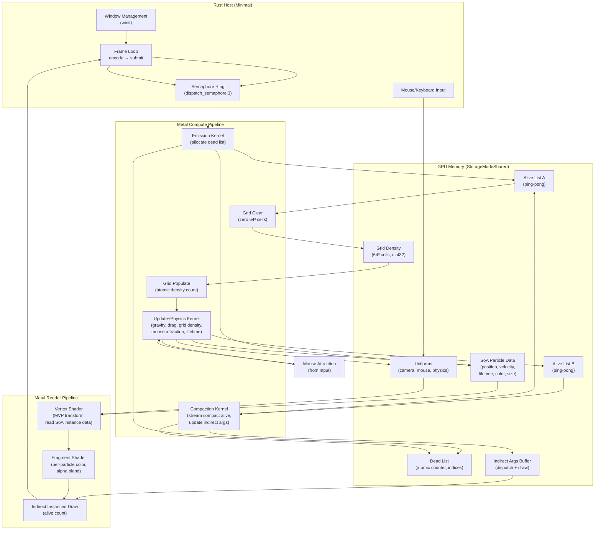
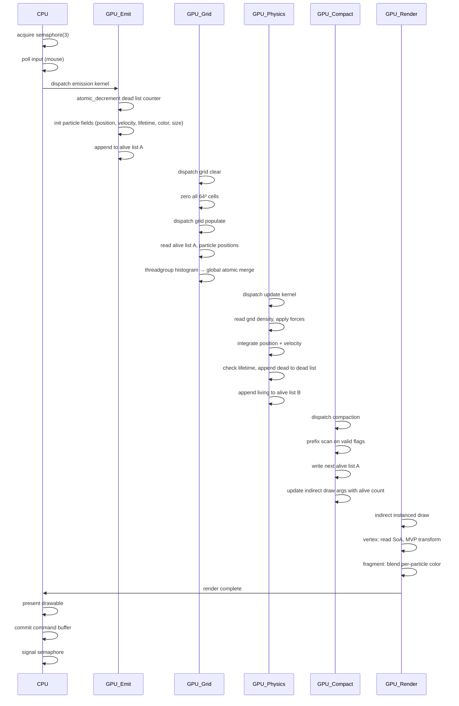
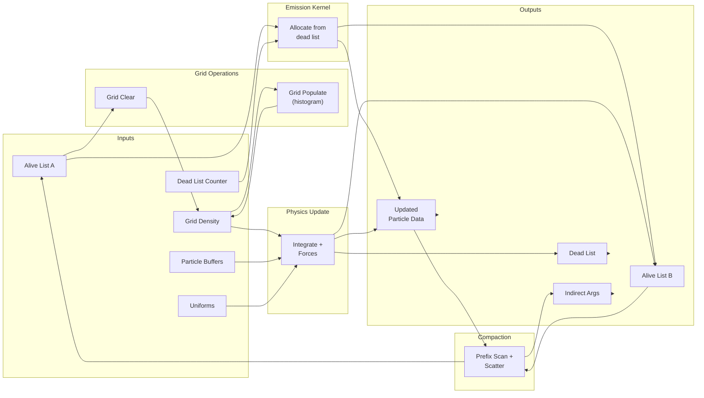

# Design: GPU Particle System

## Overview

Fully GPU-driven particle system rendering 10M+ interactive particles at 60fps on Apple Silicon M4 using Metal compute and render shaders. CPU (Rust host via objc2-metal + winit) handles only windowing, mouse input, and command buffer submission. Core architecture: 4-kernel compute pipeline (emission → grid build → physics update → compaction) with indirect instanced rendering, triple-buffered command submission, and lock-free atomic free lists.

---

## Architecture



---

## Components

### CPU Host (Rust)

| Component | Purpose | Responsibilities |
|-----------|---------|------------------|
| **Main Event Loop** | Winit integration | Acquire semaphore, poll input, encode frame, present drawable, commit, signal semaphore |
| **Metal Device/Queue** | GPU interface | MTLDevice, MTLCommandQueue, pipeline state creation, resource allocation |
| **Input Manager** | Mouse tracking | Convert screen→world mouse position, detect clicks, accumulate drag for camera |
| **Camera** | Projection | Compute view/projection matrices, orbit controls, unproject mouse to 3D world-space |
| **Frame Encoder** | Command buffer | Dispatch compute passes, encode render pass, update indirect args buffer |

### GPU Compute Kernels

#### Emission Kernel
**Purpose**: Allocate particles from dead list, initialize fields with GPU PRNG.

**Input**: Emission config (rate, position, velocity spread), dead list (atomic counter + indices)

**Output**: Initialized particle data in SoA buffers, updated dead list counter, appended indices to alive list

**Threadgroup**: 256 threads; each thread allocates up to N particles via atomic decrement

---

#### Grid Clear Kernel
**Purpose**: Zero all 64³ grid cells at frame start.

**Input**: Empty (clears buffer in-place)

**Output**: Grid buffer zeroed

**Threadgroup**: 256 threads; 262,144 cells ÷ 256 threads per dispatch → 1024 dispatches

---

#### Grid Populate Kernel
**Purpose**: Build 3D density field from alive particles via threadgroup histogram + global atomic merge (two-phase pattern).

**Input**: Alive list A, particle position buffer, physics params (grid bounds)

**Output**: Grid density buffer populated (uint32 per cell)

**Threadgroup**: 256 threads; Phase 1: threadgroup-local histogram, Phase 2: merge partial results

**Pattern**: Follows `histogram.metal.tmpl` from gpu-forge templates

---

#### Physics Update Kernel
**Purpose**: Integrate velocity, apply forces (gravity, drag, grid-based pressure, mouse attraction), update lifetime, cull dead particles.

**Input**: Particle buffers (position, velocity, lifetime, color, size), grid density buffer, uniforms (camera, mouse pos, dt, physics params), alive list A

**Output**: Updated particle buffers, dead indices appended to dead list, appended to alive list B

**Threadgroup**: 256 threads; one thread per particle in alive list

**Register pressure**: Complex kernel requiring ~100 registers; mixed FP16/FP32 strategy to stay <104 registers for 2 threadgroups per core

---

#### Compaction Kernel
**Purpose**: Stream compact alive particles from previous frame, write next-frame alive list, update indirect draw argument buffer.

**Input**: Alive list B (from physics kernel), particle count from physics

**Output**: Alive list A with compacted indices, indirect args buffer with updated alive count

**Pattern**: Prefix scan (inclusive) on alive flags, then scatter valid particles

---

### Render Shaders

#### Vertex Shader
**Purpose**: Per-instance transformation: read particle position/color/size from SoA, compute MVP transform, emit billboard quad vertices.

**Input**: Vertex buffer (quad mesh: 4 vertices per instance), instance data (indices from indirect draw), SoA particle buffers, view/projection uniforms

**Output**: Transformed position, color, size to rasterizer

---

#### Fragment Shader
**Purpose**: Per-fragment color and alpha blending.

**Input**: Rasterized particle color (from vertex shader), alpha interpolation based on lifetime

**Output**: RGBA with alpha-blend enabled

---

## Data Flow



**Per-Frame Sequence** (triple-buffer ring index 0, 1, 2):

1. **CPU**: Acquire semaphore (blocks if GPU still on frame N-2)
2. **CPU**: Poll input, compute camera matrices, unproject mouse to 3D
3. **CPU**: Encode command buffer:
   - Emission kernel dispatch (1M ÷ 256 = 3906 threadgroups)
   - Grid clear dispatch (262144 ÷ 256 = 1024 threadgroups)
   - Grid populate phase 1 & 2 dispatches
   - Physics update dispatch (alive count ÷ 256 threadgroups, variable)
   - Compaction dispatch
   - Render pass with indirect draw
4. **GPU**: Execute all compute passes sequentially (serial per Metal spec); atomic-free synchronization via buffer dependencies
5. **GPU**: Execute render pass
6. **CPU**: Present drawable to CAMetalLayer
7. **CPU**: Commit command buffer
8. **CPU**: Signal semaphore
9. **GPU**: Present frame; ring rotates to next buffer

---

## Buffer Layout

All buffers use `MTLResourceStorageModeShared` (unified memory on Apple Silicon, zero-copy, hardware-coherent writes within command buffer scope).

### Particle Data (SoA Layout)

**Position Buffer**:
- Type: `device float3*` (12 bytes per element, no padding needed in MSL array)
- Capacity: Pool size (1M initial → 10M)
- Total at 10M: 10M × 12B = 120 MB

**Velocity Buffer**:
- Type: `device float3*`
- Capacity: Pool size
- Total at 10M: 120 MB

**Lifetime Buffer**:
- Type: `device half2*` (age, maxAge; 4 bytes)
- Capacity: Pool size
- Total at 10M: 40 MB

**Color Buffer**:
- Type: `device half4*` (half R, G, B, A; 8 bytes)
- Capacity: Pool size
- Total at 10M: 80 MB

**Size Buffer**:
- Type: `device half*` (2 bytes, padded to 4 in arrays via MSL alignment)
- Capacity: Pool size
- Total at 10M: 40 MB

**Per-particle read+write per frame**: 12+12+4+8+4 = 40 bytes (if all fields accessed in physics kernel; actually 64B with padding/cache alignment = 640 MB/frame at 10M)

### Free/Alive Lists

**Dead List Buffer**:
```
Offset 0-3:   atomic_uint counter       (16-byte aligned)
Offset 16+:   uint32 indices[pool_size] (each dead particle's index)
```
- Atomic counter starts at `pool_size`; decremented by emission kernel
- Lock-free append pattern: counter = atomic_fetch_sub(&counter, N); write indices at [counter..counter+N-1]
- Total at 10M: 4 + (10M × 4 bytes) = 40 MB

**Alive List A & B** (ping-pong):
```
Offset 0-3:   atomic_uint counter       (number of alive particles this frame)
Offset 16+:   uint32 indices[pool_size] (indices of alive particles)
```
- Swapped each frame (A reads from physics, B writes compaction; next frame roles reverse)
- Counters reset to 0 at frame start; incremented by emission + update kernels; final value written by compaction
- Total per list at 10M: 40 MB; two lists = 80 MB

### Grid Density Buffer

**Grid Buffer**:
```
uint32 cells[64 × 64 × 64] = 262,144 cells
```
- Stores particle count density per cell (3D spatial quantization)
- Indexed as `grid[z * 4096 + y * 64 + x]` (row-major Z-major)
- Atomically incremented by grid populate kernel; read by physics kernel (27-neighborhood)
- Total: 262K × 4 bytes = 1.05 MB

### Indirect Arguments Buffer

**Dispatch Arguments** (for compaction kernel's potential second pass, if needed):
```
struct MTLDispatchThreadgroupsIndirectArguments {
    uint32 threadgroupsPerGridX;
    uint32 threadgroupsPerGridY;
    uint32 threadgroupsPerGridZ;
};
```
Offset 0-11: Dispatch args (rarely updated; mostly for documentation)

**Draw Arguments** (for render pass):
```
struct MTLDrawPrimitivesIndirectArguments {
    uint32 vertexCount;        // 4 (quad vertices per instance)
    uint32 instanceCount;      // alive count from compaction (written by GPU)
    uint32 vertexStart;        // 0
    uint32 baseInstance;       // 0
};
```
Offset 12-27: Draw args

- Total: 28 bytes

### Uniforms Buffer

```c
struct Uniforms {
    float4x4  view_matrix;        // 64 bytes
    float4x4  projection_matrix;  // 64 bytes
    float3    mouse_world_pos;    // 12 bytes
    float     mouse_attraction_radius;  // 4 bytes
    float     mouse_attraction_strength; // 4 bytes
    float     dt;                 // 4 bytes (frame delta time in seconds)
    float3    gravity;            // 12 bytes
    float     drag_coefficient;   // 4 bytes
    float3    grid_bounds_min;    // 12 bytes
    float3    grid_bounds_max;    // 12 bytes
    uint32    frame_number;       // 4 bytes
    float     particle_size_scale; // 4 bytes
    // ... total 196 bytes, padded to 256 for cache alignment
};
```

### Total Memory Budget at Each Scale

| Pool Size | Position | Velocity | Lifetime | Color | Size | Dead List | Alive A | Alive B | Grid | Uniforms | **Total** |
|-----------|----------|----------|----------|-------|------|-----------|---------|---------|------|----------|-----------|
| 1M | 12 MB | 12 MB | 4 MB | 8 MB | 4 MB | 4 MB | 4 MB | 4 MB | 1 MB | 0.5 MB | **53.5 MB** |
| 2M | 24 MB | 24 MB | 8 MB | 16 MB | 8 MB | 8 MB | 8 MB | 8 MB | 1 MB | 0.5 MB | **105.5 MB** |
| 5M | 60 MB | 60 MB | 20 MB | 40 MB | 20 MB | 20 MB | 20 MB | 20 MB | 1 MB | 0.5 MB | **261.5 MB** |
| 10M | 120 MB | 120 MB | 40 MB | 80 MB | 40 MB | 40 MB | 40 MB | 40 MB | 1 MB | 0.5 MB | **521.5 MB** |

**Plus drawable/render textures** (color + depth at 1280×720): ~8 MB (BGRA8Unorm + D32Float)

**Peak at 10M**: ~530 MB GPU memory (well under 4 GB target, leaving headroom for OS and frame buffering)

---

## MSL Kernel Signatures

All kernels use `[[buffer(N)]]` bindings. Uniforms passed via `[[buffer(num_buffers-1)]]` as constant struct.

### Emission Kernel

```c
kernel void emission_kernel(
    device atomic_uint* alive_list_counter     [[buffer(0)]],
    device uint32_t*    alive_list_indices     [[buffer(1)]],
    device atomic_uint* dead_list_counter      [[buffer(2)]],
    device uint32_t*    dead_list_indices      [[buffer(3)]],
    device float3*      particle_positions     [[buffer(4)]],
    device float3*      particle_velocities    [[buffer(5)]],
    device half2*       particle_lifetimes     [[buffer(6)]],
    device half4*       particle_colors        [[buffer(7)]],
    device half*        particle_sizes         [[buffer(8)]],
    constant Uniforms&  uniforms               [[buffer(9)]],
    uint tid [[thread_position_in_grid]]
) {
    // Allocate N particles per thread from dead list
    // Each thread atomically decrements dead_list_counter
    // Writes particle data to position, velocity, lifetime, color, size
    // Appends index to alive_list_indices, increments alive_list_counter
}
```

### Grid Clear Kernel

```c
kernel void grid_clear_kernel(
    device atomic_uint* grid_cells       [[buffer(0)]],
    constant uint32_t&  cell_count       [[buffer(1)]],
    uint tid [[thread_position_in_grid]]
) {
    if (tid < cell_count) {
        atomic_store_explicit(&grid_cells[tid], 0, memory_order_relaxed);
    }
}
```

### Grid Populate Kernel (Two-Phase)

**Phase 1 — Local Histogram**:
```c
kernel void grid_populate_local(
    device uint32_t*    alive_list_indices      [[buffer(0)]],
    device atomic_uint* alive_list_counter      [[buffer(1)]],
    device float3*      particle_positions      [[buffer(2)]],
    device atomic_uint* partial_grid_histograms [[buffer(3)]],
    constant Uniforms&  uniforms                [[buffer(4)]],
    uint tid [[thread_position_in_grid]],
    uint lid [[thread_position_in_threadgroup]],
    uint gid [[threadgroup_position_in_grid]],
    uint threads_per_group [[threads_per_threadgroup]]
) {
    // Threadgroup local histogram (64×64×64 bins)
    // Each thread reads alive particle, computes grid cell index
    // Atomically increments local histogram
    // Write local histogram to partial_grid_histograms[gid * 262144 + cell_index]
}
```

**Phase 2 — Global Merge**:
```c
kernel void grid_populate_merge(
    device atomic_uint* partial_grid_histograms [[buffer(0)]],
    device atomic_uint* grid_cells              [[buffer(1)]],
    constant uint32_t&  num_groups              [[buffer(2)]],
    uint tid [[thread_position_in_grid]]
) {
    // Each thread handles one grid cell
    // Sum across all partial histograms, write to global grid
    if (tid < 262144) {
        uint total = 0;
        for (uint g = 0; g < num_groups; g++) {
            total += atomic_load_explicit(
                &partial_grid_histograms[g * 262144 + tid],
                memory_order_relaxed
            );
        }
        atomic_store_explicit(&grid_cells[tid], total, memory_order_relaxed);
    }
}
```

### Physics Update Kernel

```c
kernel void update_physics_kernel(
    device uint32_t*    alive_list_a_indices       [[buffer(0)]],
    device atomic_uint* alive_list_a_counter       [[buffer(1)]],
    device float3*      particle_positions         [[buffer(2)]],
    device float3*      particle_velocities        [[buffer(3)]],
    device half2*       particle_lifetimes         [[buffer(4)]],
    device half4*       particle_colors            [[buffer(5)]],
    device half*        particle_sizes             [[buffer(6)]],
    device atomic_uint* alive_list_b_counter       [[buffer(7)]],
    device uint32_t*    alive_list_b_indices       [[buffer(8)]],
    device atomic_uint* dead_list_counter          [[buffer(9)]],
    device uint32_t*    dead_list_indices          [[buffer(10)]],
    device uint32_t*    grid_cells                 [[buffer(11)]],
    constant Uniforms&  uniforms                   [[buffer(12)]],
    uint tid [[thread_position_in_grid]]
) {
    // Read from alive_list_a_indices[tid]
    // Apply physics: gravity, drag, grid density forces, mouse attraction
    // Integrate: position += velocity * dt; velocity += accel * dt
    // Update lifetime: age += dt
    // Check: if age >= maxAge, append to dead list; else append to alive_list_b
    // Interpolate: color.w = mix(1, 0, age/maxAge); size *= (1 - age/maxAge)
}
```

### Compaction Kernel

```c
kernel void compact_alive_kernel(
    device uint32_t*    alive_list_b_indices       [[buffer(0)]],
    device atomic_uint* alive_list_b_counter       [[buffer(1)]],
    device uint32_t*    alive_list_a_indices       [[buffer(2)]],
    device atomic_uint* alive_list_a_counter       [[buffer(3)]],
    device uint32_t*    valid_flags                [[buffer(4)]],  // uint32 per particle: 1 if valid
    device uint32_t*    indirect_args_buffer       [[buffer(5)]],  // Contains draw args
    constant Uniforms&  uniforms                   [[buffer(6)]],
    uint tid [[thread_position_in_grid]]
) {
    // Compute prefix sum on valid_flags (inclusive scan)
    // For each valid particle, write to alive_list_a at scan position
    // Write final alive count to indirect_args_buffer at offset 4 (instanceCount)
}
```

### Vertex Shader

```c
struct VertexInput {
    float3 position        [[attribute(0)]];  // Billboard quad vertex (-0.5 to +0.5)
    uint   instance_id     [[instance_id]];
};

struct VertexOutput {
    float4 position       [[position]];
    float4 color;
    float  size;
};

vertex VertexOutput vertex_main(
    VertexInput v                        [[stage_in]],
    device uint32_t*    alive_indices    [[buffer(0)]],
    device float3*      positions        [[buffer(1)]],
    device half4*       colors           [[buffer(2)]],
    device half*        sizes            [[buffer(3)]],
    constant Uniforms&  uniforms         [[buffer(4)]]
) {
    uint particle_idx = alive_indices[v.instance_id];
    float3 world_pos = positions[particle_idx];
    float4 world_pos_h = float4(world_pos, 1.0);

    // Apply camera transform
    float4 clip_pos = uniforms.projection_matrix * (uniforms.view_matrix * world_pos_h);

    // Billboard: scale quad vertex by particle size
    float particle_size = float(sizes[particle_idx]);
    clip_pos.xy += v.position.xy * particle_size * clip_pos.w;

    VertexOutput out;
    out.position = clip_pos;
    out.color = float4(colors[particle_idx]);
    out.size = particle_size;
    return out;
}
```

### Fragment Shader

```c
struct FragmentInput {
    float4 color;
    float  size;
};

fragment float4 fragment_main(FragmentInput frag [[stage_in]]) {
    // Simple alpha blend; color already interpolated with alpha from lifetime
    return frag.color;
}
```

---

## Rust Host Structure

### File Layout

```
particle-system/
├── Cargo.toml                     # Workspace dependencies
├── build.rs                       # Metal shader compilation
├── src/
│   ├── main.rs                    # Entry point, winit event loop, frame loop
│   ├── gpu.rs                     # MTLDevice, pipeline creation, resource management
│   ├── buffers.rs                 # Buffer allocation, pool growth, SoA layout
│   ├── input.rs                   # Mouse/keyboard state tracking
│   ├── camera.rs                  # View/projection matrices, orbit controls
│   ├── frame.rs                   # Per-frame command buffer encoding
│   └── types.rs                   # Shared structs (Uniforms, etc.)
├── shaders/
│   ├── types.h                    # MSL struct definitions (shared with Rust)
│   ├── prng.metal                 # GPU hash-based random number generation
│   ├── emission.metal             # Emission kernel
│   ├── grid.metal                 # Grid clear + populate kernels
│   ├── update.metal               # Physics update kernel
│   ├── compact.metal              # Stream compaction kernel
│   └── render.metal               # Vertex + fragment shaders
└── README.md                      # Build/run instructions
```

### Key Rust Dependencies

```toml
[dependencies]
objc2 = "0.6"
objc2-metal = { version = "0.3", features = ["all"] }
objc2-foundation = "0.3"
winit = "0.30"
raw-window-handle = "0.6"
glam = "0.29"          # Optional: fast math (4x4 matrix, vec3 ops)
```

### Main Event Loop Sketch (Pseudocode)

```rust
fn main() {
    let (window, event_loop) = create_window();
    let gpu = GPU::new(&window);
    let frame_ring = FrameRing::new(&gpu, 3);  // Triple buffer

    event_loop.run(|event, _target, control_flow| {
        match event {
            Event::WindowEvent(WindowEvent::CloseRequested) => {
                control_flow.set_exit();
            }
            Event::WindowEvent(WindowEvent::MouseInput { state, button, .. }) => {
                input.on_click(button, state, cursor_pos);
            }
            Event::WindowEvent(WindowEvent::CursorMoved { position, .. }) => {
                input.set_cursor(position);
            }
            Event::AboutToWait => {
                let frame = frame_ring.acquire();  // Blocks on semaphore if needed
                let drawable = gpu.next_drawable();
                let cmd_buf = gpu.create_command_buffer();

                encode_frame(&gpu, &mut cmd_buf, &frame, &drawable);
                cmd_buf.commit();

                drawable.present();
                frame_ring.signal();  // Signal semaphore for next frame
            }
            _ => {}
        }
    });
}
```

---

## Technical Decisions

| Decision | Options Considered | Choice | Rationale |
|----------|-------------------|--------|-----------|
| **Buffer Organization** | AoS interleaved vs SoA separate arrays | **SoA** | Avoids cache-line waste on partial reads (e.g., physics reads position+velocity only, not color/size); reduces per-particle bandwidth from 96B to 64B |
| **Mixed Precision** | All FP32 vs all FP16 vs mixed | **Mixed (FP32 position/velocity, FP16 color/lifetime/size)** | FP16 saves 50% bandwidth on color/lifetime/size; position/velocity need FP32 precision for accumulating physics errors over frame; Apple Family 9 dual-issues FP16+FP32 in parallel |
| **Free List Atomics** | Threadgroup-local aggregation vs per-particle atomics | **Threadgroup pre-aggregation** (KB: atomic contention risk mitigation) | At 10M particles, per-particle atomic appends serialize across all cores; threadgroup histogram + global merge reduces contention by factor of threadgroup size (256) |
| **Grid Resolution** | 32³, 64³, 128³ | **64³ (262K cells)** | 64³ provides sufficient spatial granularity for 10M particles (~38 particles/cell avg); 128³ would double memory (4 MB) and atomic contention; 32³ too coarse |
| **Gravity Model** | Uniform field vs distance-based vs vortex | **Uniform field** | Simple, low register pressure; particle interactions handled by grid density forces, not gravity alone |
| **Dead List Pattern** | Linked list vs stack (array) vs free pool | **Atomic-uint counter + indices array** | Lock-free, cache-coherent; avoids pointer chase; simple to implement and profile |
| **Render Geometry** | Point sprites vs billboard quads vs instanced meshes | **Billboard quads** | Quads allow per-particle size/rotation without expensive mesh topology; higher quality than point sprites; cheaper than full meshes at 10M scale |
| **Command Buffer Strategy** | One per frame vs one per pass vs per-drawable | **One per frame** (KB: serial dispatch via MTLCommandQueue) | Metal docs recommend single command buffer per frame; serial dispatch ensures implicit memory coherence; reduces CPU submission overhead |
| **Triple Buffering** | Double (ping-pong) vs triple vs more | **Triple (dispatch_semaphore:3)** | Balances latency (triple allows 2 frames in-flight) vs memory (4+ buffers excessive); matches 60fps target (16.6ms per frame, ~3 frame pipeline) |
| **Particle Lifecycle** | Age in update kernel vs separate pass | **Integrated into update kernel** | Avoids extra dispatch; single kernel handles physics + lifetime + death decision |
| **Grid Density Quantization** | Per-cell uint32 vs uint16 | **uint32** | Future-proof for 20M+ particles; uint16 would overflow at ~64K particles/cell (unlikely but risky) |
| **Indirect Draw Strategy** | CPU-encoded with readback vs GPU-written indirect args | **GPU-written indirect args** | No CPU readback stall; indirect args written by compaction kernel directly to buffer |
| **Memory Coherency** | Manual fences vs implicit (serial dispatch) | **Serial dispatch (implicit coherence)** | KB confirmed: Metal 3.2 coherent(device) requires explicit fences anyway; serial dispatch provides implicit guarantees at lower cost |
| **PRNG** | CPU-seeded RNG vs GPU hash-based | **GPU hash-based** (XOR-shift variant) | Eliminates CPU→GPU sync for per-frame random state; deterministic replay for debugging; satisfies requirement for zero CPU physics logic |

---

## Data Flow Diagram (Per-Kernel)



---

## Error Handling

| Error Scenario | Handling Strategy | User Impact |
|----------------|-------------------|-------------|
| **Dead list exhausted** (emission blocked) | Clamp emission rate to available dead slots; no new particles spawn until some die | Particle count stays at max alive; visual effect plateaus but no crash |
| **GPU timeout (IOAF)** | Implement frame pacing: if frame takes >10ms, reduce emission rate next frame; cap at safe thresholds | FPS gracefully degrades; no GPU hang |
| **Buffer allocation failure** | Fallback to smaller pool; document memory requirement in README | Application starts at lower particle count; user can restart to retry |
| **Shader compilation error** | Log shader errors at startup; print to stderr; exit with status code 1 | Clear build-time feedback; developer fixes source and rebuilds |
| **CAMetalLayer attachment failure** | Graceful degradation: log error, create dummy drawable placeholder | Window displays black; input still polled; demo runs without rendering |
| **Window resize during pool growth** | Defer resize until pool growth complete; re-encode frame with new drawable dimensions | Brief stutter (~1 frame) when resizing during growth; acceptable |
| **Semaphore timeout** | Set timeout to 100ms (6 frames at 60fps); if exceeded, log warning and continue anyway | Indicates GPU stall; user sees frame drops; logged for debugging |

---

## Progressive Scaling Strategy

**Goal**: Validate bandwidth and occupancy at each tier (1M → 2M → 5M → 10M) without 10M upfront allocation.

**Mechanism**:

1. **Initial**: Allocate 1M particle buffers + list buffers at startup
2. **Runtime growth** (triggered by keyboard: 1, 2, 5, 0 keys):
   - Allocate new SoA buffers at 2x current size
   - Copy existing particle data to new buffers (async compute kernel or CPU copy)
   - Atomically swap buffer pointers in GPU state struct
   - Extend dead list with new indices [old_size..new_size-1]
   - No frame drop: growth happens during presentation, buffer swap on next frame

3. **Memory budget**:
   - At 1M: 53.5 MB GPU
   - At 2M: 105.5 MB GPU (can grow from 1M without intermediate 1.5M)
   - At 5M: 261.5 MB GPU
   - At 10M: 521.5 MB GPU (peak)

4. **Profiling gates**:
   - 1M: Verify basic functionality (emission, physics, rendering)
   - 2M: Check bandwidth utilization (target <50 GB/s)
   - 5M: Validate occupancy and register pressure
   - 10M: Confirm 60fps target on M4; check thermal throttling

---

## Performance Budget (16.6ms Frame Time)

| Phase | Target | Rationale |
|-------|--------|-----------|
| **CPU Host** (input + encoding) | <1ms | Input polling is O(1); command buffer encoding scales with dispatch count (fixed 6 dispatches) |
| **Emission Kernel** | <0.5ms | 1M-10M ÷ 256 threadgroups; simple allocation logic; ~3906 threadgroups at 10M |
| **Grid Clear** | <0.2ms | 262K ÷ 256 = 1024 threadgroups; trivial atomic store |
| **Grid Populate Phase 1** | <1.5ms | 10M ÷ 256 = 39K threadgroups; threadgroup histogram; memory-bound |
| **Grid Populate Phase 2** | <0.3ms | 262K ÷ 256 = 1024 threadgroups; merge operation |
| **Physics Update** | <6ms | 10M ÷ 256 = 39K threadgroups; complex kernel (gravity, drag, grid read, mouse attraction, lifetime); register-limited; bottleneck |
| **Compaction** | <0.5ms | Prefix scan + scatter; 39K threadgroups |
| **Render Pass** | <4ms | 10M indirect instances; vertex+fragment shader; memory-bound on rasterization |
| **GPU Presentation** | <1ms | CAMetalLayer flip; happens after CPU signals semaphore |
| **Slack** | ~2ms | Thermal throttling margin; profiler overhead |

**Total**: ~16.6ms (60fps target)

---

## Edge Cases

- **Mouse outside viewport**: Unproject to world-space ray at far plane; attraction force vanishes naturally with distance
- **Burst emission exceeding dead list**: Clamp to min(burst_count, available_dead_slots); silent truncation
- **Zero alive particles**: Render pass still executes with instanceCount=0 (no vertices emitted); no crash
- **Frame delta time = 0**: Guard against in physics kernel (dt = max(dt, 1/120000.0f)); prevents velocity explosion
- **Window minimize (pause)**: Semaphore still acquires/signals; frame loop blocks waiting for drawable; acceptable behavior
- **High thermal load**: GPU clock throttles; frame time naturally increases; no explicit throttle detection (observable via FPS counter)
- **Pool reallocation during burst**: Growth happens frame-to-frame; burst particle count already determined before growth; uses old pool addresses; valid

---

## Test Strategy

### Unit Tests (Rust)

- **Buffer Allocation**: Verify SoA buffer sizes match expected byte counts at various pool sizes
- **Camera Math**: Test view/projection matrix computation, mouse unproject, orbit rotation
- **Input Tracking**: Verify cursor position capture, click event handling, drag accumulation
- **Semaphore Ring**: Test acquire/signal ordering, verify no deadlock with 3-frame rotation

### Integration Tests (GPU)

- **Emission**: Dispatch kernel, readback alive count, verify N particles allocated
- **Physics**: Run one frame, readback positions, verify gravity applied (delta ≈ -9.8 * dt²)
- **Grid Density**: Populate grid with known particle distribution, readback cells, verify counts
- **Compaction**: Kill all particles, verify alive list empty after compaction
- **Indirect Draw**: Encode draw command, render off-screen, verify instance count matches alive list

### E2E Tests (Full App)

- **Startup**: Window opens, Metal initializes, first frame renders (no crash)
- **Scaling 1M→10M**: Growth triggers correctly, memory footprint increases as expected, rendering stable
- **Mouse Interaction**: Cursor movement causes particle attraction; click causes burst
- **FPS Counter**: HUD displays sustained 60fps at 10M particles on M4 Pro or higher
- **Multi-hour stability**: Run for 1+ hour at 10M particles, verify no memory leaks or GPU resets

### Performance Tests (Profiling)

- **Metal System Trace**: Profile with Instruments; verify pass times match budget (φ10M: compute <10ms, render <5ms, total <16.6ms)
- **Occupancy Measurement**: Check simdgroup occupancy via Xcode GPU Debugger; target >50%
- **Bandwidth Utilization**: Profile at 1M, 2M, 5M, 10M; verify <100 GB/s sustained (M4 limit)
- **Register Pressure**: Verify physics kernel uses <104 registers (2 threadgroups/core target)
- **Atomic Contention**: Profile dead list and grid populate atomics; verify no serialization hotspots

---

## Security Considerations

- **GPU Memory Access**: SoA buffers are unencrypted; no sensitive data stored (position/velocity/color only)
- **Command Buffer Encoding**: CPU encodes all dispatches; GPU cannot fork new tasks or execute arbitrary code
- **Input Validation**: Verify mouse position is within window bounds; clamp to prevent out-of-bounds unproject
- **Shader Injection**: Shaders compiled offline (build.rs); no runtime compilation or JIT
- **Resource Limits**: Hard caps on pool size (10M) and emission rate; prevents DoS via unbounded allocation

---

## Existing Patterns to Follow

Based on codebase analysis and gpu-forge KB:

1. **Buffer Binding Pattern** (Metal compute best practice):
   - Use positional `[[buffer(N)]]` slots; atomic buffers at top-level (not nested in structs)
   - All computation buffers as `device` (not `constant`); uniforms as `constant`
   - Reference: KB 171 (MLX Metal backend), KB 153 (atomic ring buffer pattern)

2. **Threadgroup Sizing** (Apple GPU occupancy):
   - 256 threads per threadgroup (multiple of 32 SIMD width) to hide latency
   - Target <104 registers per thread for 2 threadgroups per core (KB 157: maxTotalThreadsPerThreadgroup)
   - Reference: KB 157 (pipeline state optimization), reduction.metal.tmpl (256 thread pattern)

3. **Atomic Contention Mitigation** (KB 283, histogram template):
   - Threadgroup-local pre-aggregation before global atomic
   - Histogram pattern: local histogram in threadgroup memory → atomic merge
   - Reference: histogram.metal.tmpl, KB 328 (parallel reduction), KB 357 (prefix sum patterns)

4. **Synchronization** (Metal 3 best practice):
   - Serial command buffer per frame (KB 137: one buffer per frame)
   - threadgroup_barrier(mem_flags::mem_threadgroup) for threadgroup sync
   - No explicit MTLFence needed within single command buffer (KB 141: fences sync across passes)
   - Reference: KB 163 (multi-pass compute), reduction.metal.tmpl

5. **Indirect Dispatch** (Metal 3 API):
   - MTLDispatchThreadgroupsIndirectArguments struct at buffer offset 0
   - No alignment requirements between dispatch and draw args in same buffer (offset separately)
   - Reference: KB 148 (indirect dispatch), blank.metal.tmpl (standard buffer pattern)

6. **SIMD Operations** (KB 310-390: SIMD patterns):
   - Use simd_sum, simd_min for reductions (built-in, verified KB 332)
   - Use simd_prefix_inclusive_sum for prefix scans (KB 344)
   - Avoid divergence: guard branches with all-threads check if possible (KB 382-385: divergence costs ~70 cycles)
   - Reference: scan.metal.tmpl (Hillis-Steele pattern), KB 336 (atomic-free reduction)

---

## Unresolved Questions

- **Grid resolution finality**: 64³ assumed optimal; may need 128³ for 20M+. Profile at each scale to decide.
- **Burst particle velocity multiplier**: Qualitative "higher than continuous" needs specific value (e.g., 2x). Set during implementation based on visual feedback.
- **Mouse unproject depth**: Ray-cast to particle volume center vs. fixed depth plane? Implement both, profile latency.
- **Depth sorting for alpha**: OIT deferred to P2; initially accept sorting artifacts at high overlap.
- **Thermal throttling fallback**: Monitor GPU temperature? Accept graceful frame rate degradation for now.

---

## Implementation Steps

1. **Milestone 1: Window + Metal Init**
   - Create Rust host with winit event loop
   - Attach CAMetalLayer via raw-window-handle
   - Initialize MTLDevice, MTLCommandQueue, CAMetalDrawable
   - Create triple-buffer semaphore ring
   - Compile .metal shaders via build.rs

2. **Milestone 2: Buffer Allocation**
   - Implement SoA buffer pool (position, velocity, lifetime, color, size)
   - Allocate dead list, alive list A/B (ping-pong)
   - Allocate grid density buffer (64³)
   - Allocate indirect args and uniforms buffers
   - Verify total memory < 200 MB at 1M particles

3. **Milestone 3: Emission + Rendering**
   - Implement emission kernel (allocate from dead list, init particle fields)
   - Implement vertex shader (MVP transform, billboard quad)
   - Implement fragment shader (per-particle color blend)
   - Render first frame with 100K particles; verify on-screen

4. **Milestone 4: Physics + Grid**
   - Implement physics update kernel (gravity, drag, lifetime)
   - Implement grid clear + populate kernels (threadgroup histogram pattern)
   - Implement compaction kernel (prefix scan, scatter, update indirect args)
   - Render 1M particles at 60fps; profile with Metal Trace

5. **Milestone 5: Interaction**
   - Implement mouse tracking + world-space unproject
   - Add mouse attraction force to physics kernel
   - Implement burst emission on click
   - Test: cursor movement causes visible attraction; clicks emit bursts

6. **Milestone 6: Scaling**
   - Implement progressive pool growth (1M → 2M → 5M → 10M)
   - Add keyboard hotkeys (1, 2, 5, 0) to trigger growth
   - Verify memory budget and frame time at each scale
   - Profile at 10M on M4 Pro or M4 Max

7. **Milestone 7: Polish (P1+)**
   - Add camera orbit controls (drag rotate, scroll zoom)
   - Implement lifetime-based fade-out and shrink effects
   - Add HUD with FPS + particle count
   - Document build and run instructions

8. **Milestone 8: Optimization (P2)**
   - Profile register pressure; reduce if >104 registers
   - Investigate FP16 optimization for velocity (if acceptable precision loss)
   - Implement function constants for kernel variants
   - Consider depth sorting or OIT for alpha blending
   - Runtime parameter tuning (gravity, drag, attraction radius via keyboard)

---

## Next Phase: Approval

This design is ready for user review. Key decisions:

- **Buffer layout**: SoA with FP32 position/velocity, FP16 color/lifetime/size (64B per particle at 10M)
- **Compute pipeline**: 4-kernel sequence (emit → grid → physics → compact) with indirect rendering
- **Scaling**: Progressive growth from 1M to 10M without upfront 4GB allocation
- **Performance target**: 60fps on M4 with <10ms compute, <5ms render
- **CPU role**: Minimal; only windowing, input polling, command buffer encode/submit

Pending user approval to proceed to implementation planning phase.
