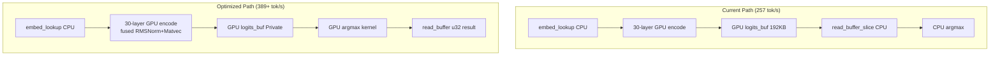

# Design: gpu-perf-phase2

## Overview

Three layered optimizations to the `GpuForwardPass` pipeline. Each builds on the previous: GPU argmax enables Private logits_buf, Private buffers reduce coherency overhead, fused kernels reduce dispatch count. All changes are additive -- existing APIs preserved.

## Architecture



## Components

### Component 1: GPU Argmax Kernel

**Purpose**: Replace CPU argmax over 49152 f32 logits with 2-stage GPU parallel reduction.

**Metal Kernel Design** (`argmax.metal`):

```metal
// Stage 1: argmax_reduce
// Each threadgroup reduces 1024 elements to 1 (max_val, max_idx) pair.
// Dispatch: grid=(ceil(vocab_size/1024), 1, 1), threadgroup=(256, 1, 1)
// Output: partial_vals[num_groups], partial_idxs[num_groups]

// Stage 2: argmax_final
// Single threadgroup reduces num_groups partial results to 1.
// Dispatch: grid=(1, 1, 1), threadgroup=(256, 1, 1)
// Output: result_buf = { u32 token_id, f32 max_val }
```

**Reduction strategy**:
- 256 threads per threadgroup, each thread processes 4 elements (1024 per group)
- Threadgroup shared memory for local reduction
- simd_sum not ideal for argmax (need index tracking), use threadgroup barrier + shared memory
- For vocab_size=49152: ceil(49152/1024) = 48 threadgroups in stage 1, 1 in stage 2

**Buffer layout**:
- `argmax_partial_vals`: 48 * sizeof(f32) = 192 bytes (StorageModePrivate)
- `argmax_partial_idxs`: 48 * sizeof(u32) = 192 bytes (StorageModePrivate)
- `argmax_result`: sizeof(u32) + sizeof(f32) = 8 bytes (StorageModeShared -- CPU reads result)

**Edge cases**:
- NaN: treated as less-than all finite values (NaN comparison returns false)
- -inf: natural minimum, never selected unless all values are -inf
- Ties: lowest index wins (deterministic, matches CPU argmax behavior)

### Component 2: StorageModePrivate Buffers

**Purpose**: Eliminate CPU cache coherency overhead for GPU-only scratch buffers.

**Changes to `buffer.rs`**:
```rust
/// Allocate StorageModePrivate buffer (GPU-only, no CPU access).
pub fn alloc_buffer_private(
    device: &ProtocolObject<dyn MTLDevice>,
    size: usize,
) -> Retained<ProtocolObject<dyn MTLBuffer>> {
    let options = MTLResourceOptions::StorageModePrivate;
    device.newBufferWithLength_options(size, options)
        .expect("Failed to allocate Private Metal buffer")
}
```

**Buffers to convert** (in `GpuForwardPass::from_gguf`):

| Buffer | Current | Target | Reason |
|--------|---------|--------|--------|
| hidden_a | Shared | **Shared** | CPU embed_lookup writes via contents() |
| hidden_b | Shared | **Private** | Only GPU reads/writes |
| scratch_q | Shared | **Private** | Only GPU reads/writes |
| scratch_k | Shared | **Private** | Only GPU reads/writes |
| scratch_v | Shared | **Private** | Only GPU reads/writes |
| scratch_attn_out | Shared | **Private** | Only GPU reads/writes |
| scratch_o | Shared | **Private** | Only GPU reads/writes |
| scratch_gate | Shared | **Private** | Only GPU reads/writes |
| scratch_up | Shared | **Private** | Only GPU reads/writes |
| scratch_silu | Shared | **Private** | Only GPU reads/writes |
| scratch_ffn | Shared | **Private** | Only GPU reads/writes |
| scratch_residual | Shared | **Private** | Only GPU reads/writes |
| logits_buf | Shared | **Private** | After GPU argmax, only GPU reads |

**Debug mode**: When `GPU_DEBUG=1`, all buffers remain Shared for `read_buffer_slice()` readback. Check at allocation time:
```rust
let debug = std::env::var("GPU_DEBUG").is_ok();
let alloc = if debug { alloc_buffer } else { alloc_buffer_private };
```

### Component 3: Fused RMSNorm+Matvec Kernel

**Purpose**: Fuse rmsnorm_optimized + matvec_q4_0 into single kernel, eliminating intermediate buffer write.

**Metal Kernel Design** (`rmsnorm_matvec_q4_0.metal`):

```metal
// Fused kernel: output[row] = dot(dequant(weight_row), rmsnorm(input, norm_weight))
//
// Phase 1: Compute RMS via simd_sum (same as rmsnorm_optimized)
// Phase 2: For each output row (1 threadgroup per row):
//   Each thread computes partial dot product of dequant(weight[row]) * normalized_input
//   Using simd_sum for final reduction
//
// Dispatch: grid=(out_dim, 1, 1) threadgroups, threadgroup=(32, 1, 1)
// Buffers: input(0), norm_weight(1), matvec_weight(2), output(3), params(4)
```

**Key insight**: RMS is a scalar computed once from the input vector. Each output row needs the same normalized input. We compute RMS in the first phase (all threads cooperate via simd_sum), then each threadgroup computes one output row using the same RMS value -- no intermediate buffer needed.

**Challenge**: With out_dim threadgroups, each must independently compute RMS from the same input. This means redundant RMS computation across all threadgroups. For SmolLM dimensions:
- Attention Q/K/V: out_dim = 576/192/192, redundant RMS compute is cheap (576 elements)
- FFN gate/up: out_dim = 1536, more redundancy but still fast
- lm_head: out_dim = 49152, significant redundancy -- may keep separate for this case

**Decision**: Fuse only for out_dim <= 1536 (attention + FFN projections). Keep separate rmsnorm + matvec for lm_head (49152 rows). This covers 61 out of 62 rmsnorm+matvec pairs per token.

**Params struct**:
```metal
struct FusedParams {
    uint out_dim;
    uint in_dim;      // = hidden_dim for norm
    float rms_eps;
};
```

## Data Flow

1. CPU embed_lookup writes 2.3KB to hidden_a (Shared)
2. GPU encode 30 layers: fused rmsnorm+matvec for Q/K/V/O/gate/up/down, separate for rope/attention/silu/residual/buffer_copy
3. Final rmsnorm + lm_head matvec (separate -- vocab_size too large for fusion)
4. GPU argmax: 2-stage reduction on logits_buf -> argmax_result (8 bytes)
5. CPU reads argmax_result: 8 bytes via contents()

## Technical Decisions

| Decision | Options | Choice | Rationale |
|----------|---------|--------|-----------|
| Argmax reduction | simd_sum vs threadgroup shared mem | Threadgroup shared mem | argmax needs index tracking, simd_sum only works for sum |
| Argmax elements/thread | 4 vs 8 vs 16 | 4 | 256 threads * 4 = 1024 per group. 48 groups for 49152. Clean. |
| Private buffer gating | Runtime flag vs compile-time | Runtime (env var) | GPU_DEBUG already checked at runtime, consistent |
| Fused kernel scope | All matvecs vs <=1536 | <=1536 out_dim | lm_head (49152) redundant RMS too expensive |
| Fused kernel threadgroup | 32 (1 simdgroup) | 32 | Matches existing matvec_q4_0 pattern |
| forward_token API | Break return type vs add method | Add forward_token_greedy() | Backward compatible |

## File Structure

| File | Action | Purpose |
|------|--------|---------|
| `crates/metal-attention-kernels/shaders/argmax.metal` | Create | 2-stage parallel argmax kernel |
| `crates/metal-attention-kernels/shaders/rmsnorm_matvec_q4_0.metal` | Create | Fused RMSNorm+Matvec Q4_0 kernel |
| `crates/metal-attention-kernels/shaders/rmsnorm_matvec_f32.metal` | Create | Fused RMSNorm+Matvec F32 kernel (for lm_head if needed) |
| `crates/metal-attention-kernels/src/buffer.rs` | Modify | Add `alloc_buffer_private()` |
| `crates/metal-attention/src/gpu_forward_pass.rs` | Modify | Add argmax encode, Private alloc, fused encode, `forward_token_greedy()` |
| `src/main.rs` | Modify | Use `forward_token_greedy()` in GPU decode loop |

## Error Handling

| Error | Handling | User Impact |
|-------|----------|-------------|
| Argmax on empty logits | Return Err("empty logits buffer") | CLI error message |
| NaN in all logits | Argmax returns index 0 (NaN < everything) | Generates token 0 (BOS/PAD) |
| Private buffer read attempt | Panic in debug (contents() on Private = UB) | Developer error caught early |
| Fused kernel numerical drift | Caught by regression tests (1e-4 tolerance) | Test failure blocks merge |

## Existing Patterns to Follow
- PSO prewarming: add new kernel names to `pso_cache.prewarm()` call in `from_gguf()` (`gpu_forward_pass.rs:196-210`)
- Inline encode methods: `encode_rmsnorm()`, `encode_matvec_q4_0()` pattern -- add `encode_argmax()`, `encode_fused_rmsnorm_matvec()`
- Buffer binding: `set_buffer(encoder, buf, 0, idx)` + `set_bytes(encoder, &val, idx)` convention from `dispatch.rs`
- Threadgroup sizes: 32 for simdgroup ops, 256 for element-wise ops
