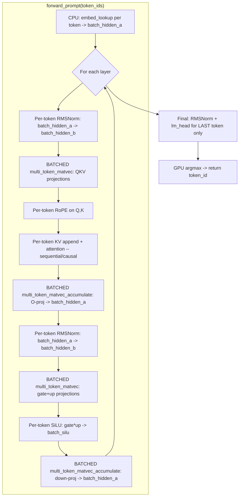

# Design: gpu-perf-phase3

## Overview

Add multi-token batched prefill to the existing GPU inference pipeline. The key insight: SmolLM-135M weight matrices (60-486 KB) fit in M4's SLC cache, so processing multiple tokens per dispatch amortizes the weight read cost. Batch matvec projections (QKV, O, gate, up, down) while keeping RMSNorm, RoPE, attention, and SiLU as per-token operations.

## Architecture

## Components

### Component 1: Multi-token Metal Shaders
**Purpose**: Production kernels for batched matvec over N tokens
**Files**: `crates/metal-attention-kernels/shaders/multi_token_matvec_q4_0.metal`

**Kernel 1: `multi_token_matvec_q4_0`**
- Copied from proven `bandwidth_test.metal` experiment
- Buffer layout: weight[0], input[1] (`batch_size * in_dim`), output[2] (`batch_size * out_dim`), out_dim[3], in_dim[4], batch_size[5]
- 256 threads, 8 simdgroups, each handles 1 output row
- Inner loop over `batch_size` tokens: weight cached in registers/SLC after first token
- Grid: `ceil(out_dim / 8)` threadgroups

**Kernel 2: `multi_token_matvec_q4_0_accumulate`**
- Same structure, but `output[tok * out_dim + row] += sum` instead of `= sum`
- Used for O-projection (accumulate into batch_hidden_a) and down-projection (same)

### Component 2: Batch Buffer Allocation
**Purpose**: Dynamically allocate batch-sized GPU buffers for multi-token processing
**File**: `crates/metal-attention/src/gpu_forward_pass.rs`

**Batch buffers** (allocated per `forward_prompt` call, proportional to `batch_size`):

| Buffer | Size (floats) | Purpose |
|--------|--------------|---------|
| batch_hidden_a | batch * hidden_size | Ping-pong A (embeddings, residuals) |
| batch_hidden_b | batch * hidden_size | Ping-pong B (RMSNorm output) |
| batch_q | batch * num_heads * head_dim | Q projections |
| batch_k | batch * num_kv_heads * head_dim | K projections |
| batch_v | batch * num_kv_heads * head_dim | V projections |
| batch_attn_out | batch * num_heads * head_dim | Attention output |
| batch_gate | batch * intermediate_size | Gate projection |
| batch_up | batch * intermediate_size | Up projection |
| batch_silu | batch * intermediate_size | SiLU(gate) * up |

For SmolLM-135M with batch=128: ~1.3 MB total batch buffers (negligible vs 70 MB weights).

**Memory strategy**: Allocate as `alloc_buffer` (Shared mode) since `hidden_a` needs CPU write for embed_lookup. Use `alloc_buffer_private` for GPU-only buffers.

### Component 3: forward_prompt() Method
**Purpose**: Multi-token prefill through all transformer layers
**File**: `crates/metal-attention/src/gpu_forward_pass.rs`

**Signature**: `pub fn forward_prompt(&mut self, token_ids: &[u32]) -> Result<u32, String>`

**Algorithm**:
1. Validate `token_ids` not empty, all within vocab range
2. Allocate batch buffers for `batch_size = token_ids.len()`
3. CPU: embed_lookup for each token into `batch_hidden_a[tok * hidden_size..]`
4. For each layer (0..num_layers):
   a. Per-token RMSNorm: `batch_hidden_a[tok*H..] -> batch_hidden_b[tok*H..]` (use `set_buffer` with offset `tok * H * 4`)
   b. Batched QKV: `multi_token_matvec_q4_0(Q_weight, batch_hidden_b, batch_q, ...)` (single dispatch, all tokens)
   c. Similarly for K and V (or batched Q+K+V if using batched kernel with multi-token)
   d. Per-token RoPE: `rope_apply(batch_q[tok*Q..], position=self.position+tok)` (use buffer offset)
   e. Per-token KV append + attention: sequential, `kv_len = initial_pos + tok + 1`
   f. Batched O-proj + accumulate: `multi_token_matvec_q4_0_accumulate(O, batch_attn_out, batch_hidden_a, ...)`
   g. Per-token RMSNorm for FFN: `batch_hidden_a[tok*H..] -> batch_hidden_b[tok*H..]`
   h. Batched gate/up: `multi_token_matvec_q4_0(gate, batch_hidden_b, batch_gate, ...)`
   i. Per-token SiLU: `silu(batch_gate[tok*I..]) * batch_up[tok*I..] -> batch_silu[tok*I..]`
   j. Batched down + accumulate: `multi_token_matvec_q4_0_accumulate(down, batch_silu, batch_hidden_a, ...)`
5. Final: RMSNorm + lm_head for LAST token only (single hidden vector)
6. GPU argmax -> return token_id
7. Increment `self.position += batch_size`

**Per-token operations with buffer offsets**: Use `set_buffer(encoder, buffer, offset_bytes, index)` to point RMSNorm/RoPE/SiLU at the correct token within batch buffers. The `set_buffer` helper already supports offset parameter.

### Component 4: Encoder Helpers for Multi-token
**Purpose**: New encode methods for multi-token dispatch
**File**: `crates/metal-attention/src/gpu_forward_pass.rs`

**New helpers**:
- `encode_multi_token_matvec_q4_0(encoder, weight, input, output, out_dim, in_dim, batch_size)` — dispatches `multi_token_matvec_q4_0` PSO
- `encode_multi_token_matvec_q4_0_accumulate(encoder, weight, input, output, out_dim, in_dim, batch_size)` — dispatches accumulate variant

**Reused helpers** (with buffer offsets for per-token ops):
- `encode_rmsnorm` — called per-token with buffer offset
- `encode_rope` — called per-token with position = base_position + tok
- `encode_decode_attention` — called per-token with increasing kv_len
- `encode_ffn_silu` — called per-token with buffer offsets on gate/up/silu

### Component 5: CLI Integration
**Purpose**: Benchmark prefill throughput
**File**: `src/main.rs`

Modify `run_inference_gpu()` to use `forward_prompt()` instead of sequential `forward_token()` for prompt processing. Report prefill tok/s = `prompt_tokens.len() / prefill_time`.

Modify `run_bench_gpu()` to call `forward_prompt()` for prefill phase and report prefill tok/s.

## Data Flow

1. User calls `forward_prompt(&[tok0, tok1, ..., tokN-1])`
2. CPU embeds all N tokens into `batch_hidden_a` (N * 576 * 4 = N * 2.3 KB)
3. Single command buffer with one compute encoder encodes all operations
4. For each layer: per-token cheap ops interleaved with batched matvec dispatches
5. After all layers: single-token final norm + lm_head + argmax
6. 4-byte argmax result readback, position advanced by N

## Technical Decisions

| Decision | Options | Choice | Rationale |
|----------|---------|--------|-----------|
| Batch buffer allocation | Pre-allocate max | Dynamic per-call | Prompts vary in length; avoid 2048*hidden waste |
| Per-token vs batched attention | Batched | Per-token | Causal constraint: token N needs K/V from 0..N |
| Per-token vs batched RMSNorm | Batched | Per-token | 32-thread kernel, trivial cost, not worth new kernel |
| Per-token vs batched SiLU | Batched | Per-token | Element-wise, cheap, not worth new kernel |
| Command buffer strategy | Per-layer | Single for all | Matches existing forward_token pattern, minimizes submit overhead |
| Buffer offset mechanism | Separate buffers per token | setBuffer offset | Metal-native, zero-copy, no allocation overhead |

## File Structure

| File | Action | Purpose |
|------|--------|---------|
| `crates/metal-attention-kernels/shaders/multi_token_matvec_q4_0.metal` | Create | Production multi-token matvec + accumulate kernels |
| `crates/metal-attention/src/gpu_forward_pass.rs` | Modify | Add forward_prompt(), encode helpers, batch buffer allocation |
| `crates/metal-attention-kernels/src/lib.rs` | Modify | Register new shader in build (if needed) |
| `src/main.rs` | Modify | Wire forward_prompt into CLI run/bench |
| `benches/inference.rs` | Modify | Add prefill benchmark |

## Error Handling

| Error | Handling | User Impact |
|-------|----------|-------------|
| Empty token_ids | Return Err("empty prompt") | Clear error message |
| Token ID out of vocab range | Return Err with details | Same as forward_token |
| Batch buffer allocation failure | Return Err | OOM for very long prompts |
| Command buffer error | validate_command_buffer | Same as forward_token |
| KV cache overflow | Return Err if prompt + decode > 2048 | Prompt too long |

## Existing Patterns to Follow
- `forward_token_greedy()` in `gpu_forward_pass.rs:1562-1733`: single command buffer pattern, encoder reuse, argmax at end
- `encode_matvec_q4_0_accumulate()`: buffer binding pattern, 256-thread / 8-row dispatch geometry
- `set_buffer(encoder, buf, offset, index)` in `dispatch.rs`: offset parameter for per-token buffer slicing
- `alloc_buffer` / `alloc_buffer_private` in `buffer.rs`: shared vs private allocation pattern
- `PsoCache::prewarm()` in `from_gguf()`: PSO prewarm pattern for new kernel names
