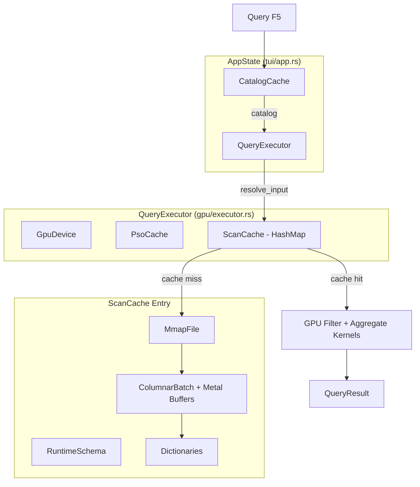

# Design: gpu-query-perf

## Overview

Introduce three caching layers into gpu-query's execution engine to eliminate redundant host-side I/O that accounts for 93% of query latency. The architecture follows a bottom-up approach: (1) CatalogCache eliminates filesystem re-scans, (2) Persistent QueryExecutor retains Metal device + PSO cache across queries, (3) ScanCache deduplicates CSV parsing within and across queries. All changes are internal to existing structs; no public API changes.

## Architecture



## Components

### Component 1: CatalogCache
**Purpose**: Cache directory scan results with file modification tracking.
**Location**: New file `gpu-query/src/io/catalog_cache.rs`

**Responsibilities**:
- Store `Vec<TableEntry>` from `scan_directory()`, keyed by directory path
- Track per-file `(size, mtime)` fingerprints for invalidation
- Validate cache on each access via O(n) stat calls (~0.1ms for 10 files)
- Expose `get_or_refresh()` returning `&[TableEntry]`
- Support manual `invalidate()` for `.refresh` command

**Data Structure**:
```rust
pub struct CatalogCache {
    dir: PathBuf,
    entries: Vec<TableEntry>,
    fingerprints: HashMap<PathBuf, FileFingerprint>,
    dir_modified: Option<SystemTime>,
}

struct FileFingerprint {
    size: u64,
    modified: SystemTime,
}
```

### Component 2: Persistent QueryExecutor
**Purpose**: Retain Metal device, command queue, metallib, and PSO cache across queries.
**Location**: Modified `gpu-query/src/tui/app.rs` + `gpu-query/src/tui/ui.rs`

**Responsibilities**:
- Store `Option<QueryExecutor>` in `AppState`, initialized lazily on first query
- Expose `get_or_init_executor()` method on `AppState`
- Replace `QueryExecutor::new()` calls in ui.rs:375 and event.rs:216

**Integration Pattern** (borrow checker safe):
```rust
// In execute_editor_query:
let catalog_vec = app.catalog_cache.get_or_refresh()?.to_vec();
// ... parse SQL, build plan ...
let executor = app.get_or_init_executor()?;
let result = executor.execute(&physical_plan, &catalog_vec)?;
// executor borrow ends here
app.set_result(result);
```

### Component 3: ScanCache
**Purpose**: Cache scan results (mmap + ColumnarBatch + schema + dictionaries) keyed by table name. Eliminates double-scan bug (B1), schema re-inference (B4), and dictionary rebuild (B3).
**Location**: Modified `gpu-query/src/gpu/executor.rs`

**Responsibilities**:
- `HashMap<String, ScanResult>` field on `QueryExecutor`
- `ensure_scan_cached(table, catalog)` -- populates cache on miss
- Automatic deduplication: compound filter's two `resolve_input` calls hit same cache entry
- File invalidation via `(size, mtime)` stat check before returning cached entry
- FIFO eviction at 8 entries

**Data Structure**:
```rust
pub struct QueryExecutor {
    device: GpuDevice,
    pso_cache: PsoCache,
    scan_cache: HashMap<String, ScanResult>,  // NEW
}

// ScanResult already contains mmap, batch, schema, delimiter
// Cache key: table_name.to_ascii_lowercase()
```

**resolve_input Refactor**:
```rust
fn resolve_input(&mut self, plan, catalog)
    -> Result<(String, Option<FilterResult>), String>
// Returns table_name key instead of owned ScanResult
// Callers access data via self.scan_cache.get(&key)
```

## Data Flow

### Warm Query Flow (28-42ms target)

1. `execute_editor_query()` called on F5/Ctrl+Enter
2. `app.catalog_cache.get_or_refresh()` -- stat checks only, returns cached `&[TableEntry]` (~0.1ms)
3. SQL parse + physical plan generation (~<1ms)
4. `app.get_or_init_executor()` -- returns existing executor (0ms)
5. `executor.execute(plan, catalog)`:
   a. `resolve_input(left_filter)` -> `ensure_scan_cached("sales")` -> stat check, cache HIT (0.1ms)
   b. `resolve_input(right_filter)` -> `ensure_scan_cached("sales")` -> already in HashMap (0ms)
   c. `execute_compound_filter()` -- GPU kernel (~5ms)
   d. `execute_aggregate_grouped()` -- GPU kernel (~20ms)
6. Result formatting (~3-15ms)
7. **Total: 28-42ms**

### Cold Query Flow (first query, ~195ms)

1. `catalog_cache.get_or_refresh()` -- cache miss, full `scan_directory()` (~57ms)
2. `get_or_init_executor()` -- lazy init: `GpuDevice::new()` + `PsoCache::new()` (~80ms)
3. `ensure_scan_cached("sales")` -- miss, full pipeline:
   a. `infer_schema_from_csv()` (~5ms)
   b. `MmapFile::open()` (~5ms)
   c. `gpu_parse_csv()` (~25ms GPU)
   d. `build_csv_dictionaries()` (~40ms CPU)
4. Second `ensure_scan_cached("sales")` -- HIT (B1 fixed even on cold!)
5. GPU filter + aggregate kernels (~25ms)
6. **Total: ~195ms (vs 367ms before, 1.88x improvement)**

## Technical Decisions

| Decision | Options | Choice | Rationale |
|----------|---------|--------|-----------|
| Scan cache scope | Per-query HashMap vs cross-query LRU | Per-query HashMap on executor | Simpler; executor persists in TUI so cross-query comes free |
| Cache key | (table, path, size, mtime) vs table name only | Table name for HashMap key; validate via stat | Avoids SystemTime in HashMap key; stat check is 0.05ms |
| resolve_input return | Owned ScanResult vs String key | String key | Avoids borrow checker conflict with `&mut self` + cache reference |
| Eviction | LRU vs FIFO vs size-based | FIFO with 8-entry cap | Simple; sufficient for typical workloads |
| CatalogCache location | New module vs extend catalog.rs | New `io/catalog_cache.rs` module | Separation of concerns; catalog.rs stays pure |
| Async execution | tokio spawn vs sync | Sync | Sub-50ms target makes freeze imperceptible; no tokio dependency |
| CLI behavior | Persistent vs per-invocation | Per-invocation (unchanged) | CLI is one-shot; no session to persist to |

## File Structure

| File | Action | Purpose |
|------|--------|---------|
| `gpu-query/src/io/catalog_cache.rs` | Create | CatalogCache struct + tests |
| `gpu-query/src/io/mod.rs` | Modify | Add `pub mod catalog_cache;` |
| `gpu-query/src/tui/app.rs` | Modify | Add `executor: Option<QueryExecutor>`, `catalog_cache: CatalogCache`, `get_or_init_executor()` |
| `gpu-query/src/tui/ui.rs` | Modify | Replace `scan_directory()` + `QueryExecutor::new()` with cached versions |
| `gpu-query/src/tui/event.rs` | Modify | Replace `scan_directory()` + `QueryExecutor::new()` with cached versions |
| `gpu-query/src/tui/mod.rs` | Modify | Initialize CatalogCache in AppState; use for initial catalog |
| `gpu-query/src/gpu/executor.rs` | Modify | Add `scan_cache` field; refactor `resolve_input` to return key; add `ensure_scan_cached` |
| `gpu-query/benches/query_latency.rs` | Create/Modify | New warm/cold query benchmarks |
| `gpu-query/benches/filter_throughput.rs` | Modify | Add 1M-row compound filter benchmarks |
| `gpu-query/benches/scan_throughput.rs` | Modify | Add schema/catalog/dictionary cache benchmarks |

## Error Handling

| Error | Handling | User Impact |
|-------|----------|-------------|
| Metal device init failure | Propagate error; show in TUI status bar | "GPU init failed: ..." message |
| File deleted between cache and use | Stat check fails -> cache miss -> re-scan -> file-not-found error | "Table 'X' not found" |
| File modified mid-query | Stat check detects mtime change -> cache miss -> full re-scan | Transparent to user; slightly slower |
| Cache entry eviction under memory pressure | FIFO eviction; next access re-scans | Slightly slower on evicted table |
| Catalog directory unreadable | Propagate IO error | "Cannot read data directory: ..." |

## Cache Invalidation Summary

| Layer | Trigger | Check Cost | Mechanism |
|-------|---------|-----------|-----------|
| CatalogCache | dir mtime + per-file (size, mtime) | ~0.1ms (n stat calls) | Automatic on `get_or_refresh()` |
| ScanCache | File (size, mtime) change | ~0.05ms (1 stat call) | On `ensure_scan_cached()` before return |
| PsoCache | Never (PSOs are immutable for loaded metallib) | 0ms | N/A |
| Manual | `.refresh` command | N/A | Calls `invalidate()` on all caches |

## Memory Budget

| Component | Per Table (1M rows) | 8-Entry Cache |
|-----------|-------------------|---------------|
| INT64 buffers (5 cols) | 40 MB | 320 MB |
| FLOAT32 buffers (3 cols) | 12 MB | 96 MB |
| DICT code buffers (2 cols) | 8 MB | 64 MB |
| Dictionary HashMaps | ~2 MB | ~16 MB |
| MmapFile (virtual, not physical) | ~0 physical | ~0 |
| **Total** | **~62 MB** | **~496 MB** |

Configurable via `max_entries` (default 8) and future `MAX_CACHE_BYTES` ceiling (512MB default).

## Existing Patterns to Follow

- **PsoCache** (`src/gpu/pipeline.rs`): Existing HashMap-based cache with composite key. ScanCache follows same pattern.
- **GpuDevice ownership** (`src/gpu/device.rs`): Uses `Retained<dyn MTLDevice>` (ARC). Safe to hold in AppState.
- **ScanResult** (`src/gpu/executor.rs`): Already owns mmap + batch + schema. Adding it to HashMap requires no new fields.
- **execute_scan** (`src/gpu/executor.rs:412`): Pure function today; becomes `ensure_scan_cached` + `execute_scan_uncached`.
- **AppState** (`src/tui/app.rs`): Flat struct, all `pub` fields, `new()` constructor. Standard extension point.
