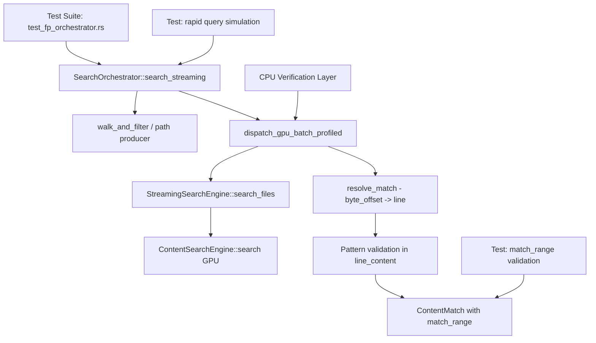

# Design: gpu-search-false-positives-2

## Overview

The fix targets three layers of the search pipeline: (1) orchestrator-level integration tests that exercise the full path from file walking through GPU dispatch to ContentMatch resolution, (2) byte_offset validation in resolve_match() to reject matches where the GPU-reported position doesn't correspond to a real pattern occurrence, and (3) match_range integrity checks. The key insight is that existing tests cover the StreamingSearchEngine layer, but the bug manifests in the orchestrator's resolve_match() function which accepts false positives when the pattern appears anywhere in the line.

## Architecture

## Components

### Component A: Orchestrator-Level Integration Tests
**Purpose**: Exercise full pipeline path that existing tests miss
**Responsibilities**:
- Create controlled test directories with known content (files with "kolbey", files with "Patrick Kavanagh", files with neither)
- Execute SearchOrchestrator::search() and search_streaming() directly
- Validate every returned ContentMatch against file contents
- Simulate rapid query changes using SearchSession cancel/restart

### Component B: Byte Offset Validation Enhancement
**Purpose**: Reject false positives where GPU byte_offset doesn't match pattern
**Responsibilities**:
- In resolve_match(), after finding the line, verify the byte at byte_offset matches the pattern
- Log diagnostic when byte_offset disagrees with line_content.find() position
- Reject matches where discrepancy exceeds pattern length (clear false positive)

### Component C: match_range Integrity
**Purpose**: Ensure UI highlighting is correct for every match
**Responsibilities**:
- Validate line_content[match_range] equals pattern (case-insensitive)
- Validate match_range bounds within line_content length

### Component D: Rapid Query Simulation Tests
**Purpose**: Reproduce the real-world false positive scenario
**Responsibilities**:
- Use orchestrator with real channels (crossbeam)
- Dispatch searches in rapid succession, cancelling previous
- Collect all StampedUpdate messages, filter by final generation
- Validate all surviving ContentMatches are genuine

## Data Flow

1. Test creates temp directory with controlled files (some with pattern A, some with pattern B, some with neither)
2. Test creates SearchOrchestrator with real GPU device + PsoCache
3. Test calls search() or search_streaming() with pattern
4. Orchestrator walks directory, batches files, dispatches to GPU
5. GPU returns StreamingMatch results with byte_offsets
6. resolve_match() reads file, finds line at byte_offset, searches for pattern
7. Test validates: (a) line_content contains pattern, (b) match_range is correct, (c) file actually contains pattern
8. For rapid query tests: dispatch multiple searches via channel, validate generation filtering

## Technical Decisions

| Decision | Options | Choice | Rationale |
|----------|---------|--------|-----------|
| Test level | Unit / Integration / E2E | Integration (orchestrator) | Bug manifests in orchestrator pipeline, not GPU layer |
| Query simulation | Real channels / Mock | Real crossbeam channels | Must test actual cancel/restart timing |
| Validation approach | Count comparison / Content check | Content check per match | Need to verify WHICH files match, not just counts |
| resolve_match fix | Reject on offset mismatch / Log only | Reject + log diagnostic | Must eliminate false positives, logging aids debugging |

## File Structure

| File | Action | Purpose |
|------|--------|---------|
| gpu-search/tests/test_fp_orchestrator.rs | Create | Orchestrator-level false positive tests |
| gpu-search/src/search/orchestrator.rs | Modify | Enhance resolve_match byte_offset validation |
| gpu-search/tests/test_false_positives.rs | Modify | Add rapid query simulation at StreamingEngine level |

## Error Handling

| Error | Handling | User Impact |
|-------|----------|-------------|
| GPU byte_offset points outside file | resolve_match returns None (existing) | Match silently rejected |
| byte_offset disagrees with find() | Log diagnostic, accept find() position (existing) | Correct highlighting, diagnostic logged |
| Pattern not found in line at all | resolve_match returns None (existing) | False positive rejected |
| byte_offset mismap > pattern.len() | NEW: reject match entirely | False positive eliminated |

## Existing Patterns to Follow
- Test structure: `test_false_positives.rs` pattern with `create_streaming_engine()` helper
- GPU health check: `gpu_returns_results()` to skip tests on non-Metal hardware
- CPU reference: `cpu_streaming_search()` for ground truth comparison
- File creation: `create_unique_content_files()` with controlled patterns
- Orchestrator test: `orchestrator.rs` mod tests with `make_test_directory()` + `test_session()`
