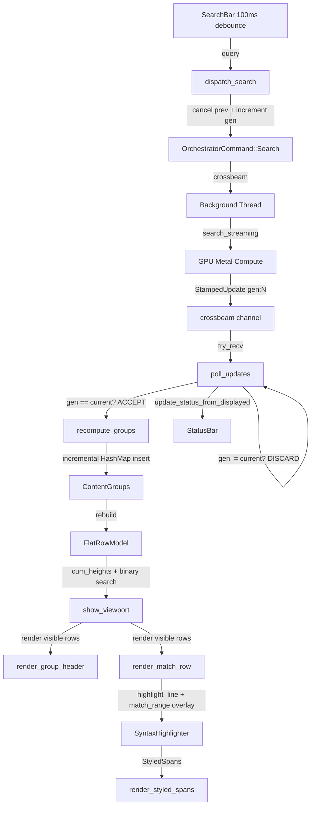

# Design: gpu-search-overhaul-2

## Overview

Overhaul the gpu-search UI pipeline to fix the P0 stale results race condition via generation-stamped messages, replace the flat result list with grouped-by-file display using variable-height virtual scroll, connect the existing syntax highlighter with GPU match_range precision, enable adaptive CPU verification, and wire existing action infrastructure.

## Architecture



## Components

### Component A: StampedUpdate (Generation Guard)

**Purpose**: Prevent stale results from superseded searches leaking into the UI.

**Responsibilities**:
- Wrap every `SearchUpdate` with a `generation: u64` field
- Orchestrator stamps outgoing updates with `session.guard.generation_id()`
- `poll_updates()` discards updates where `generation != current_gen`

**Type Definition** (`src/search/types.rs`):
```rust
pub struct StampedUpdate {
    pub generation: u64,
    pub update: SearchUpdate,
}
```

### Component B: ContentGroup + Incremental Grouping

**Purpose**: Group content matches by file for hierarchical display.

**Responsibilities**:
- Maintain `Vec<ContentGroup>` + `HashMap<PathBuf, usize>` for O(1) group lookup
- Incrementally insert new matches into groups as batches arrive
- Sort groups by match count descending on `Complete`
- Pre-compute `dir_display` and `filename` via `abbreviate_path()`

**Type Definition** (`src/ui/results_list.rs`):
```rust
struct ContentGroup {
    path: PathBuf,
    dir_display: String,
    filename: String,
    extension: String,
    match_indices: Vec<usize>,
}
```

### Component C: FlatRowModel (Virtual Scroll)

**Purpose**: Flatten grouped structure into a single virtual list with heterogeneous row heights.

**Responsibilities**:
- Map groups into `Vec<RowKind>` with interleaved section headers, group headers, file rows, match rows
- Maintain prefix-sum `cum_heights: Vec<f32>` for O(log n) binary search
- Support selected row expansion (24px -> 52px) via height recalculation

**Type Definitions** (`src/ui/results_list.rs`):
```rust
enum RowKind {
    SectionHeader(SectionType),
    FileMatchRow(usize),
    GroupHeader(usize),
    MatchRow { group_idx: usize, local_idx: usize },
}

enum SectionType { FileMatches, ContentMatches }

const SECTION_HEADER_HEIGHT: f32 = 24.0;
const GROUP_HEADER_HEIGHT: f32 = 28.0;
const FILE_ROW_HEIGHT: f32 = 28.0;
const MATCH_ROW_COMPACT: f32 = 24.0;
const MATCH_ROW_EXPANDED: f32 = 52.0;
```

### Component D: Path Abbreviation

**Purpose**: Transform absolute paths into readable abbreviated forms.

**Responsibilities**:
- Strip search root prefix for relative display
- `$HOME` env var substitution with `~` (OnceCell cached)
- Middle truncation for directories > 50 chars
- Return `(dir_display, filename)` tuple for independent styling

**Location**: New `src/ui/path_utils.rs` module (shared by results_list + status_bar).

### Component E: Match Highlighting Pipeline

**Purpose**: Replace query re-search with precise GPU match_range + syntax coloring.

**Responsibilities**:
- `apply_match_range_overlay()`: Split syntax spans at match_range boundaries, apply amber overlay
- `render_styled_spans()`: Paint `Vec<StyledSpan>` with per-span foreground + optional background
- `SyntaxHighlighter` passed as `&mut` parameter to `results_list.show()`
- Fresh parse state per line (`reset_cache(ext)` before each `highlight_line()`)

### Component F: Adaptive VerifyMode

**Purpose**: Enable CPU verification by default to filter GPU false positives.

**Responsibilities**:
- Default from `Off` to `Sample`
- `effective(result_count)` auto-upgrades to `Full` when < 100 results
- Orchestrator calls `effective()` after collecting GPU results per batch

## Data Flow

1. User types query -> SearchBar fires after 100ms debounce
2. `dispatch_search()` cancels previous, increments generation, drains channel, sends command
3. Background thread receives command, runs `search_streaming()` with GPU Metal compute
4. Orchestrator stamps every outgoing `SearchUpdate` with `generation: u64` via `StampedUpdate`
5. `poll_updates()` receives `StampedUpdate`, compares generation, discards stale, applies current
6. On `ContentMatches`: extend `content_matches`, call `recompute_groups()` (incremental HashMap insert)
7. On `Complete`: replace all matches, sort groups by count descending, rebuild FlatRowModel
8. `rebuild_flat_row_model()` constructs `Vec<RowKind>` + prefix-sum `cum_heights`
9. `show_viewport()` binary-searches `cum_heights` for first visible row, renders only visible subset
10. Each visible match row: `highlight_line()` -> `apply_match_range_overlay()` -> `render_styled_spans()`
11. `update_status_from_displayed()` syncs status bar count with actual displayed vectors

## Technical Decisions

| Decision | Options | Choice | Rationale |
|----------|---------|--------|-----------|
| Virtual scroll API | `show_rows()`, `show_viewport()`, `egui_virtual_list` | `show_viewport()` + prefix-sum | Variable heights for selected expansion; no external dep; O(log n) first-visible |
| Stale results guard | Per-variant gen field, `StampedUpdate` wrapper, channel replacement | `StampedUpdate` wrapper | Clean: one stamp per message; `SearchUpdate` enum unchanged; 8 bytes overhead |
| Grouping algorithm | Full re-group per batch, incremental HashMap | Incremental HashMap | O(1) per new match vs O(n) per batch |
| Home dir detection | `dirs` crate, `$HOME` env var | `$HOME` env var + OnceCell | Zero new deps; macOS-only (`$HOME` guaranteed); `dirs` already in Cargo.toml but env var is simpler |
| Syntax highlight state | Cached per-file, fresh per-line | Fresh per-line | Virtual scroll shows lines from different files; single-line highlighting 95%+ accurate |
| File type indicator | Extension badge `[RS]`, colored dot 6px | 6px colored dot | Compact (10px total vs 28px); consistent rendering; UX-Q2 decision |
| SyntaxHighlighter ownership | Move to ResultsList, RefCell wrap, `&mut` parameter | `&mut` parameter | Clean Rust borrow semantics; no RefCell overhead; TECH-Q1 decision |
| Status bar source | `SearchResponse.total_matches`, displayed data | Displayed data | Defense-in-depth: never contradicts visible results; PM-P0-3 |

## File Structure

| File | Action | Purpose |
|------|--------|---------|
| `src/search/types.rs` | Modify | Add `StampedUpdate` struct |
| `src/search/verify.rs` | Modify | Default `Sample`, add `effective()` method |
| `src/search/orchestrator.rs` | Modify | Stamp all `tx.send()` with generation; adaptive verify integration |
| `src/ui/app.rs` | Modify | Channel type `StampedUpdate`; generation guard in `poll_updates()`; `recompute_groups()`; `update_status_from_displayed()`; rename `_highlighter`; wire actions |
| `src/ui/results_list.rs` | **Rewrite** | `RowKind`, `FlatRowModel`, `show_viewport()`, `render_group_header()`, `render_match_row()`, `render_styled_spans()`, header-skipping navigation |
| `src/ui/search_bar.rs` | Modify | `DEFAULT_DEBOUNCE_MS` 30 -> 100 |
| `src/ui/status_bar.rs` | Modify | `is_searching` state, live count, `~` path substitution |
| `src/ui/highlight.rs` | Modify | Add `apply_match_range_overlay()`, extract `split_spans_at_ranges()` |
| `src/ui/theme.rs` | Modify | Add `extension_dot_color()` function |
| `src/ui/path_utils.rs` | **Create** | `abbreviate_path()`, `middle_truncate()`, `home_dir()` (~60 lines) |
| `src/ui/mod.rs` | Modify | Add `pub mod path_utils;` |

## Error Handling

| Error | Handling | User Impact |
|-------|----------|-------------|
| Stale generation in `StampedUpdate` | Silently discard in `poll_updates()` | None -- user sees only current results |
| `match_range` exceeds line length | Clamp to `min(end, line.len())`; skip if `start >= len` | Highlight truncated or absent; no panic |
| `$HOME` env not set | Fall back to absolute path display | Full paths shown (graceful degradation) |
| `SyntaxHighlighter` fails for unknown extension | Return unstyled spans (TEXT_PRIMARY) | Code shown without coloring |
| `open_in_editor` fails ($EDITOR not set) | Fall back to `macOS open` command | File opens in default app |
| Channel closed during search | Orchestrator thread exits cleanly | "No results" state; app stays responsive |

## Existing Patterns to Follow

- **Custom row rendering**: `allocate_exact_size()` + `Painter.text()` pattern in current `render_file_row()` and `render_content_row()` (results_list.rs:234-392)
- **Tokyo Night color constants**: All new colors use existing `theme.rs` tokens (ACCENT, TEXT_PRIMARY, TEXT_MUTED, BG_SURFACE, BORDER)
- **Selection highlighting**: 3px left ACCENT border + ACCENT @ 15% alpha background (results_list.rs:163)
- **Crossbeam channel usage**: Unbounded channels with `try_recv()` polling in egui frame loop (app.rs:131,214)
- **Cancellation**: `cancellation_pair()` + `SearchSession` pattern in `dispatch_search()` (app.rs:193-195)

## Layout Wireframes (from UX.md)

### Grouped Content Match Layout
```
| CONTENT MATCHES (12 in 4 files)                                  |  <- Section header (24px)
|   * orchestrator.rs  -- 5 matches       src/search/              |  <- Group header (28px, * = 6px dot)
|     :142  let orchestrator = SearchOrchestrator::new(...);       |  <- Match row compact (24px)
|     :205  orchestrator.search_streaming(request, &tx, &session); |
|     :239  // orchestrator verification stage                      |
|   * streaming.rs  -- 3 matches          src/search/              |  <- Group header
|     :45   pub fn search_streaming(&mut self, ...) {              |
```

### Selected Match Row (Expanded, 52px)
```
|                |               |       |   // context before line (TEXT_MUTED, 11px)        |
|                |  :142         |       |   let orchestrator = SearchOrchestrator::new(...);  |  <- amber highlight
|                |               |       |   // context after line (TEXT_MUTED, 11px)          |
```
