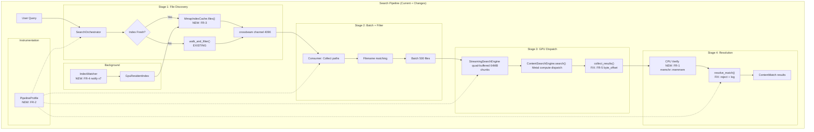

# Design: gpu-search-overhaul

## Overview

Fix the CPU-side byte_offset resolution chain (P0 accuracy bug), wire the existing GSIX mmap index into the orchestrator's producer thread via channel-swap, add notify v7 FSEvents watcher for index freshness, and instrument the full pipeline with per-stage timing. No GPU kernel changes required -- the bug and all performance bottlenecks are in the CPU orchestration layer.

## Architecture



## Components

### Component A: CPU Verification Layer (`src/search/verify.rs` -- NEW)
**Purpose**: Validate GPU match byte offsets against actual file content using `memchr::memmem`.

**Responsibilities**:
- Run `memchr::memmem::find_iter()` on file content to find all pattern occurrences
- Compare GPU-reported byte offsets against CPU-found positions
- Report: confirmed, missed_by_gpu, false_positive_by_gpu
- Three modes: Off (production), Sample (1-in-20 files), Full (tests)

**Interface**:
```rust
pub enum VerifyMode { Off, Sample, Full }

pub struct VerificationResult {
    pub confirmed: u32,
    pub false_positives: u32,
    pub missed: u32,
}

pub fn cpu_verify_matches(
    file_content: &[u8],
    pattern: &[u8],
    gpu_byte_offsets: &[u32],
    case_sensitive: bool,
) -> VerificationResult;
```

**Pattern**: Follows existing `cpu_search()` in content.rs but returns structured verification, not just count.

### Component B: Pipeline Profiler (`src/search/profile.rs` -- NEW)
**Purpose**: Per-stage timing and counters for every search.

**Responsibilities**:
- Capture `Instant::now()` at each pipeline stage boundary
- Track file/byte/match counters
- Measure TTFR (time from search start to first ContentMatch sent)
- Attach to SearchResponse

**Interface**:
```rust
#[derive(Debug, Clone, Default)]
pub struct PipelineProfile {
    pub walk_us: u64,
    pub filter_us: u64,
    pub batch_us: u64,
    pub gpu_load_us: u64,
    pub gpu_dispatch_us: u64,
    pub resolve_us: u64,
    pub total_us: u64,
    pub files_walked: u64,
    pub files_filtered: u64,
    pub files_searched: u64,
    pub bytes_searched: u64,
    pub gpu_dispatches: u32,
    pub matches_raw: u64,
    pub matches_resolved: u64,
    pub matches_rejected: u64,
    pub ttfr_us: u64,
}
```

**Pattern**: Follows existing `StreamingProfile` in streaming.rs. Merges/extends it.

### Component C: Index-First Search Path (orchestrator.rs -- MODIFY)
**Purpose**: Swap the producer thread from walk_and_filter() to index iterator when a fresh index is available.

**Responsibilities**:
- Check index freshness via `SharedIndexManager::is_stale()`
- If fresh: iterate `MmapIndexCache.entries()` into the crossbeam channel
- If stale: fall back to existing `walk_and_filter()` producer thread
- Background: rebuild index from walk results for next search

**Integration Point**: orchestrator.rs `search_streaming()`, Stage 1 producer.

**Pattern**: Channel-swap -- consumer (Stage 2+3) is unchanged. Only the producer source changes. Minimal-invasive per TECH.md Section 3.3.

### Component D: FSEvents Watcher (`src/index/watcher.rs` -- NEW)
**Purpose**: Keep GSIX index current via filesystem change detection.

**Responsibilities**:
- Use `notify` v7 `RecommendedWatcher` (FSEvents backend on macOS)
- Batch changes with `notify-debouncer-mini` at 500ms interval
- On events: update `GpuResidentIndex` entries, persist via `SharedIndexManager::save()`
- Register on startup, zero-cost when idle

**Interface**:
```rust
pub struct IndexWatcher {
    watcher: RecommendedWatcher,
    index: Arc<RwLock<GpuResidentIndex>>,
    manager: SharedIndexManager,
}

impl IndexWatcher {
    pub fn start(root: PathBuf, index: Arc<RwLock<GpuResidentIndex>>) -> Result<Self>;
    pub fn stop(&mut self);
}
```

**Pattern**: Follows Spotlight architecture -- FSEvents journal + debounced batch update.

### Component E: Byte Offset Fix (content.rs + streaming.rs -- MODIFY)
**Purpose**: Fix the `context_start` dual-meaning bug causing false positives.

**Current Bug**:
- GPU kernel: `context_start = offset_in_chunk + line_start_in_64B_window` (line start relative to chunk)
- But `line_start` only counts newlines within the 64-byte thread window, not from chunk start
- For matches >64 bytes into a chunk, line_start is wrong

**Fix Strategy**:
1. In `collect_results()`: compute byte_offset using match position instead of line start:
   ```
   byte_offset = chunk_index * CHUNK_SIZE + offset_in_chunk + local_pos
   ```
   where `offset_in_chunk + local_pos = global_pos` (the match byte, not line start)
2. In `resolve_match()`: use byte_offset to find the containing line, then search for pattern within that line
3. Keep the existing `find(pattern)` safety net that rejects false positives

## Data Flow

1. User types query -> `SearchOrchestrator::search_streaming()` starts
2. **Producer**: If index fresh, `MmapIndexCache.entries()` -> channel. Else, `walk_and_filter()` -> channel.
3. **Consumer**: Receive paths, build filename matches, batch into groups of 500
4. **GPU Dispatch**: For each batch, `StreamingSearchEngine::search_files()` partitions into 64MB stream chunks, loads content via `read()`, dispatches Metal compute
5. **Collect**: `collect_results()` reads GPU match buffer, computes file-relative byte_offset (FIXED)
6. **Verify**: In test/debug mode, `cpu_verify_matches()` confirms GPU results with `memchr::memmem`
7. **Resolve**: `resolve_match()` re-reads file, maps byte_offset to line, validates pattern present
8. **Profile**: `PipelineProfile` captures timing at each stage boundary
9. **Send**: `SearchUpdate::ContentMatches` pushed to UI channel progressively

## Technical Decisions

| Decision | Options | Choice | Rationale | KB Citation |
|----------|---------|--------|-----------|-------------|
| I/O strategy for multi-file | mmap per-file vs read() into pool | read() into MTLBuffer pool | mmap kernel overhead on macOS, per-file mapping cost | KB #1343 |
| I/O strategy for index file | read() vs mmap | mmap (existing) | Single large file, loaded once, zero-copy | KB #1343 |
| Buffer pool size | 2x/4x/8x 64MB | 4x64MB (256MB) | Absorbs SSD variability, 3.1% of 8GB min RAM | KB #1274, #1374 |
| FS change detection | polling vs FSEvents | notify v7 (FSEvents) | Zero-cost idle, journal-based, proven in Spotlight | TECH.md |
| Event debounce | notify raw vs debouncer-mini vs debouncer-full | debouncer-mini (500ms) | Simple time-based batching, no rename tracking needed | TECH.md |
| Index format | SQLite vs GSIX binary | GSIX (existing) | Already implemented, mmap-compatible, zero-copy | KB #1388 |
| Profiling | tracing crate vs Instant | Instant-based | Zero new deps, zero overhead when not collecting | TECH.md |
| CPU verification | custom impl vs memchr | memchr::memmem | SIMD-accelerated, already in Cargo.toml | TECH.md |
| Line counting | GPU in-kernel vs deferred to CPU | Deferred (turbo_search pattern) | Metal can't do decoupled lookback prefix sum | KB #1320, #1322 |
| Test oracle | ripgrep vs grep | grep -rn | POSIX, no filtering logic differences | TECH.md |
| byte_offset fix | Modify kernel vs fix CPU interpretation | Fix CPU-side only | Kernel correct, changing risks breaking turbo/batch | TECH.md |

## File Structure

| File | Action | Purpose |
|------|--------|---------|
| `src/search/verify.rs` | Create | CPU verification layer with memchr::memmem |
| `src/search/profile.rs` | Create | PipelineProfile struct and formatting |
| `src/index/watcher.rs` | Create | FSEvents watcher using notify v7 |
| `src/search/content.rs` | Modify | Fix collect_results() byte_offset calculation (~15 lines) |
| `src/search/streaming.rs` | Modify | Fix file_byte_offset computation (~10 lines) |
| `src/search/orchestrator.rs` | Modify | Wire profiler, CPU verify, index-first path (~200 lines) |
| `src/search/mod.rs` | Modify | Add `pub mod verify; pub mod profile;` |
| `src/index/mod.rs` | Modify | Add `pub mod watcher;` |
| `Cargo.toml` | Modify | Add notify, notify-debouncer-mini deps |
| `tests/test_search_accuracy.rs` | Create | End-to-end accuracy + grep oracle tests |
| `benches/pipeline_profile.rs` | Create | Real-world scenario benchmarks |

## Error Handling

| Error | Handling | User Impact |
|-------|----------|-------------|
| GPU byte_offset maps to wrong line | `resolve_match()` rejects via `find(pattern)` -> `None` | Match silently dropped; `matches_rejected` counter incremented |
| Index file corrupt/missing | `MmapIndexCache::load_mmap()` returns `CacheError` | Fall back to walk-based search, log warning |
| Index stale (>1 hour) | `SharedIndexManager::is_stale()` check | Walk-based producer, background rebuild |
| FSEvents watcher fails | `notify::Error` | Fall back to poll-based, log warning |
| File read permission denied | `std::fs::read()` -> `Err` | Skip file, continue search, increment skip counter |
| GPU match buffer overflow (>10K) | Truncate at MAX_MATCHES | Some matches lost in large result sets |

## Existing Patterns to Follow

- **Channel-based pipeline**: `orchestrator.rs` uses `crossbeam_channel` with bounded capacity (4096) for backpressure between producer and consumer. Index-first path reuses this exact pattern.
- **Streaming sub-batches**: `streaming.rs` processes files in SUB_BATCH_SIZE (200) per GPU dispatch to stay under MAX_MATCHES (10000). New profiling wraps existing sub-batch loop.
- **GPU repr(C) structs**: `content.rs` uses `#[repr(C)]` structs matching `search_types.h`. No struct changes needed for byte_offset fix.
- **Atomic write for index**: `shared_index.rs` uses temp file + rename for crash-safe index persistence. Watcher reuses this pattern.
- **mmap with madvise**: `io/mmap.rs` uses `MADV_SEQUENTIAL` for index loading. Already production-ready.
- **Test corpus via tempdir**: `test_orchestrator_integration.rs` uses `tempfile::TempDir` with deterministic content. Accuracy tests follow same pattern.
