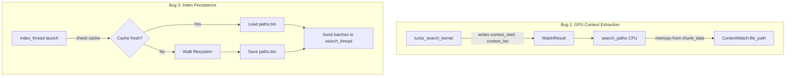

# Design: gpu-search-ui-fix

## Overview

Three targeted fixes to the gpu-search-ui path search pipeline: (1) move newline scanning from CPU to GPU kernel, (2) verify/fix absolute path preservation, (3) add disk persistence for the path index. Plus a comprehensive test suite.

## Architecture



## Components

### Component A: GPU Newline Scanner (turbo_search_kernel modification)

**Purpose**: Eliminate CPU backward/forward newline scan by doing it on GPU per match.
**File**: `/Users/patrickkavanagh/gpu-search-ui/src/engine/shader.rs`

**Current behavior** (turbo_search_kernel lines 309-326):
```msl
result.context_start = offset_in_chunk + local_pos;  // Raw byte offset
result.context_len = min(valid_bytes - local_pos, (uint)MAX_CONTEXT);
```

**New behavior** — scan device memory for newlines:
```msl
// Scan backward in device buffer to find line start (\n or chunk start)
uint abs_pos = chunk_idx * CHUNK_SIZE + offset_in_chunk + local_pos;
uint line_start = abs_pos;
device const uchar* raw = (device const uchar*)data;
while (line_start > chunk_idx * CHUNK_SIZE && raw[line_start - 1] != '\n') {
    line_start--;
}

// Scan forward to find line end (\n or chunk end)
uint chunk_end = chunk_idx * CHUNK_SIZE + chunk_len;
uint line_end = abs_pos + params.pattern_len;
while (line_end < chunk_end && raw[line_end] != '\n') {
    line_end++;
}

result.context_start = line_start - chunk_idx * CHUNK_SIZE;  // Offset within chunk
result.context_len = min(line_end - line_start, (uint)MAX_CONTEXT);
```

**Key design decisions**:
- Read from `data` (device buffer) not `local_data` (only 64+64 bytes)
- Cast `data` from `uchar4*` to `uchar*` for byte-level access
- Bound scan to chunk boundaries (chunk_idx * CHUNK_SIZE to chunk_end)
- Cap at MAX_CONTEXT (512 bytes) — sufficient for paths (longest macOS path ~1024 bytes)

### Component B: Simplified CPU extraction (search_paths modification)

**Purpose**: Replace per-match CPU newline scan with direct slice from chunk_data.
**File**: `/Users/patrickkavanagh/gpu-search-ui/src/engine/search.rs` lines 379-433

**Current** (7 lines of backward + forward scan per match):
```rust
let mut line_start = abs_offset;
while line_start > 0 && self.chunk_data[line_start - 1] != b'\n' {
    line_start -= 1;
}
let mut line_end = abs_offset + pattern_bytes.len();
while line_end < data_end && self.chunk_data[line_end] != b'\n' {
    line_end += 1;
}
```

**New** (direct slice using GPU-provided offsets):
```rust
let context_start_in_chunk = m.context_start as usize;
let context_len = m.context_len as usize;
let abs_start = chunk_idx * CHUNK_SIZE + context_start_in_chunk;
let abs_end = (abs_start + context_len).min(self.chunk_data.len());
let path_bytes = &self.chunk_data[abs_start..abs_end];
let path = String::from_utf8_lossy(path_bytes).trim().to_string();
```

### Component C: Index persistence

**Purpose**: Cache path index to disk, skip FS walk on subsequent launches.
**File**: New function in `/Users/patrickkavanagh/gpu-search-ui/src/engine/index.rs`

**Cache format** (paths.bin):
```
[8 bytes] magic: b"GPUSRCH\0"
[4 bytes] version: 1u32
[8 bytes] timestamp: unix secs (u64)
[4 bytes] root_path_len: u32
[N bytes] root_path: UTF-8
[4 bytes] file_count: u32
For each file:
  [4 bytes] path_len: u32
  [N bytes] path: UTF-8
```

**Staleness check**: Load cache only if:
1. Root path matches current root
2. Cache age < 3600 seconds (1 hour)
3. File count > 0

**Integration in app.rs index_thread**:
```rust
// Try loading cache first
if let Some(cached_paths) = PathCache::load(&root) {
    // Send all cached paths as single batch
    let _ = batch_tx.send(cached_paths.clone());
    let _ = index_tx.send(IndexUpdate::Complete { total_files: cached_paths.len() });
    // Optionally rescan in background and update cache
    return;
}
// ... existing walk logic ...
// After walk completes, save cache
PathCache::save(&root, &all_paths);
```

### Component D: Test suite

**Purpose**: Comprehensive GPU search correctness tests without GUI.
**File**: `/Users/patrickkavanagh/gpu-search-ui/tests/test_gpu_correctness.rs`

Tests grouped by concern:
1. **Path round-trip**: Load paths, search, verify exact match text
2. **Context completeness**: Verify no truncation at 64 bytes
3. **Chunk boundaries**: Path at exact CHUNK_SIZE boundary
4. **Long paths**: > 200 byte paths preserved fully
5. **Unicode paths**: Non-ASCII characters in paths
6. **Case sensitivity**: Toggle case_sensitive flag
7. **Absolute prefix**: Verify leading `/` preserved
8. **Performance gate**: Sub-10ms at 500K paths

## Data Flow

1. `load_paths()` packs paths newline-delimited into 4KB chunks → GPU buffer
2. `turbo_search_kernel` finds matches, scans to newline boundaries, writes context offsets
3. `search_paths()` reads GPU results, slices chunk_data at GPU-provided offsets
4. Returns `Vec<ContentMatch>` with complete file paths

## Technical Decisions

| Decision | Options | Choice | Rationale |
|----------|---------|--------|-----------|
| Newline scan location | CPU / GPU | GPU | Eliminates 70-79% CPU bottleneck |
| Device memory access | local_data / device buffer | device buffer | local_data only 128 bytes, paths up to 1024 |
| Cache format | JSON / bincode / custom binary | Custom binary | Zero dependencies, simple format |
| Cache staleness | mtime / file count / timer | Timer (1hr) | Simple, reliable, no stat() per file |
| Context cap | 256 / 512 / 1024 | 512 (MAX_CONTEXT) | Already defined in shader, sufficient for paths |

## File Structure

| File | Action | Purpose |
|------|--------|---------|
| `/gpu-search-ui/src/engine/shader.rs` | Modify | Add newline scan to turbo_search_kernel |
| `/gpu-search-ui/src/engine/search.rs` | Modify | Simplify search_paths() CPU extraction |
| `/gpu-search-ui/src/engine/index.rs` | Modify | Add PathCache save/load functions |
| `/gpu-search-ui/src/app.rs` | Modify | Use PathCache in index_thread |
| `/gpu-search-ui/tests/test_gpu_correctness.rs` | Create | Comprehensive correctness test suite |

## Error Handling

| Error | Handling | User Impact |
|-------|----------|-------------|
| GPU context offsets out of bounds | Bounds check, skip match | Silent skip — same as current behavior |
| Cache file corrupt/unreadable | Fall back to FS walk | Slightly slower launch, auto-recovers |
| Cache directory doesn't exist | Create `~/.cache/gpu-search-ui/` | Transparent |
| Path > MAX_CONTEXT (512) | Truncate at 512 bytes | Extremely rare (macOS max ~1024) |

## Existing Patterns to Follow

- **Chunk data access**: `search_paths()` already accesses `self.chunk_data` by absolute offset — same pattern for GPU-provided offsets
- **Buffer sizing**: `total_path_bytes / 4096 + 2048` formula in app.rs search_thread
- **Test structure**: `test_path_search.rs` pattern of `Device::system_default()` → `new_for_paths()` → `load_paths()` → `search_paths()` → assert
- **MSL patterns**: `content_search_kernel` already does backward/forward newline scan in shader.rs lines 178-201
