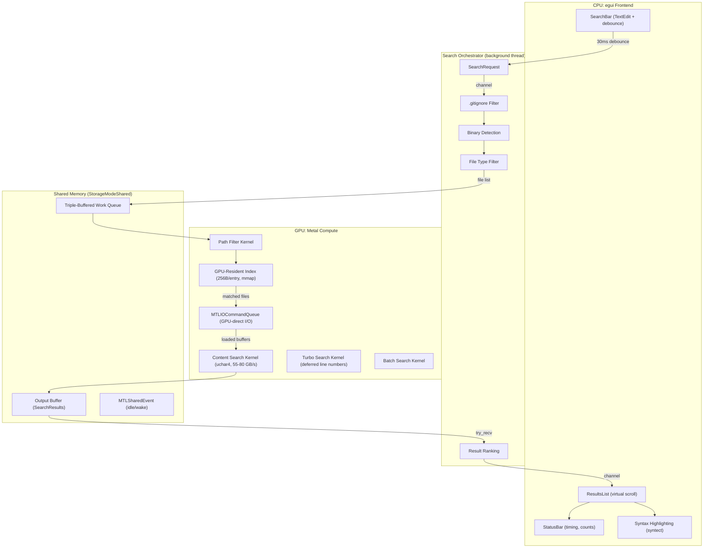

# Design: gpu-search

## Overview

Dual-Metal architecture: egui renders UI via wgpu Metal backend, objc2-metal drives GPU compute (search kernels, MTLIOCommandQueue, filesystem index). Both reference same physical MTLDevice, use separate MTLCommandQueues. CPU orchestrates search pipeline, GPU owns I/O and compute.

## Architecture

## Components

### GPU Device Layer (`src/gpu/`)
**Purpose**: Metal device initialization, PSO cache, shader management
**Responsibilities**:
- `device.rs`: `MTLCreateSystemDefaultDevice()`, capability queries
- `pipeline.rs`: HashMap PSO cache for search kernels. Load `shaders.metallib` from build output
- `types.rs`: `#[repr(C)]` structs matching MSL: SearchParams, SearchResult, GpuPathEntry
- `work_queue.rs`: Triple-buffered CPU->GPU request handoff (Acquire-Release ordering)
- `executor.rs`: Completion-handler re-dispatch chain, MTLSharedEvent idle/wake

### Search Engine (`src/search/`)
**Purpose**: Content search dispatch, streaming pipeline, persistent batch
**Responsibilities**:
- `content.rs`: Buffer allocation, kernel dispatch (256 threads, 64 bytes/thread), result collection
- `streaming.rs`: Quad-buffered pipeline (4 x 64MB chunks), I/O + compute overlap
- `persistent.rs`: Persistent kernel variant with batch processing
- `orchestrator.rs`: Top-level pipeline coordinator (request -> filter -> I/O -> search -> response)
- `types.rs`: SearchRequest, SearchResponse, FileMatch, ContentMatch
- `ignore.rs`: .gitignore filtering via `ignore` crate
- `binary.rs`: NUL byte heuristic for binary detection
- `filetype.rs`: Extension-based file type filtering
- `ranking.rs`: Result ranking (filename > content, shorter paths preferred)
- `cancel.rs`: AtomicBool cancellation, generation ID for stale result discard
- `channel.rs`: Progressive delivery (Wave 1: filenames, Wave 2: content)

### File I/O (`src/io/`)
**Purpose**: GPU-direct file loading, zero-copy mmap
**Responsibilities**:
- `gpu_io.rs`: MTLIOCommandQueue wrapper (native objc2-metal bindings, no msg_send!)
- `batch.rs`: BatchLoadResult, BatchLoadHandle for bulk file loading
- `mmap.rs`: mmap + `newBufferWithBytesNoCopy` for zero-copy GPU access

### Filesystem Index (`src/index/`)
**Purpose**: GPU-resident path index for fast filtering
**Responsibilities**:
- `gpu_index.rs`: GpuPathEntry (256B, cache-aligned), GpuResidentIndex
- `shared_index.rs`: Persistence at ~/.gpu-search/, load via mmap
- `scanner.rs`: Parallel directory scan with rayon + ignore crate WalkBuilder
- `cache.rs`: Binary index save/load with header (version, count, root hash)
- `watcher.rs`: Incremental updates via notify crate (FSEvents on macOS)
- `gpu_loader.rs`: mmap -> newBufferNoCopy -> GPU buffer

### UI (`src/ui/`)
**Purpose**: egui floating panel, search interaction
**Responsibilities**:
- `app.rs`: `GpuSearchApp` implementing `eframe::App`. Window config, channel polling
- `search_bar.rs`: TextEdit with 30ms debounce, search icon, filter toggle
- `results_list.rs`: Two sections (filename + content), virtual scroll, selection highlight
- `theme.rs`: Tokyo Night dark theme colors, egui Visuals config
- `keybinds.rs`: Keyboard shortcuts (Up/Down/Enter/Escape/Cmd+C/Cmd+Enter)
- `highlight.rs`: syntect integration, query match override, cached parse state
- `filters.rs`: Filter pills (extension, exclude dir, case sensitive)
- `status_bar.rs`: Match count, timing, search root, active filters
- `actions.rs`: Open-in-editor action (VS Code, Vim, Sublime, fallback)

## Data Flow

1. User types in search bar -> egui TextEdit captures input (CPU, <0.1ms)
2. Debounce timer fires (30ms after last keystroke) -> construct SearchRequest
3. SearchOrchestrator receives request via channel -> applies .gitignore + binary + filetype filters
4. GPU path filter kernel scopes files via resident index (GPU, <0.5ms)
5. MTLIOCommandQueue batch loads matched files to GPU buffers (GPU, ~30ms cold / <1ms cached)
6. Content search kernel runs vectorized uchar4 search (GPU, 0.2-2ms per 64MB chunk)
7. Streaming pipeline overlaps I/O with compute (4 x 64MB quad-buffer)
8. Results written to unified memory output buffer (GPU, <0.1ms)
9. CPU reads results via try_recv (non-blocking), formats for display
10. egui renders results with syntax highlighting (CPU, <2ms at 60fps)

**Total**: ~50-200ms first search (I/O dominated), <5ms incremental (cached files)

## Technical Decisions

| Decision | Options | Choice | Rationale |
|----------|---------|--------|-----------|
| Metal crate | metal 0.33, objc2-metal 0.3 | objc2-metal 0.3 | Active, RAII, complete API, consistent with gpu-query |
| GUI framework | egui, iced, Slint, Tauri | egui/eframe | Immediate mode fits search UX, wgpu shares Metal device |
| Compute API | wgpu compute, raw objc2-metal | raw objc2-metal | wgpu abstracts away MTLIOCommandQueue, SIMD, threadgroup memory |
| Search kernel | Rewrite, port MSL unchanged | Port MSL unchanged | Proven 55-80 GB/s, zero algorithmic risk |
| Work queue | rust-experiment atomics, gpu-query triple-buffer | gpu-query triple-buffer | Better memory ordering, no torn reads |
| Persistent kernel | while(true) kernel, re-dispatch chain | Completion-handler re-dispatch | No watchdog timeout, gpu-query proven |
| Shader compilation | Inline strings, AOT build.rs | AOT via build.rs | gpu-query pattern, better error messages |
| .gitignore | Custom parser, ignore crate | ignore crate | Same as ripgrep, gold standard |
| Syntax highlighting | tree-sitter, syntect | syntect | Simpler, read-only display, ~16K lines/sec |
| Theme | System, custom dark | Tokyo Night dark | Developer audience, ship faster, dark-only v1 |

## File Structure

| File | Action | Purpose |
|------|--------|---------|
| `gpu-search/Cargo.toml` | Create | Dependencies: objc2-metal, eframe, syntect, rayon, ignore, criterion |
| `gpu-search/build.rs` | Create | Compile .metal -> .metallib (gpu-query pattern) |
| `gpu-search/shaders/search_types.h` | Create | Shared repr(C) type definitions (MSL side) |
| `gpu-search/shaders/content_search.metal` | Create | Extract from rust-experiment inline MSL |
| `gpu-search/shaders/turbo_search.metal` | Create | Extract from rust-experiment inline MSL |
| `gpu-search/shaders/batch_search.metal` | Create | Extract from rust-experiment inline MSL |
| `gpu-search/shaders/path_filter.metal` | Create | Extract from rust-experiment inline MSL |
| `gpu-search/src/main.rs` | Create | Entry point: Metal init + eframe launch |
| `gpu-search/src/lib.rs` | Create | Module declarations |
| `gpu-search/src/gpu/device.rs` | Create | Port from gpu-query (objc2-metal device init) |
| `gpu-search/src/gpu/pipeline.rs` | Create | Port from gpu-query (PSO cache) |
| `gpu-search/src/gpu/types.rs` | Create | repr(C) structs + layout assertions |
| `gpu-search/src/gpu/work_queue.rs` | Create | Adapt from gpu-query (triple-buffered) |
| `gpu-search/src/gpu/executor.rs` | Create | Adapt from gpu-query (re-dispatch chain) |
| `gpu-search/src/search/content.rs` | Create | Port from rust-experiment (1660 lines) |
| `gpu-search/src/search/streaming.rs` | Create | Port from rust-experiment (1071 lines) |
| `gpu-search/src/search/persistent.rs` | Create | Port from rust-experiment (1089 lines) |
| `gpu-search/src/search/orchestrator.rs` | Create | New: pipeline coordinator |
| `gpu-search/src/search/types.rs` | Create | SearchRequest, SearchResponse, FileMatch, ContentMatch |
| `gpu-search/src/search/ignore.rs` | Create | New: .gitignore via ignore crate |
| `gpu-search/src/search/binary.rs` | Create | New: NUL byte binary detection |
| `gpu-search/src/search/filetype.rs` | Create | New: extension-based filtering |
| `gpu-search/src/search/ranking.rs` | Create | New: result ranking |
| `gpu-search/src/search/cancel.rs` | Create | New: AtomicBool cancellation |
| `gpu-search/src/search/channel.rs` | Create | New: progressive delivery |
| `gpu-search/src/io/gpu_io.rs` | Create | Port from rust-experiment (524 lines) |
| `gpu-search/src/io/batch.rs` | Create | Port from rust-experiment (514 lines) |
| `gpu-search/src/io/mmap.rs` | Create | Port from rust-experiment (566 lines) |
| `gpu-search/src/index/gpu_index.rs` | Create | Port from rust-experiment (867 lines) |
| `gpu-search/src/index/shared_index.rs` | Create | Port from rust-experiment (921 lines) |
| `gpu-search/src/index/scanner.rs` | Create | New: rayon parallel scan + ignore WalkBuilder |
| `gpu-search/src/index/cache.rs` | Create | New: binary index persistence |
| `gpu-search/src/index/watcher.rs` | Create | New: notify crate filesystem watching |
| `gpu-search/src/index/gpu_loader.rs` | Create | New: mmap -> GPU buffer loading |
| `gpu-search/src/ui/app.rs` | Create | New: eframe::App implementation |
| `gpu-search/src/ui/search_bar.rs` | Create | New: TextEdit + debounce |
| `gpu-search/src/ui/results_list.rs` | Create | New: virtual-scrolled results |
| `gpu-search/src/ui/theme.rs` | Create | New: Tokyo Night colors |
| `gpu-search/src/ui/keybinds.rs` | Create | New: keyboard shortcuts |
| `gpu-search/src/ui/highlight.rs` | Create | New: syntect integration |
| `gpu-search/src/ui/filters.rs` | Create | New: filter pills |
| `gpu-search/src/ui/status_bar.rs` | Create | New: ambient info bar |
| `gpu-search/src/ui/actions.rs` | Create | New: open-in-editor |

## Error Handling

| Error | Handling | User Impact |
|-------|----------|-------------|
| GPU device unavailable | Show error dialog, suggest restart | Cannot use app |
| MTLIOCommandQueue failure | Fall back to CPU `std::fs::read` | Slower but functional |
| Search kernel timeout (watchdog) | Restart re-dispatch chain, retry | Brief pause, results arrive |
| Invalid UTF-8 in file | Skip file, continue search | File excluded from results |
| Permission denied on file | Skip, log warning, continue | File excluded, warning in status |
| Out of GPU memory | Reduce batch size, retry smaller chunks | Slower but functional |
| Broken symlink | Skip, no crash | File excluded |
| Circular symlink | Visited-set detection, skip | Directory excluded |
| Invalid regex (Phase 2) | User-friendly error in search bar | Error message shown |
| File modified during search | Graceful ENOENT handling | Partial results OK |

## Existing Patterns to Follow

| Pattern | Source | Application |
|---------|--------|-------------|
| `#[repr(C)]` + offset tests | gpu-query `types.rs` | SearchParams, GpuPathEntry |
| PSO cache HashMap | gpu-query `pipeline.rs` | Search kernel PSO cache |
| Triple-buffered work queue | gpu-query `work_queue.rs` | SearchRequest submission |
| Completion-handler re-dispatch | gpu-query `executor.rs` | Persistent search loop |
| MTLSharedEvent idle/wake | gpu-query `executor.rs` | Power-efficient idle |
| build.rs Metal compilation | gpu-query `build.rs` | .metal -> .metallib |
| mmap + newBufferNoCopy | rust-experiment `mmap_buffer.rs` | Index + file access |
| Quad-buffered streaming | rust-experiment `streaming_search.rs` | I/O + compute overlap |
| Vectorized uchar4 kernel | rust-experiment `content_search.rs` | Core search algorithm |
| GPU-CPU dual verification | gpu-query `gpu_filter.rs` | Test correctness pattern |

## Test Strategy

| Dimension | Count (est.) | Tools | Key Focus |
|-----------|-------------|-------|-----------|
| Unit tests | ~120 | cargo test | Core logic, types, filters |
| GPU kernel tests | ~80 | cargo test + Metal | Search accuracy, boundary cases, memory safety |
| Integration tests | ~100 | cargo test + tempfile | Full pipeline, filesystem edge cases |
| Performance tests | ~40 | criterion | Throughput, latency, regression (10% threshold) |
| Stress tests | ~15 | #[ignore], --test-threads=1 | Memory leaks, watchdog, sustained load |
| UI tests | ~30 | egui_kittest | Accessibility, screenshots, input |

**GPU-CPU dual verification**: Every GPU search result compared against CPU reference (memchr/manual). Zero false positives, zero false negatives.

**Metal validation**: `MTL_SHADER_VALIDATION=1` in debug builds catches OOB access, nil resources, infinite loops.

**CI pipeline**: Self-hosted Apple Silicon runner. 5 stages: fast checks -> GPU integration -> performance -> stress (nightly) -> UI screenshots.
