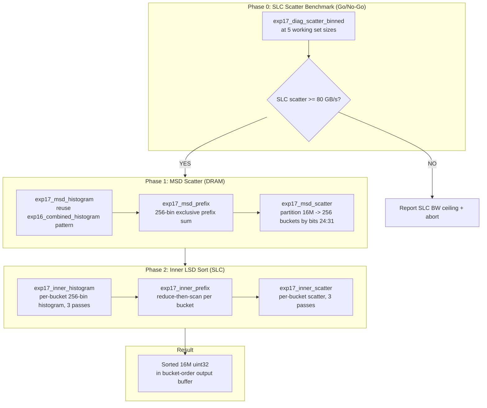
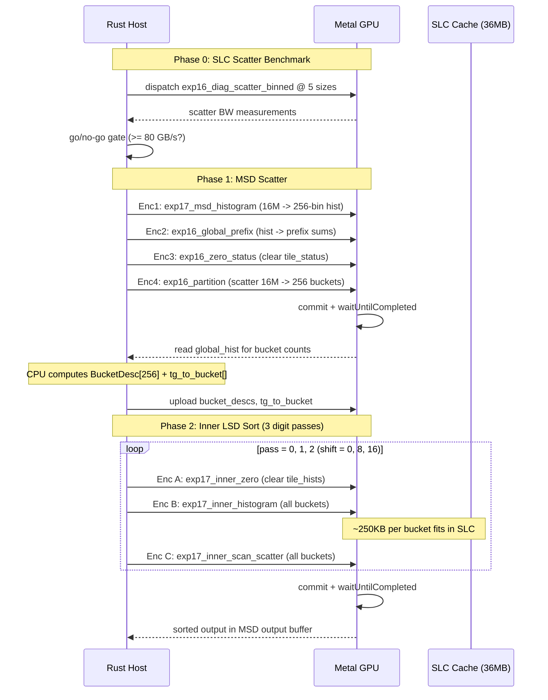

# Design: GPU Radix Sort 5000+ Mkeys/s (MSD+LSD Hybrid)

## Overview

Experiment 17 implements an MSD+LSD hybrid radix sort: one global MSD scatter pass (bits 24-31) partitions 16M uint32 into 256 buckets of ~62K elements (~250KB each, SLC-resident), then a single-dispatch inner LSD sort processes all buckets with 3 passes of 8-bit radix at SLC bandwidth (469 GB/s vs 245 GB/s DRAM). Phase 0 measures SLC scatter bandwidth as a go/no-go gate before committing to the hybrid pipeline.

### GPU-Centric Design (Post-Research Update)

**Key architectural change**: The entire sort pipeline runs in **1 command buffer, 1 encoder, 14 dispatches** with zero CPU readback. Metal guarantees sequential coherence between dispatches within a single encoder (KB #3498, #3563). PSO switching via `setComputePipelineState()` between dispatches replaces separate encoders. Total structural overhead: ~14μs.

**Dispatch strategy**: Fixed 4352 TGs (17 tiles × 256 buckets) for inner sort. For uniform random uint32, bucket sizes follow Binomial(16M, 1/256) with std=255. Padding to 17 tiles of 4096 (69632 elements) is 16σ above the mean — effectively zero overflow probability. Pure arithmetic mapping: `bucket_id = gid / 17`, `tile_in_bucket = gid % 17`. No lookup table, no indirect dispatch needed. ~6.2% memory overhead.

**SLC scatter bandwidth**: The "21 GB/s write port limit" claim from earlier research was **incorrect** (KB #3512). Both random (21 GB/s) and structured (131 GB/s) scatter saturate DRAM bandwidth when accounting for cache line write amplification. SLC-resident structured scatter is predicted at ~250 GB/s (KB #3524). This makes the hybrid approach clearly viable.

## Architecture



## Components

### Phase 0: SLC Scatter Bandwidth Benchmark

**Purpose**: Measure 256-bin scatter bandwidth at SLC-resident working set sizes; gate hybrid approach.

Reuses existing `exp16_diag_scatter_binned` kernel at 5 sizes: 62.5K, 250K, 1M, 4M, 16M elements. No new shader needed -- Rust host code generates per-element offsets at each size and dispatches.

**Go/No-Go**: If 250K scatter < 80 GB/s, abort hybrid. Print all measurements and exit.

### Phase 1: MSD Scatter

**Purpose**: Partition 16M elements into 256 buckets by bits[24:31].

Three kernels (reusing exp16 architecture exactly):

| Kernel | Reuse | Difference from exp16 |
|--------|-------|----------------------|
| `exp17_msd_histogram` | Clone of `exp16_combined_histogram` | Only 1 pass (bits 24:31), not 4 |
| `exp17_msd_prefix` | Clone of `exp16_global_prefix` | 1 SG does 256-bin prefix, not 4 SGs |
| `exp17_msd_scatter` | Clone of `exp16_partition` | shift=24 only, single pass |

**Why clone instead of reuse**: The combined histogram reads all 4 passes; MSD needs only 1. Cloning and simplifying avoids wasted work. The partition kernel is identical to exp16_partition with shift=24, pass=0 -- could literally reuse it with correct params. Decision: **reuse exp16_partition directly** for MSD scatter (just set shift=24, pass=0, and use a dedicated global_hist with 1 pass worth of data).

Actually -- exp16_partition reads `global_hist[pass * 256 + d]`. If we set pass=0 and fill global_hist bins 0..255 with MSD prefix sums, exp16_partition works unchanged. **Reuse exp16_partition as-is.**

Similarly, exp16_combined_histogram computes all 4 passes. For MSD we only need 1 pass. Options:
1. Run exp16_combined_histogram (wastes 3x read bandwidth) -- 0.8ms total, waste ~0.6ms
2. Write a simpler 1-pass histogram -- saves 0.6ms

Decision: Write `exp17_msd_histogram` (1-pass version) to save 0.6ms. Critical for hitting 3.2ms target.

### Phase 2: Inner LSD Sort (Single Dispatch)

**Purpose**: Sort each of 256 buckets independently with 3 passes of 8-bit LSD at SLC bandwidth.

This is the novel kernel. Key challenge: **all 256 buckets in a single dispatch** to avoid per-dispatch overhead.

#### Dispatch Geometry

Each bucket has ~62,500 elements. At 4096 elements/tile = ~16 tiles/bucket (ceil(62500/4096) = 16).
Total threadgroups: 256 buckets x max_tiles_per_bucket.

**Problem**: Buckets have variable sizes. With uniform random uint32, bucket sizes follow Binomial(16M, 1/256) with mean=62500 and std=~250. Max plausible bucket ~63,500 = 16 tiles. But we need a fixed grid.

**Solution**: Use a **bucket descriptor buffer** computed on CPU after MSD scatter:

```c
struct BucketDesc {
    uint offset;       // start index in MSD output buffer
    uint count;        // number of elements in this bucket
    uint tile_count;   // ceil(count / TILE_SIZE)
    uint tile_base;    // cumulative tile index (exclusive prefix sum of tile_counts)
};
```

CPU computes `BucketDesc[256]` after MSD histogram. Total TGs = sum of all tile_counts (~4000). Each TG uses `gid` to binary-search `tile_base[]` to find its (bucket_id, tile_within_bucket).

**Optimization**: Instead of binary search, use a **flat TG-to-bucket lookup table** (4096 entries, each = bucket_id). CPU fills it. TG reads `lookup[gid]` in O(1). Table is tiny (16KB), fits in constant buffer.

#### Inner Sort Prefix Strategy: Reduce-Then-Scan

**Decision**: Reduce-then-scan (not decoupled lookback) for inner sort.

Rationale:
- At ~16 tiles/bucket, reduce-then-scan needs 2 passes (reduce + propagate) per bucket per digit pass
- This requires 2 encoders per digit pass (reduce kernel, then scan+scatter kernel)
- Total: 3 digit passes x 2 encoders = 6 encoders for inner sort
- BUT: all 256 buckets are independent, so each encoder dispatches ALL buckets simultaneously
- Encoder barrier overhead: ~6 x 0.03ms = 0.18ms (well within NFR-5: <= 0.2ms)
- No forward progress risk (unlike decoupled lookback)

Alternative considered: Decoupled lookback within each bucket. Works at 16-tile depth but adds complexity (per-bucket status arrays, fence overhead). Reduce-then-scan is simpler and ~same speed at this depth.

**Inner sort pipeline per digit pass** (3 passes total):

```
Encoder A: exp17_inner_reduce
  - Each TG: histogram 4096 elements, write tile_hist[tile_id * 256 + bin]
  - Dispatch: total_tiles TGs (all buckets)

Encoder B: exp17_inner_scan_scatter
  - Thread 0 of each bucket: sequential scan of tile_hists for that bucket
  - All threads: rank + scatter using scanned prefixes
  - Dispatch: total_tiles TGs (all buckets)
```

Wait -- reduce-then-scan with only ~16 tiles per bucket can be done even simpler. The "reduce" phase computes per-tile histograms. The "scan" phase needs per-tile exclusive prefix within each bucket. With 16 tiles, a single TG can scan all 16 tile histograms.

**Simplified approach**: Fuse everything into a **two-kernel pipeline** per digit pass:

**Kernel A: `exp17_inner_histogram`**
- Each TG processes one tile (4096 elements) from one bucket
- Computes 256-bin histogram for that tile
- Writes to `tile_hists[bucket_id][tile_within_bucket][256]`
- Dispatch: total_tiles TGs

**Kernel B: `exp17_inner_scan_scatter`**
- Each TG processes one tile from one bucket
- Thread `lid` (0..255) handles bin `lid`:
  - Reads `tile_hists[bucket_id][0..tile_within_bucket][lid]` to compute exclusive prefix within bucket
  - This is a serial scan over ~16 values -- trivial
- Then: per-SG atomic rank + scatter (same as exp16_partition P5)
- Dispatch: total_tiles TGs

This avoids decoupled lookback entirely. The serial scan over 16 values per thread takes ~16 cycles -- negligible.

## Kernel Signatures

### exp17_msd_histogram (Phase 1)

```metal
#define EXP17_NUM_BINS   256u
#define EXP17_TILE_SIZE  4096u
#define EXP17_ELEMS      16u
#define EXP17_THREADS    256u
#define EXP17_NUM_SGS    8u

struct Exp17Params {
    uint element_count;
    uint num_tiles;
    uint shift;          // 24 for MSD, 0/8/16 for inner LSD
    uint pass;           // 0 for MSD; 0,1,2 for inner LSD
};

// 1-pass histogram: reads input once, counts bits[24:31]
kernel void exp17_msd_histogram(
    device const uint*     src         [[buffer(0)]],
    device atomic_uint*    global_hist [[buffer(1)]],    // [256] bins
    constant Exp17Params&  params      [[buffer(2)]],
    uint lid [[thread_position_in_threadgroup]],
    uint gid [[threadgroup_position_in_grid]],
    uint simd_id   [[simdgroup_index_in_threadgroup]])
{
    // Same as exp16_combined_histogram but single pass only
    // Per-SG atomic histogram on TG memory, reduce to global
}
```

### exp17_msd_scatter (Phase 1)

Reuse `exp16_partition` directly. Set `params.shift = 24`, `params.pass = 0`, load global_hist with MSD prefix sums at offset 0.

### exp17_compute_bucket_descs (Phase 1, after histogram)

```metal
// GPU-side BucketDesc computation. 1 threadgroup, 256 threads.
// Runs after msd_histogram, before global_prefix (which destroys raw counts).
// Thread lid handles bucket lid.
kernel void exp17_compute_bucket_descs(
    device const uint*    global_hist   [[buffer(0)]],    // 256 raw bin counts
    device BucketDesc*    bucket_descs  [[buffer(1)]],    // output: 256 descriptors
    constant uint&        tile_size     [[buffer(2)]],    // 4096
    uint lid [[thread_position_in_threadgroup]])
{
    // Each thread reads its bucket count
    uint count = global_hist[lid];
    uint tile_count = (count + tile_size - 1u) / tile_size;

    // Thread 0: serial prefix sum for offsets (256 values, ~256 cycles)
    threadgroup uint shared_counts[256];
    threadgroup uint shared_offsets[256];
    shared_counts[lid] = count;
    threadgroup_barrier(mem_flags::mem_threadgroup);

    if (lid == 0u) {
        uint running = 0u;
        for (uint i = 0u; i < 256u; i++) {
            shared_offsets[i] = running;
            running += shared_counts[i];
        }
    }
    threadgroup_barrier(mem_flags::mem_threadgroup);

    bucket_descs[lid] = BucketDesc {
        shared_offsets[lid],  // offset
        count,                // count
        tile_count,           // tile_count
        0u                    // tile_base (unused with fixed dispatch)
    };
}
```

### exp17_inner_histogram (Phase 2, Kernel A)

```metal
// Fixed dispatch: 17 tiles × 256 buckets = 4352 TGs
#define EXP17_MAX_TPB  17u   // max tiles per bucket (17 = 16σ above mean for uniform)

struct Exp17InnerParams {
    uint shift;              // 0, 8, or 16 for the 3 inner LSD passes
};

// Per-tile histogram for inner sort
// Fixed dispatch: 4352 TGs. Arithmetic mapping: bucket = gid/17, tile = gid%17
kernel void exp17_inner_histogram(
    device const uint*       data          [[buffer(0)]],  // MSD output (partitioned)
    device uint*             tile_hists    [[buffer(1)]],  // [256][EXP17_MAX_TPB][256]
    device const BucketDesc* bucket_descs  [[buffer(2)]],  // BucketDesc[256]
    constant Exp17InnerParams& params      [[buffer(3)]],
    uint lid [[thread_position_in_threadgroup]],
    uint gid [[threadgroup_position_in_grid]],
    uint simd_id   [[simdgroup_index_in_threadgroup]])
{
    // 1. Arithmetic mapping (no lookup table)
    uint bucket_id = gid / EXP17_MAX_TPB;
    uint tile_in_bucket = gid % EXP17_MAX_TPB;

    // 2. Read bucket descriptor, early-exit if tile beyond actual count
    BucketDesc desc = bucket_descs[bucket_id];
    if (tile_in_bucket * EXP17_TILE_SIZE >= desc.count) return;

    // 3. Load 4096 elements from data[desc.offset + tile_in_bucket * 4096 ..]
    // 4. Per-SG atomic histogram (same as exp16 P2)
    // 5. Reduce to tile_hists[bucket_id * EXP17_MAX_TPB * 256 + tile_in_bucket * 256 + bin]
}
```

### exp17_inner_scan_scatter (Phase 2, Kernel B)

```metal
// Scan tile histograms + rank + scatter for inner sort
// Fixed dispatch: 4352 TGs. Arithmetic mapping: bucket = gid/17, tile = gid%17
kernel void exp17_inner_scan_scatter(
    device const uint*       src           [[buffer(0)]],  // inner sort input
    device uint*             dst           [[buffer(1)]],  // inner sort output
    device const uint*       tile_hists    [[buffer(2)]],  // from kernel A
    device const BucketDesc* bucket_descs  [[buffer(3)]],  // BucketDesc[256]
    constant Exp17InnerParams& params      [[buffer(4)]],
    uint lid [[thread_position_in_threadgroup]],
    uint gid [[threadgroup_position_in_grid]],
    uint simd_lane [[thread_index_in_simdgroup]],
    uint simd_id   [[simdgroup_index_in_threadgroup]])
{
    // TG memory: same 18KB layout as exp16_partition
    threadgroup atomic_uint sg_hist_or_rank[EXP17_NUM_SGS * EXP17_NUM_BINS]; // 8 KB
    threadgroup uint sg_prefix[EXP17_NUM_SGS * EXP17_NUM_BINS];             // 8 KB
    threadgroup uint tile_hist[EXP17_NUM_BINS];                              // 1 KB
    threadgroup uint exclusive_pfx[EXP17_NUM_BINS];                          // 1 KB

    // 1. Look up bucket_id, tile_in_bucket (same as histogram kernel)
    // 2. Load 4096 elements, extract digits

    // 3. Per-SG atomic histogram (Phase 2 from exp16)
    // 4. Cross-SG prefix (Phase 2b from exp16)

    // 5. SERIAL SCAN for exclusive prefix within bucket (REPLACES decoupled lookback)
    //    Thread lid handles bin lid:
    //    exclusive_pfx[lid] = sum of tile_hists[bucket_id][0..tile_in_bucket][lid]
    //    This is a loop over ~16 values -- trivial, ~16 cycles
    {
        uint running = 0u;
        uint base = bucket_id * max_tpb * 256u;
        for (uint t = 0u; t < tile_in_bucket; t++) {
            running += tile_hists[base + t * 256u + lid];
        }
        exclusive_pfx[lid] = running;
    }
    threadgroup_barrier(mem_flags::mem_threadgroup);

    // 6. Per-SG atomic rank + scatter (Phase 5 from exp16)
    //    dst offset = bucket_offset + exclusive_pfx[d] + sg_prefix + within_sg
    //    NOTE: no global_hist offset needed -- inner sort writes WITHIN the bucket region
}
```

### exp17_inner_zero (utility)

```metal
// Zero tile_hists between inner digit passes
kernel void exp17_inner_zero(
    device uint* tile_hists [[buffer(0)]],
    constant uint& total_entries [[buffer(1)]],
    uint tid [[thread_position_in_grid]])
{
    if (tid < total_entries)
        tile_hists[tid] = 0u;
}
```

## Data Flow



## Buffer Layout

### GPU Buffers

| Buffer | Size @ 16M | Purpose | Lifetime |
|--------|-----------|---------|----------|
| `buf_input` | 64 MB | Original random uint32 input | Entire run |
| `buf_a` | 64 MB | Ping buffer (MSD input, inner sort ping) | Entire run |
| `buf_b` | 64 MB | Pong buffer (MSD output, inner sort pong) | Entire run |
| `buf_msd_hist` | 1 KB | 256-bin MSD histogram | Phase 1 |
| `buf_tile_status` | ~4 MB | Decoupled lookback status (num_tiles x 256 x 4B) | Phase 1 |
| `buf_counters` | 4 B | Work counter for exp16_partition | Phase 1 |
| `buf_bucket_descs` | 4 KB | BucketDesc[256] (offset, count, tile_count, tile_base) | Phase 2 |
| `buf_tg_to_bucket` | 8 KB | ushort[~4096]: gid -> bucket_id lookup | Phase 2 |
| `buf_tile_hists` | ~16 MB | tile_hists[256 buckets][16 tiles][256 bins] x 4B | Phase 2 (per pass) |
| `buf_inner_a` | alias buf_b | Inner sort ping (MSD output is in buf_b) | Phase 2 |
| `buf_inner_b` | 64 MB | Inner sort pong (could alias buf_a) | Phase 2 |

**Total peak**: 64 + 64 + 64 + ~20 = ~212 MB (within NFR-6: <= 512 MB)

**Buffer reuse strategy**:
- MSD reads from `buf_a`, writes to `buf_b`
- Inner sort pass 0: reads `buf_b`, writes `buf_a`
- Inner sort pass 1: reads `buf_a`, writes `buf_b`
- Inner sort pass 2: reads `buf_b`, writes `buf_a`
- After 3 inner passes (odd count): result is in `buf_a`
- Need to copy back to `buf_b` (original MSD order)? NO -- inner sort writes WITHIN each bucket's region. After 3 inner passes, the globally sorted result is directly in the output buffer.

**Correction on ping-pong**: The inner sort scatter writes to bucket-relative offsets. After MSD, data is in `buf_b` organized by buckets. Inner pass 0 reads from `buf_b`, scatters to `buf_a` (same bucket-relative offsets). Inner pass 1: `buf_a` -> `buf_b`. Inner pass 2: `buf_b` -> `buf_a`. Result in `buf_a` after 3 passes. Each pass preserves bucket boundaries because the 256-bin scatter within a bucket only rearranges elements within that bucket's region.

### BucketDesc Structure (CPU-computed)

```rust
#[repr(C)]
#[derive(Clone, Copy)]
struct BucketDesc {
    offset: u32,      // start index in MSD output buffer
    count: u32,       // number of elements in this bucket
    tile_count: u32,  // ceil(count / TILE_SIZE)
    tile_base: u32,   // exclusive prefix sum of tile_counts (cumulative TG index)
}
```

CPU computation after MSD histogram readback:
```rust
let mut bucket_descs = [BucketDesc::default(); 256];
let mut offset = 0u32;
let mut tile_base = 0u32;
for i in 0..256 {
    let count = msd_hist[i];
    let tile_count = count.div_ceil(TILE_SIZE as u32);
    bucket_descs[i] = BucketDesc { offset, count, tile_count, tile_base };
    offset += count;
    tile_base += tile_count;
}
let total_tiles = tile_base as usize;  // ~4000
```

### tile_hists Layout

```
tile_hists[bucket_id * max_tiles_per_bucket * 256 + tile_in_bucket * 256 + bin]
```

With max_tiles_per_bucket = 16 (padded for simplicity):
- Size = 256 * 16 * 256 * 4 = 4 MB per digit pass
- Zeroed between passes via exp17_inner_zero

### tg_to_bucket Lookup Table

```rust
let mut tg_to_bucket = vec![0u16; total_tiles];
for (bucket_id, desc) in bucket_descs.iter().enumerate() {
    for t in 0..desc.tile_count {
        tg_to_bucket[(desc.tile_base + t) as usize] = bucket_id as u16;
    }
}
```

## Dispatch Geometry

| Kernel | Threadgroups | Threads/TG | Total Threads |
|--------|-------------|------------|---------------|
| exp17_msd_histogram | ceil(16M / 4096) = 3907 | 256 | 1M |
| exp16_global_prefix | 1 | 256 | 256 |
| exp16_zero_status | ceil(3907 * 256 / 256) = 3907 | 256 | 1M |
| exp16_partition (MSD) | 3907 | 256 | 1M |
| exp17_inner_zero | ceil(4M / 256) = ~16K | 256 | ~4M |
| exp17_inner_histogram | ~4000 | 256 | ~1M |
| exp17_inner_scan_scatter | ~4000 | 256 | ~1M |

### Command Structure (Single Encoder, Zero CPU Readback)

```
1 MTLCommandBuffer, 1 MTLComputeCommandEncoder, 14 dispatches:

  setPSO(msd_histogram)         → dispatch 3907 TGs    // 1-pass histogram bits[24:31]
  setPSO(compute_bucket_descs)  → dispatch 1 TG        // GPU computes BucketDesc[256] from histogram
  setPSO(global_prefix)         → dispatch 1 TG        // prefix sum on histogram
  setPSO(zero_status)           → dispatch 3907 TGs    // clear lookback tile_status
  setPSO(msd_scatter)           → dispatch 3907 TGs    // reuse exp16_partition(shift=24)

  × 3 inner passes (shift=0, 8, 16):
    setPSO(inner_zero)          → dispatch ~16K TGs    // clear tile_hists
    setPSO(inner_histogram)     → dispatch 4352 TGs    // 17 tiles × 256 buckets
    setPSO(inner_scan_scatter)  → dispatch 4352 TGs    // serial scan + rank + scatter

  endEncoding()
  commit() + waitUntilCompleted()

Total: 14 dispatches, ~14μs structural overhead
```

**Why single encoder works**: Metal Programming Guide states "results of a compute command are available to any commands encoded after it" (KB #3498). Sequential dispatches within one encoder have implicit memory barriers. PSO switching via `setComputePipelineState()` is ~0 overhead. Per-dispatch overhead: ~1μs vs ~97μs per separate command buffer (KB #3511).

**Why no CPU readback**: The `compute_bucket_descs` kernel (1 TG, 256 threads) reads the raw histogram, computes BucketDesc[256] with prefix sums, and writes to a device buffer. Subsequent dispatches read this buffer. All within the same encoder — implicit barrier guarantees visibility.

**Fixed dispatch for inner sort**: 17 tiles × 256 buckets = 4352 TGs. Each TG computes `bucket_id = gid / 17`, `tile_in_bucket = gid % 17`. TGs where `tile_in_bucket * 4096 >= bucket_count` early-exit (~6.2% waste). No tg_to_bucket lookup table needed (KB #3510).

## Technical Decisions

| Decision | Options Considered | Choice | Rationale |
|----------|-------------------|--------|-----------|
| MSD bin count | 16 bins (4-bit), 256 bins (8-bit) | 256 bins | 250KB/bucket ideal SLC fit. 16 bins = 4MB/bucket, partially evicts SLC. 256-bin scatter proven at 131 GB/s. |
| Inner prefix strategy | Decoupled lookback, Reduce-then-scan, Serial scan | Serial scan within kernel B | At 16 tiles/bucket, serial scan of 16 values per thread = ~16 cycles. Zero complexity, zero risk, negligible cost. |
| Inner dispatch | 256 separate dispatches, Single dispatch with lookup | Single dispatch + tg_to_bucket lookup | 256 dispatches = ~0.4ms overhead (too high). Single dispatch: 0 overhead, ~4000 TGs. |
| MSD histogram kernel | Reuse exp16_combined_histogram (4-pass), New 1-pass kernel | New 1-pass kernel | Saves 0.6ms by reading data once instead of counting 4 passes. Critical for 3.2ms total budget. |
| MSD scatter kernel | New kernel, Reuse exp16_partition | Reuse exp16_partition | Identical logic. Set shift=24, pass=0. Zero new code. |
| Inner sort tile size | 4096, 8192 | 4096 | Matches exp16 proven architecture. 8192 doubles register pressure (32 keys/thread). Can benchmark both later (FR-12). |
| Bucket size variance | Fixed-size buckets, Variable with BucketDesc | Variable with BucketDesc | Uniform random variance is small (~0.4%) but BucketDesc handles any distribution correctly. |
| TG reorder in inner sort | Yes (v4 pattern), No | No (initially) | At SLC scale, scatter BW may already be high. TG reorder adds 9KB TG memory + complexity. Benchmark first, add if needed. |
| tile_hists addressing | Per-bucket status array, Flat global array | Flat: [bucket][tile][bin] | Simple, contiguous, easy to zero. 4MB per pass. |
| Command buffer split | Single cmd buf (all phases), Split at MSD/inner boundary | **Single CB, single encoder** | GPU-computed BucketDesc eliminates CPU readback. Metal implicit barriers guarantee coherence (KB #3498, #3563). 97× less overhead than split (KB #3511). |
| Inner dispatch grid | Variable (tg_to_bucket lookup), Fixed (17×256 arithmetic), Indirect dispatch | **Fixed 4352 TGs** | For uniform random, 17 tiles/bucket is 16σ above mean (KB #3510). Pure arithmetic mapping. 6.2% waste. No lookup table. |
| Encoder strategy | 13 separate encoders, 1 encoder with PSO switching | **1 encoder + PSO switching** | setComputePipelineState() between dispatches. Sequential dispatches have implicit barriers. Proven in inference pipeline (302 dispatches). |

## Unresolved Questions Resolution

### 1. SLC scatter bandwidth at 250KB

**Resolution**: Phase 0 measures this empirically. The existing `exp16_diag_scatter_binned` kernel already implements 256-bin structured scatter. Run it at 62.5K, 250K, 1M, 4M, 16M elements with CPU-computed per-element offsets. Go/no-go gate at 80 GB/s for 250K.

### 2. Optimal MSD bin count

**Resolution**: 256 bins (8-bit MSD). Each bucket = ~250KB, well within SLC (36MB). The 256-bin scatter diagnostic already showed 131 GB/s at 16M -- this is near-sequential bandwidth. 16-bin MSD (4MB/bucket) would reduce SLC advantage and require 4 inner LSD passes (bits 0-23 in 3 passes of 8 = only 24 bits, so 16-bin MSD covers bits 28-31 leaving 28 bits = 4 passes). 256-bin MSD + 3 inner passes is optimal.

### 3. Inner prefix strategy

**Resolution**: Serial scan. At ~16 tiles per bucket, each thread serially scans 16 histogram values to compute its exclusive prefix within the bucket. Cost: ~16 cycles per thread (negligible vs. the 4096-element load/scatter). No inter-TG communication needed. No forward progress risk. No decoupled lookback complexity.

### 4. Bucket size variance

**Resolution**: BucketDesc handles variable sizes naturally. For uniform random uint32, bucket sizes follow Binomial(16M, 1/256) with mean 62500 and std ~250. Worst-case bucket with >1 sigma: ~62750 elements = 16 tiles. With 3-sigma: ~63250 = 16 tiles. BucketDesc's tile_count field handles any size. Empty buckets (count=0) get tile_count=0 and are simply absent from the dispatch.

Pathological case (all same top byte): 1 bucket with 16M elements, 255 empty. This degrades to baseline LSD sort within that single bucket, at DRAM bandwidth (too large for SLC). BucketDesc handles it correctly but performance degrades. This is explicitly out of scope per requirements ("uniform random only").

### 5. TG reorder in inner sort

**Resolution**: Defer. Measure inner sort bandwidth without TG reorder first. If SLC scatter bandwidth is already high (measured in Phase 0), TG reorder adds complexity for minimal gain. If inner scatter BW is unexpectedly low, add TG reorder as a follow-up optimization using the v4 two-half pattern from exp16.

## File Structure

| File | Action | Purpose |
|------|--------|---------|
| `metal-gpu-experiments/shaders/exp17_hybrid.metal` | Create | MSD histogram, inner histogram, inner scan+scatter, inner zero kernels |
| `metal-gpu-experiments/src/exp17_hybrid.rs` | Create | Rust host: Phase 0 benchmark, Phase 1 MSD, Phase 2 inner sort, correctness, timing |
| `metal-gpu-experiments/src/main.rs` | Modify | Add `mod exp17_hybrid;` and call `exp17_hybrid::run(&ctx)` |
| `metal-gpu-experiments/shaders/types.h` | No change | Reuse FLAG_NOT_READY/AGGREGATE/PREFIX constants for MSD lookback |

## Error Handling

| Error Scenario | Handling Strategy | User Impact |
|----------------|-------------------|-------------|
| SLC scatter < 80 GB/s | Print all measurements, print "ABORT: SLC scatter too slow", skip hybrid | Clear diagnostic output |
| Empty bucket (count=0) | BucketDesc.tile_count=0, no TGs dispatched for it | Transparent -- no work for empty buckets |
| Oversized bucket (>4096 tiles) | max_tiles_per_bucket computed dynamically from actual histogram | tile_hists buffer sized accordingly |
| Correctness mismatch | Print mismatch count + first 5 examples (per exp16 pattern) | Immediate visibility of bugs |
| Inner sort produces wrong order | Verify per-bucket AND global correctness separately | Isolates MSD vs inner sort bugs |
| NaN/inf in timing | gpu_elapsed_ms returns 0.0 if GPUStartTime==0 (existing pattern) | Skip invalid measurements |

## Edge Cases

- **Empty buckets**: tile_count=0, tile_base unchanged from previous bucket. No TGs assigned. tg_to_bucket has no entries for this bucket. Inner sort simply skips it.
- **Single-element buckets**: tile_count=1, tile has 1 valid element + 4095 padding (0xFFFFFFFF). Inner histogram and scatter handle `valid[e]` mask correctly.
- **Last tile partial**: Elements beyond `count` are masked invalid (same as exp16: `mv[e] = idx < n`). For inner sort, the "n" is `bucket_desc.count` and indices are bucket-relative.
- **3 inner passes ping-pong**: After 3 passes (odd), result is in opposite buffer from input. MSD writes to `buf_b`. Inner pass 0: `buf_b`->`buf_a`. Pass 1: `buf_a`->`buf_b`. Pass 2: `buf_b`->`buf_a`. Final result in `buf_a`.

## Test Strategy

### Correctness Tests (inline, per exp16 pattern)

| Test | Size | Verification |
|------|------|-------------|
| MSD scatter only | 16M | Verify each element's bits[24:31] matches bucket index |
| MSD bucket counts | 16M | Sum of bucket counts == N |
| Inner sort per-bucket | 16M | Each bucket independently sorted after inner LSD |
| End-to-end | 1M | GPU output == `expected.sort()` |
| End-to-end | 4M | GPU output == `expected.sort()` |
| End-to-end | 16M | GPU output == `expected.sort()` |

### Benchmark Methodology (per exp16 pattern)

- 5 warmup iterations, 50 timed iterations
- p5/p50/p95 timing with spread percentage
- Per-phase timing breakdown (MSD histogram, MSD prefix, MSD scatter, inner passes)
- GB/s bandwidth computation per phase
- Comparison: hybrid p50 vs baseline (exp16_partition) p50

### Diagnostic Benchmarks

- SLC scatter bandwidth at 5 sizes (Phase 0)
- Inner sort bandwidth utilization: actual GB/s vs theoretical 469 GB/s SLC
- MSD scatter bandwidth: actual vs baseline 131 GB/s
- Dispatch overhead: total time - sum(kernel times)

## Performance Considerations

### Theoretical Budget (16M uint32, 3.2ms target = 5000 Mkeys/s)

**SLC scatter bandwidth correction (KB #3512, #3524)**: The "21 GB/s write port limit" was incorrect. Both random scatter (21 GB/s) and structured 256-bin scatter (131 GB/s) saturate DRAM bandwidth when accounting for cache line write amplification (×12 and ×1.9 respectively). SLC-resident structured scatter is predicted at ~250 GB/s.

| Phase | Bytes Transferred | Bandwidth | Time |
|-------|-------------------|-----------|------|
| MSD histogram | 4N (read) = 64MB | 245 GB/s | 0.26 ms |
| MSD BucketDesc | trivial | N/A | ~0 ms |
| MSD prefix | 1 KB | N/A | ~0 ms |
| MSD scatter | 8N (read+write) = 128MB | 131 GB/s (256-bin, DRAM) | 0.98 ms |
| Inner hist (×3) | 3 × 4N = 192MB | 469 GB/s (SLC read) | 0.41 ms |
| Inner scatter (×3) | 3 × 8N R+W = 384MB | ~250 GB/s (SLC struct. scatter) | 1.20 ms |
| Dispatch overhead | 14 dispatches × ~1μs | - | 0.01 ms |
| **Total** | | | **2.86 ms** |
| **Throughput** | | | **5594 Mkeys/s** |

### Conservative Budget (85% efficiency)

| Phase | Optimistic | Conservative (85%) |
|-------|-----------|-------------------|
| MSD total | 1.24 ms | 1.46 ms |
| Inner total | 1.61 ms | 1.89 ms |
| Overhead | 0.01 ms | 0.01 ms |
| **Total** | **2.86 ms** | **3.36 ms** |
| **Throughput** | **5594 Mkeys/s** | **4762 Mkeys/s** |

At 85% efficiency, ~4760 Mkeys/s — borderline. At 90% efficiency, ~5030 Mkeys/s — on target. The Phase 0 SLC scatter measurement is the critical validation.

### Critical Path Optimization

If inner scatter BW measures below 200 GB/s at SLC-resident sizes, consider:
1. TG reorder (v4 pattern) for inner scatter — pre-sorts scatter destinations in TG memory
2. 4-bit MSD (16 bins × ~1M/bucket) — still SLC-resident, fewer bins = better scatter coalescing
3. Merge-based inner sort (zero scatter) — trades compute for bandwidth

## Security Considerations

N/A -- standalone GPU benchmark experiment, no external input.

## Existing Patterns to Follow

Based on codebase analysis of exp16_8bit:

1. **Params struct**: `#[repr(C)]` Rust struct matching Metal constant buffer struct. Pass via `setBytes_length_atIndex`.
2. **Buffer allocation**: `alloc_buffer(&ctx.device, size)` for zeroed, `alloc_buffer_with_data(&ctx.device, &data)` for initialized.
3. **Buffer readback**: `unsafe { read_buffer_slice(&buf, count) }`.
4. **Timing**: `gpu_elapsed_ms(&cmd)` using `GPUStartTime/GPUEndTime`.
5. **Statistics**: `percentile(sorted_times, p)` for p5/p50/p95. `print_stats(label, n, times, correct)`.
6. **Ping-pong**: `if pass % 2 == 0 { (buf_a, buf_b) } else { (buf_b, buf_a) }`.
7. **PSO creation**: `ctx.make_pipeline("kernel_name")`.
8. **Encoder pattern**: `cmd.computeCommandEncoder().unwrap()` -> set PSO, buffers, bytes -> dispatch -> endEncoding.
9. **Correctness**: Sort CPU copy, compare element-by-element, print mismatch count + first 5.
10. **TG memory**: 18KB budget (8KB sg_hist_or_rank + 8KB sg_prefix + 1KB tile_hist + 1KB exclusive_pfx).
11. **Module pattern**: `mod exp17_hybrid;` in main.rs, `pub fn run(ctx: &MetalContext)` entry point.
12. **Build**: `build.rs` auto-discovers all `.metal` files in `shaders/`. No changes needed.

## Implementation Steps

1. **Create `shaders/exp17_hybrid.metal`**: Define `Exp17Params`, `Exp17InnerParams`, `BucketDesc` structs. Implement `exp17_msd_histogram` (1-pass version of exp16_combined_histogram). Implement `exp17_inner_histogram` (per-tile histogram with bucket lookup). Implement `exp17_inner_scan_scatter` (serial prefix scan + rank + scatter). Implement `exp17_inner_zero` (clear tile_hists).

2. **Create `src/exp17_hybrid.rs`**: Define Rust-side `Exp17Params`, `Exp17InnerParams`, `BucketDesc` structs. Implement `bench_slc_scatter()` for Phase 0 (reuse exp16_diag_scatter_binned PSO at 5 sizes). Implement `run_msd_scatter()` for Phase 1. Implement `compute_bucket_descs()` CPU helper. Implement `run_inner_sort()` for Phase 2. Implement `bench_hybrid()` for end-to-end timing. Implement `pub fn run(ctx: &MetalContext)` entry point.

3. **Modify `src/main.rs`**: Add `mod exp17_hybrid;`, comment out exp16 call, add `exp17_hybrid::run(&ctx);`.

4. **Build and test Phase 0**: Run SLC scatter benchmark. If < 80 GB/s at 250K, document and abort.

5. **Build and test Phase 1**: Run MSD scatter alone. Verify bucket counts sum to N. Verify each element is in correct bucket.

6. **Build and test Phase 2**: Run inner sort on pre-scattered data. Verify per-bucket correctness.

7. **End-to-end benchmark**: Full pipeline at 1M, 4M, 16M. Correctness + timing + per-phase breakdown.

8. **Optimize if needed**: If < 5000 Mkeys/s, add TG reorder to inner scatter (FR-12). Try 8192 tiles. Profile per-phase to identify bottleneck.

9. **Fallback analysis** (FR-10): If target not met, report per-phase bandwidth utilization, theoretical ceiling, comparison vs baseline.
