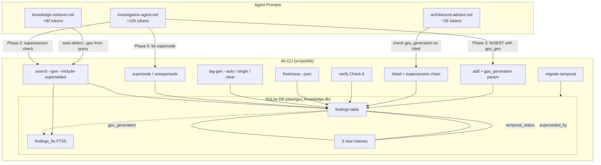
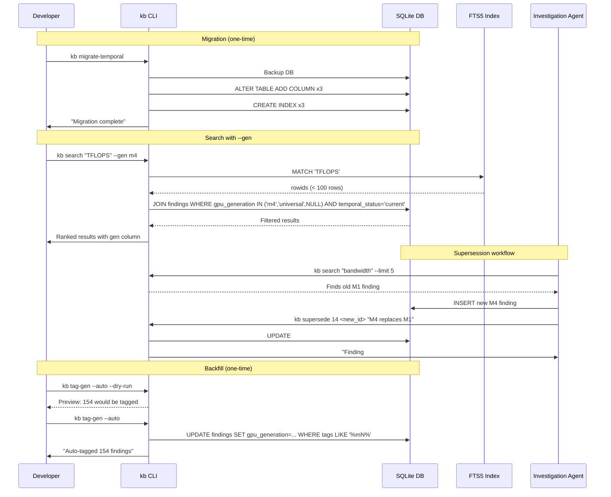

# Design: KB Temporal Relevance Pipeline

## Overview

Add temporal awareness to the gpu-forge KB by extending the `findings` table with 3 new columns (`gpu_generation`, `temporal_status`, `superseded_by`), adding 5 new CLI commands + modifying 4 existing ones, and surgically updating 3 agent prompts (<200 tokens total). Generation filtering is applied post-FTS via JOIN WHERE clauses -- the FTS5 virtual table is untouched.

## Architecture



## Data Flow



## Components

### 1. Schema Migration (`migrate-temporal` command)

**Handles**: Idempotent ALTER TABLE, backup, verification

**Key behavior**:
- `pragma_table_info` check before ALTER (idempotent)
- Backup `${DB}.pre-temporal-backup` before changes
- 3 columns + 3 indexes in single transaction
- Post-migration verification: assert 3 new columns present

### 2. Search Filter Engine (modified `search` command)

**Handles**: `--gen`, `--include-superseded`, gen column display

**Interfaces**:
```
kb search <query> [--limit N] [--gen|-g <gen>] [--include-superseded|-S]
```

**SQL pattern (post-FTS filtering)**:
```sql
SELECT f.id, s.name as skill, f.claim, f.confidence, f.source_title,
       COALESCE(f.gpu_generation, '') as gen
FROM findings_fts fts
JOIN findings f ON f.id = fts.rowid
JOIN skills s ON s.id = f.skill_id
WHERE findings_fts MATCH '<query>'
  AND (f.gpu_generation = '<gen>' OR f.gpu_generation = 'universal' OR f.gpu_generation IS NULL)  -- when --gen
  AND (f.temporal_status = 'current' OR f.temporal_status IS NULL)  -- default, unless --include-superseded
ORDER BY CASE WHEN f.temporal_status = 'superseded' THEN 1 ELSE 0 END,  -- only with -S
         bm25(findings_fts, 10.0, 5.0, 2.0, 1.0)
LIMIT <limit>;
```

### 3. Supersession Manager (`supersede`, `unsupersede` commands)

**Handles**: Marking/unmarking findings as superseded, chain display in `detail`

```
kb supersede <old_id> <new_id> [reason]  -- mark old as superseded
kb unsupersede <finding_id>              -- restore to current
```

**Validations**: Both IDs exist, self-supersession guard (`old_id != new_id`), `--force` for re-supersession

### 4. Generation Tagger (`tag-gen` command)

**Handles**: Single tagging, auto-inference from tags field, clear mode

```
kb tag-gen <id> <gen>                   -- single
kb tag-gen --auto [--dry-run] [--skill] -- batch inference
kb tag-gen <id> --clear                 -- reset to NULL
```

**Auto-inference rule**: Case-insensitive substring match, newest gen wins (m5 > m4 > m3 > m2 > m1)

### 5. Freshness Dashboard (`freshness` command)

**Handles**: Generation distribution, temporal status counts, date coverage, contradiction detection

```
kb freshness [--skill <name>] [--json]
```

**Contradiction SQL**: Exact `topic + skill_id` match between non-superseded findings with different `gpu_generation`.

### 6. Agent Prompt Updates

| Agent | File | Additions | Tokens |
|-------|------|-----------|--------|
| Investigation | `agents/investigation-agent.md` | Phase 2 supersession check, Phase 3 gen tagging, Phase 5 resolve | ~105 |
| Knowledge Retriever | `agents/knowledge-retriever.md` | Gen detection from query, gen-aware formatting | ~90 |
| Architecture Advisor | `agents/architecture-advisor.md` | Cross-gen consistency check | ~35 |

## Technical Decisions

| # | Decision | Options Considered | Choice | Rationale |
|---|----------|-------------------|--------|-----------|
| 1 | Generation filtering approach | A: Modify FTS5 schema, B: Post-FTS JOIN WHERE | B | FTS5 MATCH wrong for exact-value filtering; post-FTS <1ms on <100 row result set |
| 2 | NULL semantics | A: NULL=universal, B: NULL=unclassified with explicit `universal` | B | Eliminates ambiguity; NULL included in --gen for backward compat during backfill |
| 3 | Temporal status model | A: current/superseded/historical, B: current/superseded only | B | Reduced cognitive overhead; no need for 3-state model at ~30 stale findings |
| 4 | Migration trigger | A: Manual `kb migrate-temporal`, B: Auto-detect per command | A | Explicit > implicit for schema changes; no per-command latency |
| 5 | Graceful degradation | A: Require migration, B: `pragma_table_info` fallback | B | Modified search works on both pre- and post-migration DBs |
| 6 | Multi-gen tag handling | A: Tag with newest gen, B: Create `multi-gen` category | A | Simplifies tagging logic; no new category needed |
| 7 | Tag pattern matching | A: Case-insensitive substring, B: Word-boundary regex | A | 99%+ accuracy; simple bash; 1 edge case (`pre-m5`) caught by dry-run |
| 8 | Contradiction detection | A: Exact topic+skill match, B: FTS pairwise scoring | A | Zero false positives; catches 7 known contradictions; FTS tier deferred |
| 9 | Supersession confirmation | A: No confirm first time + --force for override, B: Always confirm | A | Minimal friction; reversible via `kb unsupersede` |
| 10 | Self-supersession | A: Guard (reject old==new), B: Allow it | A | One-line check; cheap mistake prevention |
| 11 | Gen column in search output | A: Always visible, B: Only with --gen | A | Passive discovery for devs; generation context for agents |
| 12 | Test setup strategy | A: Per-test migration in setup(), B: Shared file-level setup | A | Complete isolation; matches existing kb-cli.bats convention |
| 13 | `kb verify` severity | A: WARNING initially, ERROR after backfill, B: ERROR from start | A | Non-blocking during ramp-up |
| 14 | Backfill scope | A: Tags-only (203 findings), B: Tags + claim-text inference | A | Bounded Phase 1; text inference deferred |
| 15 | Golden test DB | A: Production DB + auto-tag in setup, B: Fixture DB | A | Tests real backfill on actual data; follows existing convention |

## File Structure

All paths relative to plugin root: `/Users/patrickkavanagh/.claude/plugins/cache/gpu-forge-local/gpu-forge/1.0.0-dev/`

| File | Action | Purpose | Est. Lines |
|------|--------|---------|------------|
| `scripts/kb` | Modify | Add 5 new commands (migrate-temporal, supersede, unsupersede, tag-gen, freshness), modify 4 (search, detail, verify, add), update help text | +350 |
| `data/schema.sql` | Modify | Add 3 columns to CREATE TABLE findings, add 3 indexes | +10 |
| `agents/investigation-agent.md` | Modify | 3 insertions: Phase 2 supersession check, Phase 3 gen tagging, Phase 5 resolve | +15 |
| `agents/knowledge-retriever.md` | Create/Modify | Gen detection from query text, gen-aware result formatting | +12 |
| `agents/architecture-advisor.md` | Create/Modify | Cross-gen consistency check when citing findings | +5 |
| `tests/unit/temporal.bats` | Create | 42 unit tests: migration, constraints, search, supersede, tag-gen, freshness, verify, detail, add, help, agent prompts | +250 |
| `tests/golden-temporal.bats` | Create | 4 golden query tests with generation-aware search on post-backfill DB | +50 |
| `tests/integration/temporal-workflows.bats` | Create | 4 multi-step workflow tests | +80 |
| `tests/performance/benchmarks.bats` | Modify | +2 performance regression tests (search --gen, freshness) | +25 |

## Schema Migration

### Exact SQL (idempotent migration via bash wrapper)

```sql
-- Step 1: gpu_generation column
ALTER TABLE findings ADD COLUMN gpu_generation TEXT
  CHECK(gpu_generation IS NULL OR gpu_generation IN ('m1','m2','m3','m4','m5','universal'))
  DEFAULT NULL;

-- Step 2: temporal_status column
ALTER TABLE findings ADD COLUMN temporal_status TEXT
  CHECK(temporal_status IS NULL OR temporal_status IN ('current','superseded'))
  DEFAULT 'current';

-- Step 3: superseded_by FK column
ALTER TABLE findings ADD COLUMN superseded_by INTEGER
  REFERENCES findings(id)
  DEFAULT NULL;

-- Step 4: Indexes
CREATE INDEX IF NOT EXISTS idx_findings_gpu_generation ON findings(gpu_generation);
CREATE INDEX IF NOT EXISTS idx_findings_temporal_status ON findings(temporal_status);
CREATE INDEX IF NOT EXISTS idx_findings_superseded_by ON findings(superseded_by);
```

### Idempotent Wrapper Pattern

```bash
migrate-temporal)
    local has_gen
    has_gen=$(run_sql "$DB" "SELECT COUNT(*) FROM pragma_table_info('findings') WHERE name='gpu_generation';")
    if [ "$has_gen" -gt 0 ]; then
      echo "Migration already applied -- gpu_generation column exists"
      exit 0
    fi
    echo "Applying temporal relevance migration..."
    cp "$DB" "${DB}.pre-temporal-backup"
    echo "Backup created: ${DB}.pre-temporal-backup"
    # ... ALTER TABLE x3, CREATE INDEX x3 ...
    # Verify: assert 3 new columns in pragma_table_info
    ;;
```

### schema.sql Update (for fresh DB creation)

Add after `investigation_session` column in `CREATE TABLE findings`:

```sql
    gpu_generation TEXT CHECK(gpu_generation IS NULL OR gpu_generation IN (
        'm1','m2','m3','m4','m5','universal'
    )) DEFAULT NULL,
    temporal_status TEXT CHECK(temporal_status IS NULL OR temporal_status IN (
        'current','superseded'
    )) DEFAULT 'current',
    superseded_by INTEGER REFERENCES findings(id) DEFAULT NULL
```

Add after existing index definitions:

```sql
CREATE INDEX IF NOT EXISTS idx_findings_gpu_generation ON findings(gpu_generation);
CREATE INDEX IF NOT EXISTS idx_findings_temporal_status ON findings(temporal_status);
CREATE INDEX IF NOT EXISTS idx_findings_superseded_by ON findings(superseded_by);
```

### FTS5 Impact: None

The FTS5 virtual table indexes `claim, evidence, tags, notes`. The 3 new columns are categorical/relational data, not free text. FTS5 triggers (`findings_ai`, `findings_ad`, `findings_au`) are unchanged.

## CLI Command Specifications

### Code Style (from existing 474-line `kb` script)

- Command dispatch: `case "${1}" in ... esac`
- Arg parsing: `shift` loops for optional flags, positional for required
- SQL execution: `run_sql "$DB" "SQL"` (no output) or `run_sql -header -column "$DB" "SQL"` (tabular)
- Input validation: `escape_sql` for strings, `grep -E '^[0-9]+$'` for IDs
- Errors: `echo "ERROR: ..." >&2; exit 1`
- No colors/emojis; plain text only

### Key Command Patterns

**search (modified)** -- Add `--gen|-g` and `--include-superseded|-S` flags to existing shift loop. Build `gen_clause` and `status_clause` strings conditionally. Append `COALESCE(f.gpu_generation, '') as gen` to SELECT. Sort superseded after current via `CASE WHEN` in ORDER BY.

**supersede (new)** -- Validate both IDs exist via `SELECT COUNT(*)`. Self-supersession guard. Check existing `superseded_by` and require `--force` to override. Append reason to notes. Update `temporal_status='superseded'` and `superseded_by=<new_id>`.

**unsupersede (new)** -- Validate finding exists and is actually superseded. Reset to `current`, clear `superseded_by`. Append audit note.

**tag-gen (new)** -- Three modes: single (`<id> <gen>`), auto (`--auto [--dry-run] [--skill]`), clear (`<id> --clear`). Auto mode reads `tags` field, matches m1-m5 case-insensitively, picks newest. Never overwrites existing non-NULL `gpu_generation`.

**freshness (new)** -- Human dashboard (default) or `--json`. Shows generation distribution, temporal status, date coverage %, contradiction pairs (exact topic+skill match). Optional `--skill` filter.

**detail (modified)** -- After standard `SELECT f.*, s.name`, add supersession chain section. Query `superseded_by` for upward link and `WHERE superseded_by=<id>` for downward links.

**verify (modified)** -- Add Check 6 after existing Check 5. Gated on `pragma_table_info` (only runs post-migration). Reports benchmark/empirical findings without `gpu_generation` as WARNING.

**add (modified)** -- Accept optional 11th positional param `${11}` for `gpu_generation`. Validate against allowed values. Build conditional SQL clause for INSERT.

**help (modified)** -- Add "Temporal commands:" section after "Quality commands:". Add "Generations:" and "Search filters:" reference lines.

### Graceful Degradation Pattern

Every temporal command checks column existence before executing:

```bash
has_gen=$(run_sql "$DB" "SELECT COUNT(*) FROM pragma_table_info('findings') WHERE name='gpu_generation';")
if [ "$has_gen" -eq 0 ]; then
    # search: fall back to original query (no gen filter, no status filter)
    # temporal commands: echo "ERROR: Run 'kb migrate-temporal' first" >&2; exit 1
fi
```

## Agent Prompt Changes

### investigation-agent.md

**Insertion 1: Phase 2 (after step 3 "Code Analysis")**

```markdown
4. **Supersession check**: Before storing a generation-specific finding, check if the KB
   already has findings on the same skill+topic with a different generation:
   ```bash
   ${CLAUDE_PLUGIN_ROOT}/scripts/kb search "<topic keywords>" --limit 5
   ```
   If an older-generation finding covers the same metric, note it for supersession in Phase 5.
```

**Insertion 2: Phase 3 (after confidence-source cross-validation table)**

```markdown
**Generation tagging (required for benchmarks):**
- For `benchmark` or `empirical_test` findings, always set `gpu_generation` to the
  relevant Apple Silicon generation: m1, m2, m3, m4, m5, or universal.
- Add gpu_generation to your INSERT: `..., gpu_generation) VALUES ..., '<gen>')`.
- If generation is unclear, leave NULL -- `kb verify` will flag it for review.
```

**Insertion 3: Phase 5 (after `kb verify` / `kb dedup` step)**

```markdown
3. **Resolve supersessions** if you identified older findings during Phase 2:
   ```bash
   ${CLAUDE_PLUGIN_ROOT}/scripts/kb supersede <old_id> <new_id> "<reason>"
   ```
```

### knowledge-retriever.md

**Insertion 1: Query Strategy (after "Run the query" step)**

```markdown
5. **Detect generation context** from the query:
   - If query mentions "M4", "M4 Pro", "M4 Max": add `--gen m4` to search
   - If query mentions "M5": add `--gen m5` to search
   - If query mentions "M1"/"M2"/"M3": add the corresponding `--gen` flag
   - If query asks about "current" or "latest": add `--gen m4` (or m5 when available)
   - If no generation mentioned: do NOT add `--gen` (return all generations)
```

**Insertion 2: Result Formatting (after "Full Format" example)**

```markdown
### Generation-Aware Format:
When `--gen` was used, note it in the response:
[verified] Finding #123 (gpu-silicon, m4): Apple M4 GPU has 10 cores...
When a finding is from a different generation than requested, flag it:
[verified] Finding #14 (gpu-silicon, m1) -- DIFFERENT GEN: M1 specs, not M4
```

### architecture-advisor.md

**Insertion: Cross-Reference section (after "Apply M4/M5 Hardware Constraints")**

```markdown
5. **Check generation consistency**: When citing findings, verify they apply to the
   target hardware generation. Use `kb detail <id>` to check gpu_generation.
   Flag findings from earlier generations that may not apply to the target hardware.
```

## Error Handling

| Error Scenario | Handling Strategy | User Impact |
|----------------|-------------------|-------------|
| Invalid `--gen` value | `case` validation; exit 1 with valid values listed | `ERROR: Invalid generation 'mx'. Valid: m1, m2, m3, m4, m5, universal` |
| `supersede` on nonexistent ID | `SELECT COUNT(*)` check; exit 1 | `ERROR: Finding #999 does not exist. Check ID with: kb search "<query>"` |
| Self-supersession (`old_id == new_id`) | Guard check before UPDATE | `ERROR: Cannot supersede a finding with itself` |
| Re-supersession without `--force` | Check existing `superseded_by` | `WARNING: Finding #14 is already superseded by #301. Use --force to override.` |
| `unsupersede` on current finding | Check `temporal_status` | `WARNING: Finding #14 is already current. Nothing to do.` (exit 0) |
| `unsupersede` on nonexistent ID | `SELECT COUNT(*)` check | `ERROR: Finding #999 does not exist` |
| `tag-gen` invalid generation | `case` validation | `ERROR: Invalid generation 'foo'. Valid: m1, m2, m3, m4, m5, universal` |
| Temporal command on pre-migration DB | `pragma_table_info` check | `ERROR: Temporal columns not found. Run: kb migrate-temporal` |
| `search --gen` on pre-migration DB | `pragma_table_info` check; ignore --gen flag | Search still works (graceful degradation); --gen silently ignored |
| Migration failure mid-ALTER | Backup file available | `ERROR: Migration failed. Restore from: ${DB}.pre-temporal-backup` |
| CHECK constraint violation | SQLite rejects INSERT/UPDATE | Standard `run_sql` error handler with context |

## Edge Cases

- **Finding with tags "m1,m2,m3,m4,m5"**: Tagged as `m5` (newest-wins rule per PM-2)
- **Finding with tag "pre-m5"**: Tagged as `m5` (substring match; caught by `--dry-run` preview)
- **Finding with empty/NULL tags**: Skipped by auto-tagger (no generation indicator)
- **Circular supersession (A->B, B->A)**: Second call would mark B as superseded by A. No cycle detection needed -- `superseded_by` is a single pointer, not a graph. Semantically odd but harmless.
- **Supersede then unsupersede then re-supersede**: Works correctly -- state transitions are independent.
- **All findings superseded**: Default search returns empty. `--include-superseded` returns all.
- **`--gen` + `--include-superseded` combined**: Both filters apply; returns superseded + gen-filtered results.
- **`--gen universal`**: Returns only `universal`-tagged + NULL findings (not m1-m5 specific).

## Test Strategy

### Test Summary

| Category | File | Count | Priority |
|----------|------|-------|----------|
| Migration + Schema | `tests/unit/temporal.bats` | 12 | P0 |
| Search Filtering | `tests/unit/temporal.bats` | 12 | P0 |
| Supersession | `tests/unit/temporal.bats` | 10 | P0 |
| Tag-Gen | `tests/unit/temporal.bats` | 6 | P1 |
| Freshness/Verify/Detail/Add/Help | `tests/unit/temporal.bats` | 7 | P1 |
| Agent Prompts (static) | `tests/unit/temporal.bats` | 2 | P2 |
| Golden Temporal Queries | `tests/golden-temporal.bats` | 4 | P1 |
| Integration Workflows | `tests/integration/temporal-workflows.bats` | 4 | P2 |
| Performance Regression | `tests/performance/benchmarks.bats` | 2 | P2 |
| **Total new tests** | **3 new + 1 modified** | **54** | |
| **Existing tests (must pass)** | **14 files** | **194** | P0 |

### Test Setup Pattern

```bash
setup() {
  TEST_DB="${BATS_TEST_TMPDIR}/test_gpu_knowledge.db"
  cp "${PLUGIN_ROOT}/data/gpu_knowledge.db" "$TEST_DB"
  export GPU_FORGE_DB="$TEST_DB"
  run "$KB" migrate-temporal
  assert_success
}
```

Per-test migration in `setup()` for complete isolation (matches existing `kb-cli.bats` convention).

### Backward Compatibility Invariants

- All 194 existing tests use `--partial` matching -- new `gen` column doesn't break assertions
- `kb add` without 11th param works unchanged (column defaults to NULL)
- Agent INSERTs use named columns -- new columns with defaults are transparent
- FTS5 index unchanged -- golden queries pass
- Default `kb search` (no flags) returns all generations; `temporal_status='current'` default means zero rows filtered

### Acceptance Criteria Coverage

All 20 FRs and 5 NFRs mapped to specific test IDs. Full matrix in QA.md (Section 9). Key coverage:

| Requirement | Test IDs |
|-------------|----------|
| FR-4 (search --gen) | S-1 through S-9 |
| FR-5 (deprioritize superseded) | SS-1 through SS-3 |
| FR-7 (kb supersede) | SP-1 through SP-7 |
| FR-15 (migrate-temporal) | M-1 through M-7 |
| NFR-1 (search <100ms) | Perf-1 |
| NFR-2 (zero data loss) | M-6 |
| NFR-3 (194 tests pass) | Full regression suite |
| NFR-4 (54 new tests) | All new test files |

## Performance Considerations

- Post-FTS filtering adds <1ms: FTS5 MATCH narrows to <100 rows, then indexed WHERE clauses
- `idx_findings_gpu_generation` makes gen filter O(1) per row
- `idx_findings_temporal_status` makes status filter O(1) per row
- Migration takes <100ms (3 ALTER TABLE + 3 CREATE INDEX on 1,555 rows)
- `kb freshness` runs ~5 aggregate queries; <2s on production DB
- No FTS5 rebuild needed -- new columns not in FTS content spec

## Security Considerations

- `escape_sql` used for all string interpolation (existing pattern)
- CHECK constraints prevent invalid `gpu_generation` and `temporal_status` values
- Self-supersession guard prevents logical corruption
- Backup file created before migration for rollback safety
- No new authentication/authorization concerns (local CLI tool)

## Existing Patterns to Follow

Based on codebase analysis of `scripts/kb` (474 lines):

- **Command dispatch**: Top-level `case "${1}" in ... esac`
- **Argument parsing**: `shift` loops with `case` for flags; positional for required args
- **SQL execution**: `run_sql "$DB" "SQL"` (wrapper with error handling)
- **ID validation**: `grep -E '^[0-9]+$'` for numeric IDs
- **String safety**: `escape_sql` (sed `s/'/''/g`) for all user strings
- **Error format**: `echo "ERROR: ..." >&2; exit 1`
- **No colors/emojis**: Plain text only
- **Test pattern**: Per-test DB copy in `BATS_TEST_TMPDIR`, `assert_output --partial`

## Design Inputs

### Interview Responses (all 15 questions resolved)

| Domain | Key Decisions |
|--------|--------------|
| PM (Q1-Q5) | NULL=unclassified, newest-gen for multi-tag, two-status model, WARNING then ERROR, tags-only backfill |
| UX (Q1-Q4) | Gen column always visible, no confirm first supersession, exact-match contradictions, NULL included in --gen |
| TECH (Q1-Q4) | Manual migration, graceful degradation, substring tag matching, exact-match only Phase 1 |
| QA (Q1-Q3) | Per-test migration setup, self-supersession guard, production DB for golden tests |

### Foreman-Spec Analysis Artifacts

- `ai/tasks/spec/TECH.md` -- 1,668 lines: exact SQL, exact bash, implementation order
- `ai/tasks/spec/UX.md` -- 835 lines: CLI ergonomics, agent interaction, output formatting
- `ai/tasks/spec/QA.md` -- 841 lines: 54 tests, backward compat plan, acceptance matrix
- `ai/tasks/spec/OVERVIEW.md` -- consolidated decisions, module roadmap

## Implementation Steps

1. **Update `data/schema.sql`** -- Add 3 columns to CREATE TABLE, 3 indexes
2. **Add `migrate-temporal` to `scripts/kb`** -- Idempotent migration with backup and verification
3. **Run migration on production DB** -- `kb migrate-temporal`; verify 194 existing tests pass
4. **Modify `search` command** -- Add `--gen`, `--include-superseded` flags; add gen column to output
5. **Add `supersede` command** -- Validation, self-guard, force override, notes append
6. **Add `unsupersede` command** -- Restore to current, clear superseded_by
7. **Add `tag-gen` command** -- Single/auto/clear modes; dry-run preview
8. **Add `freshness` command** -- Dashboard with gen distribution, contradictions; JSON mode
9. **Modify `detail` command** -- Show supersession chain section
10. **Add Check 6 to `verify`** -- Benchmark/empirical findings without gpu_generation
11. **Modify `add` command** -- Optional 11th positional param for gpu_generation
12. **Update help text** -- Temporal commands section, generations reference
13. **Update `investigation-agent.md`** -- 3 insertions (Phase 2, 3, 5)
14. **Update `knowledge-retriever.md`** -- Gen detection + gen-aware formatting
15. **Update `architecture-advisor.md`** -- Cross-gen consistency check
16. **Create `tests/unit/temporal.bats`** -- 42 unit tests
17. **Create `tests/golden-temporal.bats`** -- 4 golden query tests
18. **Create `tests/integration/temporal-workflows.bats`** -- 4 workflow tests
19. **Add 2 perf tests to `tests/performance/benchmarks.bats`**
20. **Run `kb tag-gen --auto --dry-run`** -- Preview backfill
21. **Run `kb tag-gen --auto`** -- Execute backfill (~154 findings)
22. **Run `kb freshness`** -- Identify contradictions
23. **Resolve 7 contradictions via `kb supersede`**
24. **Run full test suite** -- 194 existing + 54 new = 248 tests, 0 failures
