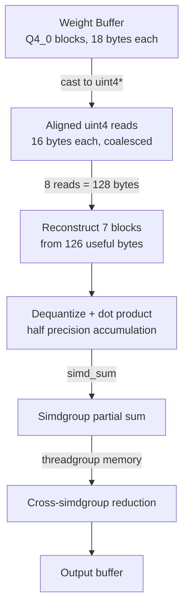

# Design: q4-bandwidth-fix

## Overview

Replace the 18-byte `BlockQ4_0` struct read pattern with aligned 16-byte `uint4` loads. The key insight: 7 Q4_0 blocks = 126 bytes, which fits into 8 x uint4 = 128 bytes (exactly 1 Apple GPU cache line). Combined with multi-row threadgroups (8 rows, 256 threads), this transforms scattered struct reads into coalesced cache-line-width transactions.

## Architecture



## Components

### Component A: matvec_q4_0_v5_coalesced.metal

**Purpose**: Coalesced Q4_0 matvec kernel with aligned reads and multi-row threadgroups.

**Key Design Decisions**:

1. **Aligned uint4 reads**: Cast `device const BlockQ4_0*` to `device const uint4*` (both are raw device pointers). Read 8 consecutive uint4 values (128 bytes) to extract 7 complete Q4_0 blocks.

2. **Block reconstruction from uint4 data**: Each Q4_0 block is 18 bytes. In 128 bytes of uint4 data:
   - Block 0: bytes [0..17] spans uint4[0] (bytes 0-15) + uint4[1] (bytes 16-17)
   - Block 1: bytes [18..35] spans uint4[1] (bytes 18-31) + uint4[2] (bytes 32-35)
   - ... and so on for 7 blocks
   - Extraction uses byte-level indexing within the 128-byte chunk

3. **Multi-row (ROWS_PER_TG=8)**: Each threadgroup processes 8 output rows. 256 threads = 8 simdgroups. Each simdgroup handles 1 row. 32 threads per simdgroup stride over blocks.

4. **Half precision accumulation**: Accumulate in `half` for 2x throughput on Apple GPU ALUs. Final reduction in float to avoid overflow.

**Responsibilities**:
- Read weight data via aligned uint4 loads
- Reconstruct Q4_0 block scale + nibbles from raw bytes
- Dequantize nibbles and compute dot product with input vector
- Simd reduction within each simdgroup
- Write one output element per row

### Component B: rmsnorm_matvec_q4_0_v5.metal (fused variant)

**Purpose**: Fused RMSNorm + coalesced Q4_0 matvec. Same aligned read pattern as Component A, with inline RMS computation.

**Responsibilities**:
- Phase 1: Cooperative RMS computation (same as current fused kernel)
- Phase 2: Coalesced Q4_0 reads + normalized dot product (new aligned reads)
- Multi-row threadgroup support (8 rows, but all rows recompute RMS independently)

### Component C: Rust dispatch (matvec_q4_0.rs updates)

**Purpose**: Dispatch v5 kernel with correct threadgroup geometry.

**Changes**:
- Add `dispatch_matvec_q4_0_v5()` function (or update existing)
- Threadgroup size: MTLSize { width: 256, height: 1, depth: 1 }
- Grid: MTLSize { width: ceil(out_dim / 8), height: 1, depth: 1 }
- Same buffer bindings as current kernel

### Component D: Forward pass integration (gpu_forward_pass.rs)

**Purpose**: Swap PSO name from "matvec_q4_0" to "matvec_q4_0_v5_coalesced" in encode methods.

**Changes**:
- `encode_matvec_q4_0()`: Update PSO key + threadgroup dimensions
- `encode_fused_rmsnorm_matvec_q4_0()`: Update PSO key + threadgroup dimensions
- `from_gguf()`: Add v5 PSO keys to prewarm list

## Data Flow

1. Forward pass calls `encode_matvec_q4_0()` with weight buffer, input, output, dimensions
2. Method looks up v5 PSO from cache, binds buffers and dimension constants
3. Dispatches with grid = ceil(out_dim/8) threadgroups, 256 threads each
4. Each threadgroup: 8 simdgroups each process 1 output row
5. Each simdgroup: threads stride over blocks, reading 8 x uint4 per 7-block group
6. Dequantize nibbles, dot product with input, simd_sum reduction
7. Thread 0 of each simdgroup writes output[row]

## Technical Decisions

| Decision | Options | Choice | Rationale |
|----------|---------|--------|-----------|
| Read width | uint2 (8B), uint4 (16B), ulong4 (32B) | uint4 (16B) | Matches cache line subdivision; 8 reads = 128B = 1 cache line |
| Rows per TG | 4, 8, 16 | 8 | 8 simdgroups x 32 threads = 256 threads; matches v3_multirow pattern |
| Accumulation | float, half | half (with float reduction) | 2x ALU throughput; Apple GPU has free half<->float conversion |
| Block grouping | Process 1, 7, or 14 blocks | 7 blocks (126B in 128B) | Minimal waste (2 bytes); exactly fits 1 cache line |
| Remainder handling | Separate loop, padding | Separate scalar loop | No weight modification needed; only affects last few blocks per row |
| Fused kernel update | Update in-place, new file | Update in-place | Same file, same function name, just new read pattern inside |

## File Structure

| File | Action | Purpose |
|------|--------|---------|
| `crates/metal-attention-kernels/shaders/matvec_q4_0_v5_coalesced.metal` | Create | New coalesced kernel |
| `crates/metal-attention-kernels/shaders/rmsnorm_matvec_q4_0.metal` | Modify | Update with coalesced reads |
| `crates/metal-attention-kernels/src/matvec_q4_0.rs` | Modify | Add dispatch_matvec_q4_0_v5(), update tests |
| `crates/metal-attention/src/gpu_forward_pass.rs` | Modify | Swap PSO names + threadgroup dims in encode methods |

## Error Handling

| Error | Handling | User Impact |
|-------|----------|-------------|
| n_blocks not divisible by 7 | Remainder loop processes leftover blocks with scalar reads | None -- correct output |
| out_dim not divisible by 8 | Guard `if (row >= out_dim) return` in kernel | None -- last TG handles fewer rows |
| PSO compilation failure | Panic at prewarm (existing pattern) | Build error reported at model load |

## Existing Patterns to Follow

- **PSO registration**: `PsoKey::simple("kernel_name")` + prewarm list in `from_gguf()` (gpu_forward_pass.rs line 237-254)
- **Threadgroup memory reduction**: `threadgroup float partial_sums[]` pattern from v3_multirow.metal
- **Encode method dispatch**: `dispatchThreadgroups_threadsPerThreadgroup(grid, tg)` pattern (gpu_forward_pass.rs line 907)
- **Unit test structure**: CPU reference `cpu_q4_0_dot()` + GPU dispatch + tolerance check (matvec_q4_0.rs tests)

## Block Reconstruction Algorithm

For 7 blocks packed into 128 bytes (8 x uint4), extraction pseudo-code:

```
// 128 bytes as uint4[8]
uint4 raw[8]; // read from device

// Each uint4 = 16 bytes (x, y, z, w each uint32 = 4 bytes)
// Block i starts at byte offset i*18
// For block i:
//   scale_bytes = bytes[i*18 .. i*18+1]  (2 bytes, fp16)
//   nibble_bytes = bytes[i*18+2 .. i*18+17]  (16 bytes)

// Extract using byte indexing:
// byte_offset = i * 18
// uint4_index = byte_offset / 16
// byte_within = byte_offset % 16
```

The extraction can be done efficiently using `as_type<uchar16>()` on each uint4, then indexing into the resulting byte array. Alternatively, use a `uchar` pointer cast from the uint4 array for direct byte access within threadgroup/register space.
